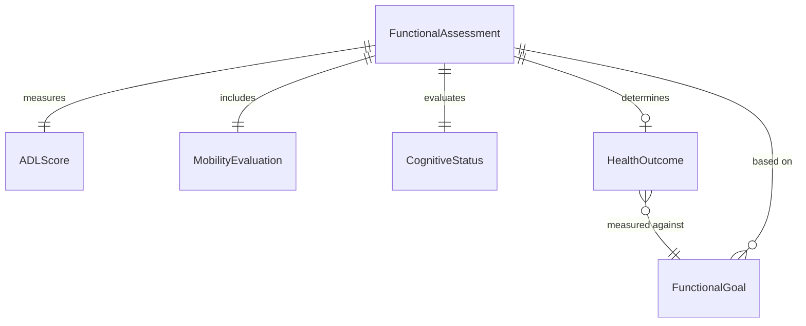
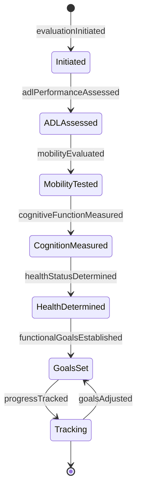
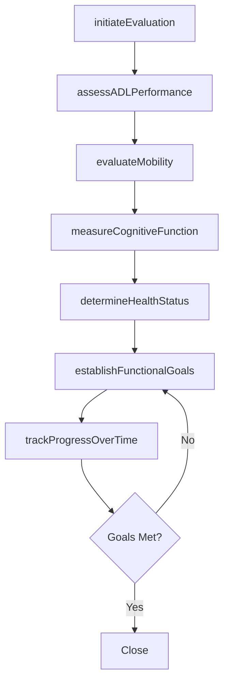
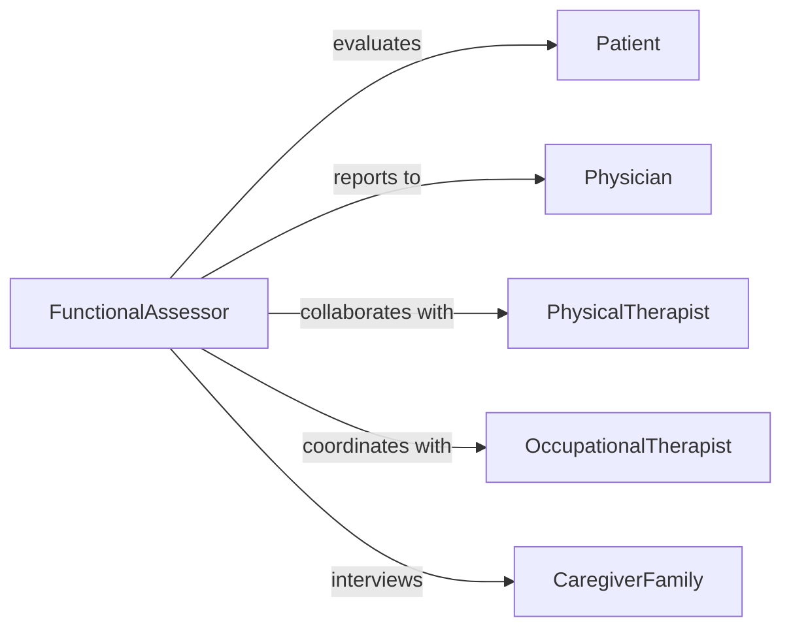

# Evaluate Patient Functioning Capabilities Health

> Business-as-Code definition for assessing patient functional abilities, health status, and quality of life. Models comprehensive evaluation processes used in rehabilitation, geriatric care, and chronic disease management.

## Overview

Functional capacity evaluation involves measuring physical abilities, cognitive function, activities of daily living, and overall health status to guide treatment planning and track rehabilitation progress. This definition provides actions for conducting holistic assessments from initial baseline through ongoing monitoring and outcome measurement.

## Actors

| Actor | Description |
|-------|-------------|
| Patient | Individual undergoing functional evaluation |
| Physician | Orders assessments and reviews results for care planning |
| PhysicalTherapist | Evaluates mobility and physical function |
| OccupationalTherapist | Assesses daily living and adaptive capabilities |
| CaregiverFamily | Provides observations of home functioning |
| InsuranceCompany | Reviews functional status for coverage decisions |

## Roles

| Role | Description |
|------|-------------|
| FunctionalAssessor | Conducts comprehensive capability evaluations |
| RehabilitationSpecialist | Measures recovery and functional improvements |
| OutcomesAnalyst | Tracks patient progress over time |
| CarePlanCoordinator | Translates assessments into intervention strategies |

## Entities

| Entity | Description |
|--------|-------------|
| FunctionalAssessment | Comprehensive evaluation of patient capabilities |
| ADLScore | Activities of daily living performance measurement |
| MobilityEvaluation | Assessment of movement and physical function |
| CognitiveStatus | Evaluation of mental and decision-making abilities |
| HealthOutcome | Measurement of overall wellbeing and quality of life |
| FunctionalGoal | Target capability level for rehabilitation |

## Actions

| Action | Description |
|--------|-------------|
| initiateEvaluation | Begin comprehensive functional assessment |
| assessADLPerformance | Measure ability to perform daily living activities |
| evaluateMobility | Test physical movement and balance capabilities |
| measureCognitiveFunction | Assess mental status and decision-making |
| determineHealthStatus | Evaluate overall wellbeing and symptom burden |
| establishFunctionalGoals | Set target capability levels for intervention |
| trackProgressOverTime | Monitor changes in functional abilities |

## Events

| Event | Description |
|-------|-------------|
| evaluationInitiated | Functional assessment has begun |
| adlPerformanceAssessed | Daily living abilities have been measured |
| mobilityEvaluated | Physical function has been tested |
| cognitiveFunctionMeasured | Mental status has been assessed |
| healthStatusDetermined | Overall wellbeing has been evaluated |
| functionalGoalsEstablished | Target capabilities have been set |
| progressTracked | Functional changes have been monitored |

## Searches

| Search | Description |
|--------|-------------|
| findEvaluations | Retrieve assessments by patient or date |
| getProgressTrends | Analyze functional changes over time |
| getGoalAchievement | Track progress toward rehabilitation targets |
| getHighRiskPatients | Identify patients with declining function |

## Entity Relationships



## State Diagram



## Workflow



## Actor Relationships



## Usage

### Calling Actions

```typescript
import { evaluatePatientFunctioningCapabilitiesHealth } from '@headlessly/evaluate-patient-functioning-capabilities-health'

const evaluator = evaluatePatientFunctioningCapabilitiesHealth()

// Begin comprehensive evaluation
const evaluation = await evaluator.initiateEvaluation({
  patientId: 'PT-6284',
  evaluationType: 'post-stroke-rehabilitation',
  baselineDate: '2026-02-05',
  evaluator: 'PT-SMITH-192'
})

// Assess activities of daily living
const adl = await evaluator.assessADLPerformance({
  evaluationId: evaluation.id,
  activities: {
    bathing: 'requires-assistance',
    dressing: 'independent-with-adaptive-equipment',
    eating: 'independent',
    toileting: 'requires-minimal-assistance',
    transferring: 'requires-moderate-assistance'
  }
})

// Evaluate mobility capabilities
const mobility = await evaluator.evaluateMobility({
  evaluationId: evaluation.id,
  tests: {
    walkingSpeed: { distance: 10, time: 28, unit: 'meters-seconds' },
    balance: 'fair',
    transfers: 'requires-assistive-device',
    stairs: 'unable'
  }
})

// Set rehabilitation goals
const goals = await evaluator.establishFunctionalGoals({
  evaluationId: evaluation.id,
  targets: [
    { area: 'mobility', goal: 'independent-ambulation-50-feet', timeframe: '8-weeks' },
    { area: 'adl', goal: 'independent-bathing', timeframe: '6-weeks' }
  ]
})
```

### Event-Driven Automation

```typescript
// Auto-flag declining function
evaluator.progressTracked(async ({ evaluationId, changes }) => {
  const significantDecline = changes.some(c => c.percentChange < -15)
  if (significantDecline) {
    await notifyCareteam({
      evaluationId,
      alert: 'functional-decline',
      recommendation: 'physician-review-needed',
      changes
    })
  }
})

// Schedule reassessment based on goals
evaluator.functionalGoalsEstablished(async ({ evaluationId, targets }) => {
  const shortestTimeframe = Math.min(...targets.map(t => t.timeframeWeeks))
  await scheduleReassessment({
    evaluationId,
    weeksFromNow: shortestTimeframe,
    purpose: 'goal-progress-evaluation'
  })
})

// Notify insurance of functional improvements
evaluator.healthStatusDetermined(async ({ evaluationId, status, previousStatus }) => {
  if (status.functionalIndependence > previousStatus.functionalIndependence + 20) {
    await notifyInsurer({
      evaluationId,
      improvement: 'significant-functional-gains',
      recommendation: 'continue-therapy-authorization'
    })
  }
})
```
