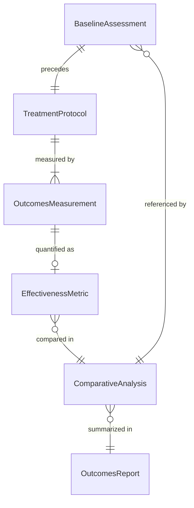
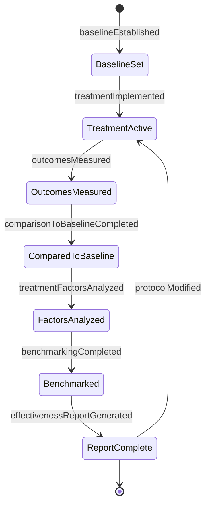
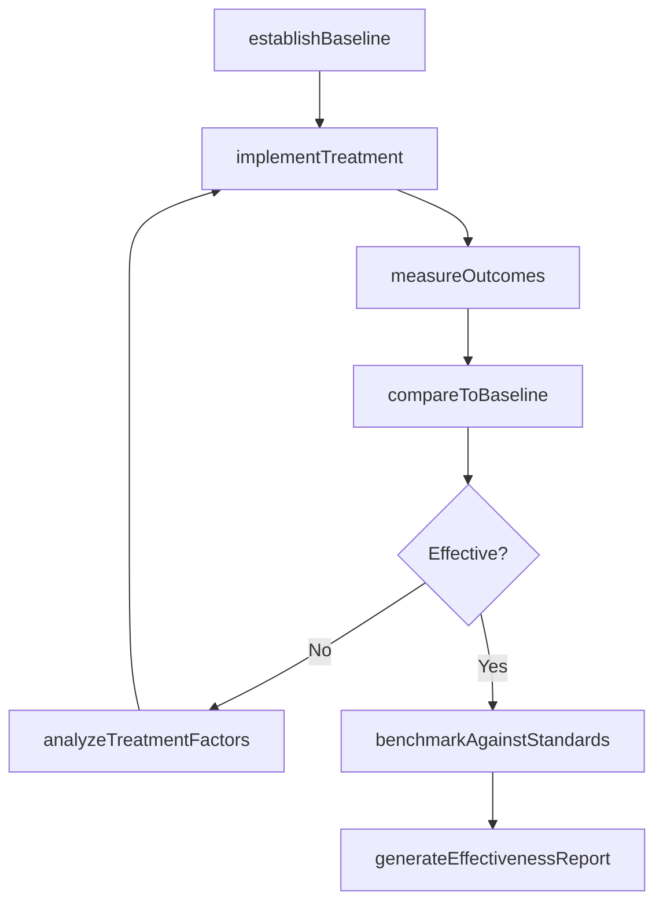
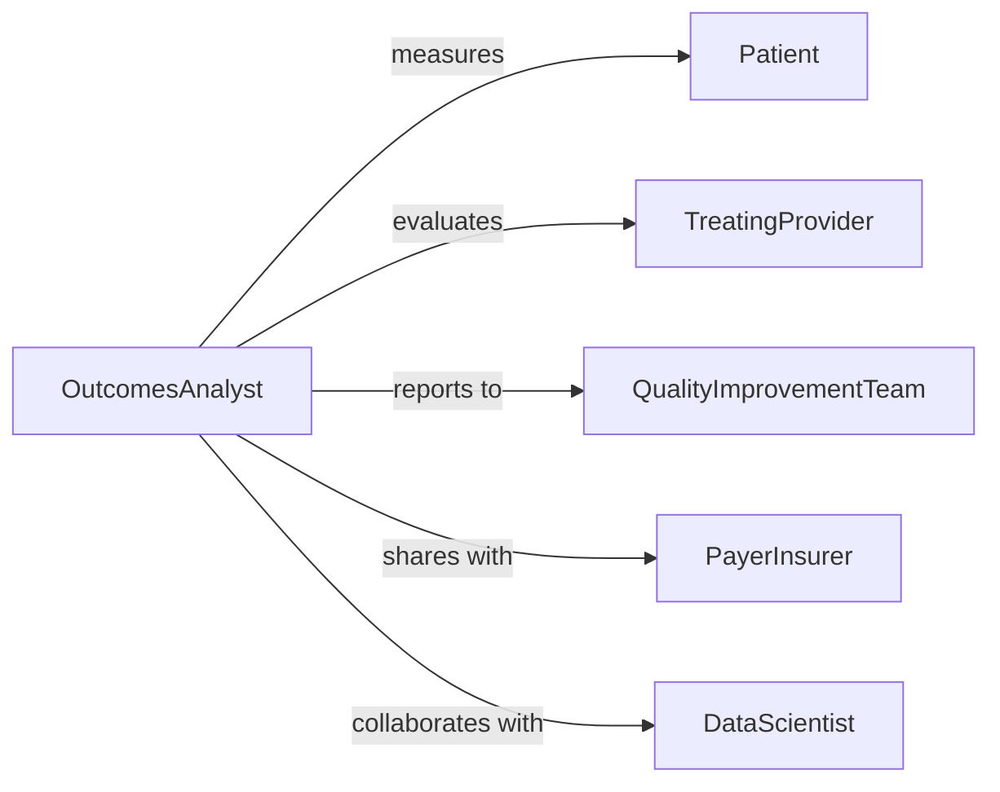

# Evaluate Patient Outcomes Determine Effectiveness

> Business-as-Code definition for measuring treatment results and therapeutic effectiveness. Models outcomes evaluation processes used in clinical quality improvement, evidence-based practice, and value-based care programs.

## Overview

Patient outcomes evaluation involves systematically measuring treatment results, comparing outcomes to benchmarks, identifying factors influencing effectiveness, and adjusting care protocols based on evidence. This definition provides actions for comprehensive outcomes assessment from baseline measurement through effectiveness analysis and practice improvement.

## Actors

| Actor | Description |
|-------|-------------|
| Patient | Individual whose treatment outcomes are measured |
| TreatingProvider | Clinician delivering care being evaluated |
| QualityImprovement Team | Analyzes outcomes for practice enhancement |
| PayerInsurer | Reviews effectiveness for coverage and reimbursement |
| ResearchInstitution | Studies outcomes for clinical evidence development |
| RegulatoryAgency | Monitors outcomes for safety and quality standards |

## Roles

| Role | Description |
|------|-------------|
| OutcomesAnalyst | Measures and interprets treatment effectiveness |
| ClinicalEvaluator | Assesses patient response to interventions |
| QualitySpecialist | Identifies improvement opportunities from outcomes data |
| DataScientist | Analyzes patterns and predictors of treatment success |

## Entities

| Entity | Description |
|--------|-------------|
| OutcomesMeasurement | Quantified result of treatment intervention |
| BaselineAssessment | Pre-treatment status for comparison |
| TreatmentProtocol | Standardized intervention being evaluated |
| EffectivenessMetric | Quantifiable indicator of treatment success |
| ComparativeAnalysis | Evaluation against benchmarks or alternatives |
| OutcomesReport | Summary of treatment effectiveness findings |

## Actions

| Action | Description |
|--------|-------------|
| establishBaseline | Document pre-treatment patient status |
| implementTreatment | Deliver standardized therapeutic intervention |
| measureOutcomes | Quantify patient results at defined intervals |
| compareToBaseline | Evaluate change from pre-treatment status |
| analyzeTreatmentFactors | Identify variables influencing effectiveness |
| benchmarkAgainstStandards | Compare results to best practices or norms |
| generateEffectivenessReport | Create summary of treatment performance |

## Events

| Event | Description |
|-------|-------------|
| baselineEstablished | Pre-treatment status has been documented |
| treatmentImplemented | Intervention has been delivered |
| outcomesMeasured | Results have been quantified |
| comparisonToBaselineCompleted | Change from baseline has been calculated |
| treatmentFactorsAnalyzed | Influencing variables have been identified |
| benchmarkingCompleted | Comparison to standards has been performed |
| effectivenessReportGenerated | Treatment performance summary is complete |

## Searches

| Search | Description |
|--------|-------------|
| findOutcomesByTreatment | Retrieve results by intervention type |
| getEffectivenessTrends | Analyze outcome patterns over time |
| getSuboptimalOutcomes | Identify treatments not meeting benchmarks |
| getSuccessFactors | Find predictors of positive treatment response |

## Entity Relationships



## State Diagram



## Workflow



## Actor Relationships



## Usage

### Calling Actions

```typescript
import { evaluatePatientOutcomesDetermineEffectiveness } from '@headlessly/evaluate-patient-outcomes-determine-effectiveness'

const evaluator = evaluatePatientOutcomesDetermineEffectiveness()

// Establish pre-treatment baseline
const baseline = await evaluator.establishBaseline({
  patientId: 'PT-7392',
  condition: 'major-depressive-disorder',
  metrics: {
    phq9Score: 18,
    functionalImpairment: 'moderate',
    qualityOfLife: 45
  },
  measurementDate: '2026-01-08'
})

// Implement standardized treatment
await evaluator.implementTreatment({
  patientId: 'PT-7392',
  protocol: 'cognitive-behavioral-therapy',
  frequency: 'weekly',
  duration: 12,
  durationUnit: 'weeks'
})

// Measure outcomes at 6 and 12 weeks
const midpoint = await evaluator.measureOutcomes({
  patientId: 'PT-7392',
  timepoint: 'week-6',
  metrics: {
    phq9Score: 12,
    functionalImpairment: 'mild',
    qualityOfLife: 62
  }
})

const endpoint = await evaluator.measureOutcomes({
  patientId: 'PT-7392',
  timepoint: 'week-12',
  metrics: {
    phq9Score: 7,
    functionalImpairment: 'minimal',
    qualityOfLife: 78
  }
})

// Analyze effectiveness
const analysis = await evaluator.compareToBaseline({
  patientId: 'PT-7392',
  timepoint: 'week-12'
})
```

### Event-Driven Automation

```typescript
// Auto-flag non-responders for protocol adjustment
evaluator.comparisonToBaselineCompleted(async ({ patientId, change, timepoint }) => {
  if (timepoint === 'week-6' && change.percentImprovement < 25) {
    await notifyProvider({
      patientId,
      alert: 'suboptimal-treatment-response',
      recommendation: 'consider-protocol-modification',
      currentChange: change
    })
  }
})

// Identify factors predicting success
evaluator.outcomesMeasured(async ({ patientId, metrics, treatmentProtocol }) => {
  await evaluator.analyzeTreatmentFactors({
    patientId,
    factors: ['adherence', 'baseline-severity', 'comorbidities', 'social-support'],
    outcome: metrics
  })
})

// Generate quality reports quarterly
evaluator.benchmarkingCompleted(async ({ treatmentProtocol, results }) => {
  if (isQuarterEnd(new Date())) {
    await evaluator.generateEffectivenessReport({
      protocol: treatmentProtocol,
      period: 'Q1-2026',
      includeComparisons: true,
      includeRecommendations: true
    })
  }
})

// Alert quality team to trends below benchmark
evaluator.effectivenessReportGenerated(async ({ protocol, benchmarkComparison }) => {
  if (benchmarkComparison.percentile < 25) {
    await notifyQualityTeam({
      protocol,
      issue: 'below-benchmark-performance',
      recommendation: 'process-improvement-review',
      data: benchmarkComparison
    })
  }
})
```
