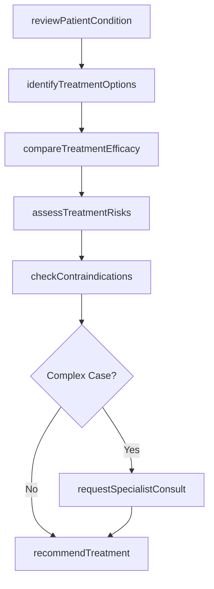
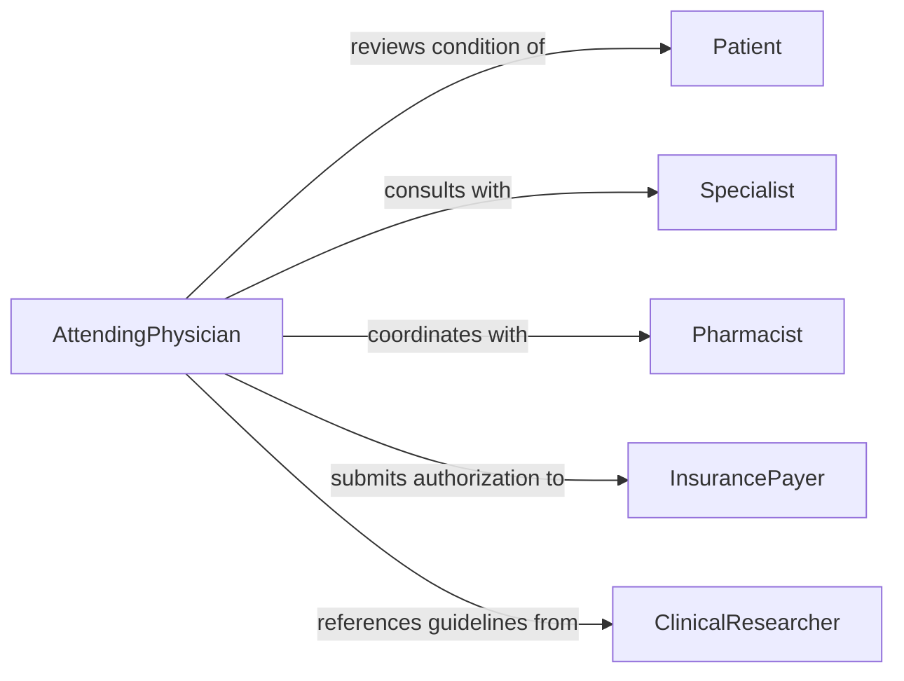

# Evaluate Treatment Options Guide Medical

> Business-as-Code definition for evaluating medical treatment alternatives. Models the clinical decision-making process from reviewing patient conditions through recommending optimal treatment pathways.

## Overview

Medical treatment evaluation involves assessing multiple therapeutic options based on patient conditions, evidence-based guidelines, and clinical outcomes. This definition exposes actions for comparing treatments, analyzing risks, and documenting clinical decisions to support informed medical care.

## Actors

| Actor | Description |
|-------|-------------|
| Patient | Individual receiving medical care and treatment |
| Physician | Medical doctor making treatment decisions |
| Specialist | Subject matter expert for complex conditions |
| Pharmacist | Reviews medication interactions and dosages |
| InsurancePayer | Evaluates coverage and authorization for treatments |
| ClinicalResearcher | Provides evidence-based treatment guidelines |

## Roles

| Role | Description |
|------|-------------|
| AttendingPhysician | Primary decision-maker for patient care |
| ConsultingSpecialist | Provides expert opinion on treatment options |
| MedicalReviewer | Evaluates treatment plans for appropriateness |
| CareCoordinator | Manages treatment execution across providers |

## Entities

| Entity | Description |
|--------|-------------|
| TreatmentOption | A potential therapeutic intervention |
| PatientCondition | Medical diagnosis or health status |
| ClinicalEvidence | Research data supporting treatment efficacy |
| RiskAssessment | Analysis of potential treatment complications |
| Recommendation | Formal clinical decision for treatment |
| ContraindicationFlag | Factor that excludes a treatment option |

## Actions

| Action | Description |
|--------|-------------|
| reviewPatientCondition | Assess current medical status and history |
| identifyTreatmentOptions | Generate list of potential interventions |
| compareTreatmentEfficacy | Analyze evidence for each treatment option |
| assessTreatmentRisks | Evaluate potential complications and side effects |
| checkContraindications | Identify factors that exclude treatments |
| recommendTreatment | Document optimal treatment decision |
| requestSpecialistConsult | Obtain expert opinion on complex cases |

## Events

| Event | Description |
|-------|-------------|
| patientConditionReviewed | Medical status assessment completed |
| treatmentOptionsIdentified | Potential interventions catalogued |
| treatmentEfficacyCompared | Evidence analysis completed |
| treatmentRisksAssessed | Complication analysis finished |
| contraindicationsChecked | Exclusion factors identified |
| treatmentRecommended | Clinical decision documented |
| specialistConsultRequested | Expert review initiated |

## Searches

| Search | Description |
|--------|-------------|
| findTreatmentOptions | Retrieve therapies for specific conditions |
| getClinicalEvidence | Search research data for treatment efficacy |
| getPatientHistory | Retrieve medical records and prior treatments |
| getContraindications | Find exclusion factors for treatments |

## Workflow



## Actor Relationships



## Usage

### Calling Actions

```typescript
import { evaluateTreatmentOptionsGuideMedical } from '@headlessly/evaluate-treatment-options-guide-medical'

const treatment = evaluateTreatmentOptionsGuideMedical()

// Review patient condition
const condition = await treatment.reviewPatientCondition({
  patientId: 'PT-89234',
  diagnosis: 'Type 2 Diabetes Mellitus',
  severity: 'moderate',
  comorbidities: ['hypertension', 'obesity']
})

// Identify available treatment options
const options = await treatment.identifyTreatmentOptions({
  conditionId: condition.id,
  patientAge: 52,
  insurancePlan: 'PPO'
})

// Compare efficacy and recommend treatment
const comparison = await treatment.compareTreatmentEfficacy({
  options: options.map(o => o.id),
  evidenceLevel: 'randomized-controlled-trial'
})

const recommendation = await treatment.recommendTreatment({
  optionId: comparison.topRanked.id,
  rationale: 'Highest efficacy with acceptable side effect profile',
  approvedBy: 'Dr. Johnson'
})
```

### Event-Driven Automation

```typescript
// Auto-flag high-risk treatments
treatment.treatmentRisksAssessed(async ({ optionId, risks }) => {
  const highRisk = risks.filter(r => r.severity === 'severe')
  if (highRisk.length > 0) {
    await treatment.requestSpecialistConsult({
      optionId,
      reason: `High risk complications identified: ${highRisk.map(r => r.name).join(', ')}`
    })
  }
})

// Notify patient when recommendation ready
treatment.treatmentRecommended(async ({ patientId, recommendation }) => {
  await notify({
    to: patientId,
    channel: 'patient-portal',
    message: `Your provider has recommended: ${recommendation.treatmentName}`
  })
})
```
