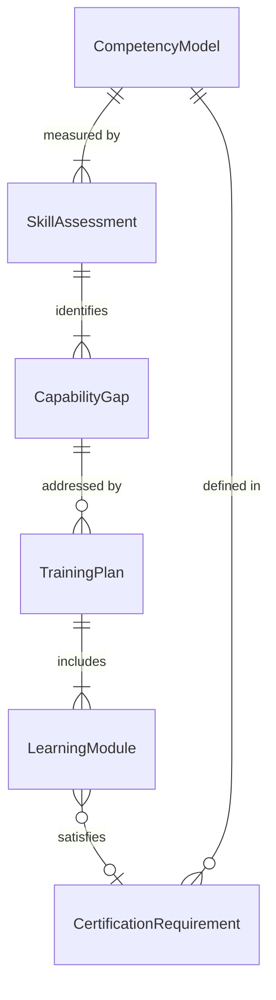
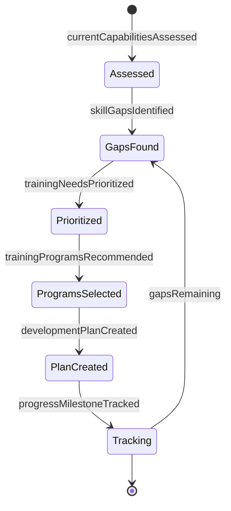
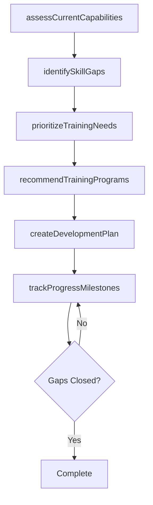
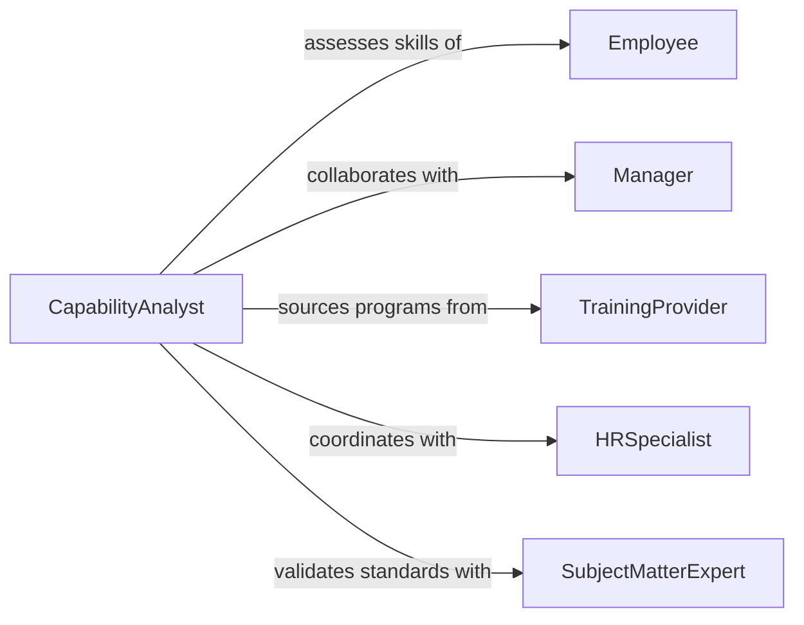

# Evaluate Capabilities Training Needs

> Business-as-Code definition for assessing employee skills and training requirements. Models the competency analysis process from identifying skill gaps through creating development plans.

## Overview

Capability and training evaluation involves assessing current employee competencies against role requirements and identifying skill gaps. This definition exposes actions for conducting assessments, analyzing capability gaps, and recommending training programs to support workforce development.

## Actors

| Actor | Description |
|-------|-------------|
| Employee | Individual whose capabilities are being assessed |
| Manager | Supervisor evaluating team member skills |
| TrainingProvider | External vendor offering development programs |
| HRSpecialist | Human resources professional managing development |
| SubjectMatterExpert | Technical expert defining competency standards |
| ExecutiveLeadership | Approves training budgets and priorities |

## Roles

| Role | Description |
|------|-------------|
| CapabilityAnalyst | Conducts skill assessments and gap analysis |
| LearningDeveloper | Designs and sources training programs |
| PerformanceManager | Oversees employee development processes |
| Assessor | Evaluates employee competency levels |

## Entities

| Entity | Description |
|--------|-------------|
| CompetencyModel | Framework defining required skills for roles |
| SkillAssessment | Evaluation of employee capabilities |
| CapabilityGap | Difference between current and required skills |
| TrainingPlan | Development program to close skill gaps |
| LearningModule | Specific training course or activity |
| CertificationRequirement | Formal credential needed for role |

## Actions

| Action | Description |
|--------|-------------|
| assessCurrentCapabilities | Evaluate employee skills against standards |
| identifySkillGaps | Determine differences between current and required competencies |
| prioritizeTrainingNeeds | Rank development areas by business impact |
| recommendTrainingPrograms | Suggest specific courses to close gaps |
| createDevelopmentPlan | Build formal learning roadmap for employee |
| trackProgressMilestones | Monitor completion of training activities |

## Events

| Event | Description |
|-------|-------------|
| currentCapabilitiesAssessed | Skill evaluation completed |
| skillGapsIdentified | Competency deficiencies documented |
| trainingNeedsPrioritized | Development areas ranked |
| trainingProgramsRecommended | Learning solutions suggested |
| developmentPlanCreated | Formal roadmap established |
| progressMilestoneTracked | Training completion recorded |

## Searches

| Search | Description |
|--------|-------------|
| findSkillGaps | Retrieve capability deficiencies by employee or team |
| getTrainingPrograms | Search available courses for specific skills |
| getDevelopmentPlans | Retrieve learning roadmaps for employees |
| getCompetencyModels | Find skill requirements for roles |

## Entity Relationships



## State Diagram



## Workflow



## Actor Relationships



## Usage

### Calling Actions

```typescript
import { evaluateCapabilitiesTrainingNeeds } from '@headlessly/evaluate-capabilities-training-needs'

const capability = evaluateCapabilitiesTrainingNeeds()

// Assess current employee capabilities
const assessment = await capability.assessCurrentCapabilities({
  employeeId: 'EMP-4521',
  roleId: 'senior-software-engineer',
  assessmentMethod: 'self-assessment-and-manager-review'
})

// Identify skill gaps
const gaps = await capability.identifySkillGaps({
  assessmentId: assessment.id,
  competencyModel: 'engineering-leadership-framework'
})

// Recommend training programs
const recommendations = await capability.recommendTrainingPrograms({
  gaps: gaps.map(g => g.skillId),
  budget: 5000,
  timeframe: '6-months'
})

// Create formal development plan
const plan = await capability.createDevelopmentPlan({
  employeeId: 'EMP-4521',
  programs: recommendations.slice(0, 3),
  targetCompletionDate: '2026-08-31'
})
```

### Event-Driven Automation

```typescript
// Auto-assign training when critical gaps identified
capability.skillGapsIdentified(async ({ employeeId, gaps }) => {
  const criticalGaps = gaps.filter(g => g.priority === 'critical')
  if (criticalGaps.length > 0) {
    await capability.recommendTrainingPrograms({
      gaps: criticalGaps.map(g => g.skillId),
      urgency: 'immediate'
    })
  }
})

// Notify manager on plan completion
capability.progressMilestoneTracked(async ({ employeeId, plan, completionRate }) => {
  if (completionRate >= 1.0) {
    await notify({
      to: plan.managerId,
      message: `${employeeId} completed development plan: ${plan.name}`
    })
  }
})
```
