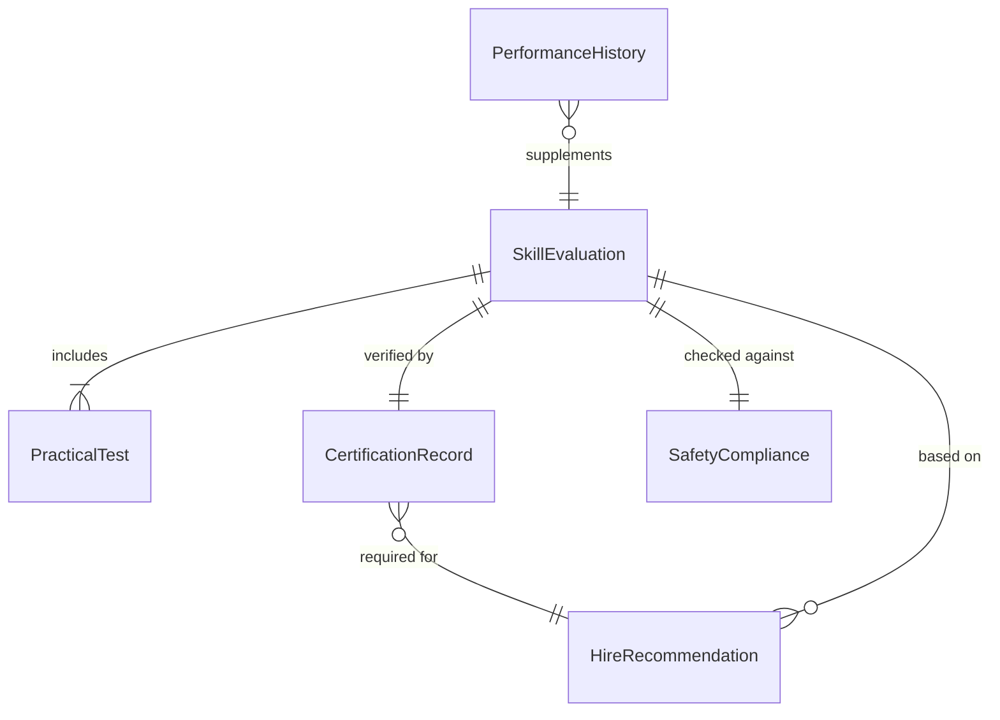
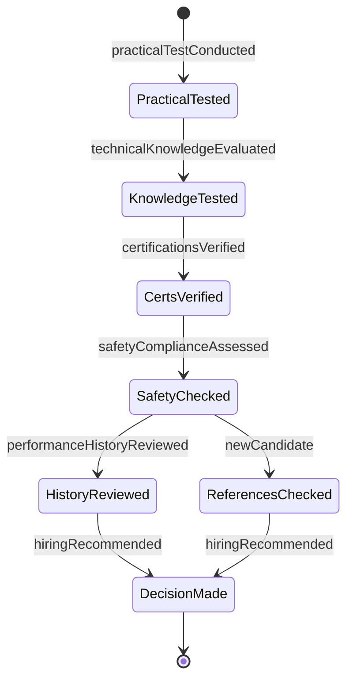
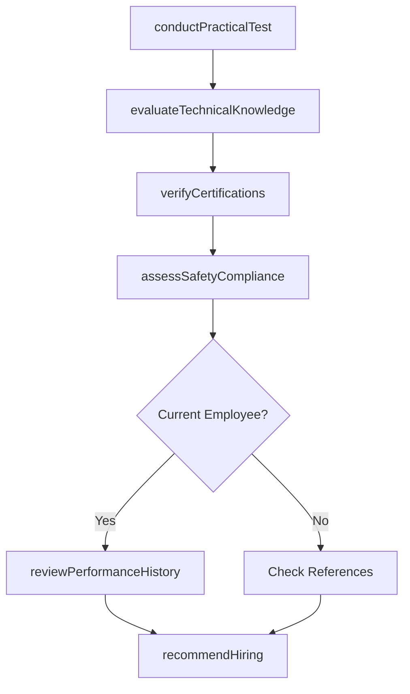
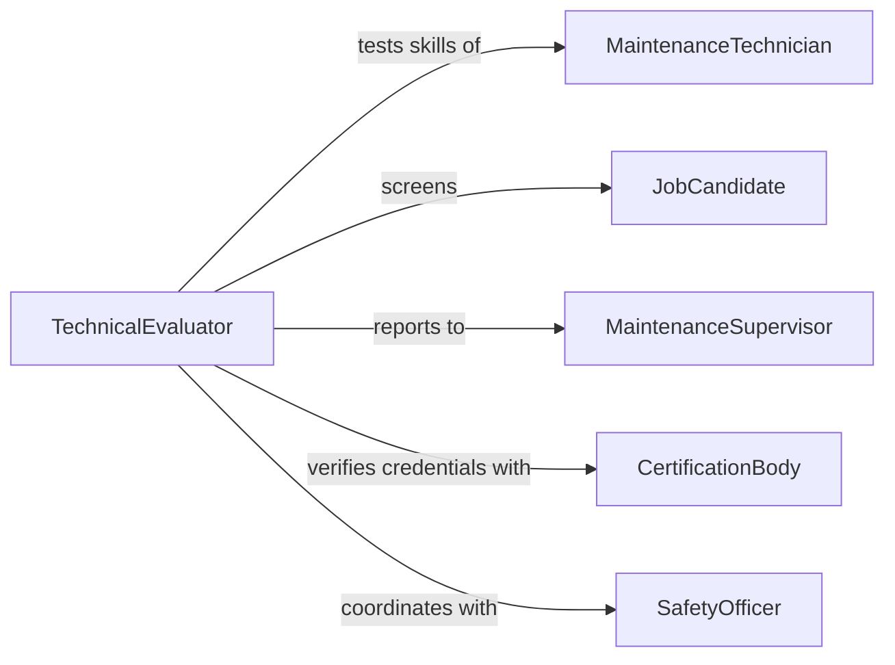

# Evaluate Current Prospective Maintenance Employees

> Business-as-Code definition for assessing maintenance workforce capabilities. Models the evaluation process for both existing technicians and job candidates to ensure technical competency standards.

## Overview

Maintenance employee evaluation involves assessing technical skills, safety compliance, and hands-on capabilities for equipment repair and facilities management. This definition exposes actions for conducting practical assessments, verifying certifications, and making hiring or promotion recommendations for maintenance roles.

## Actors

| Actor | Description |
|-------|-------------|
| MaintenanceTechnician | Current employee being evaluated |
| JobCandidate | Prospective hire applying for maintenance role |
| MaintenanceSupervisor | Manager evaluating technician performance |
| CertificationBody | Organization issuing technical credentials |
| SafetyOfficer | Ensures compliance with safety standards |
| HiringManager | Makes final hiring decisions |

## Roles

| Role | Description |
|------|-------------|
| TechnicalEvaluator | Conducts hands-on skill assessments |
| MaintenanceManager | Oversees workforce capability standards |
| Recruiter | Sources and screens maintenance candidates |
| ComplianceAuditor | Verifies certifications and safety training |

## Entities

| Entity | Description |
|--------|-------------|
| SkillEvaluation | Assessment of technical maintenance abilities |
| CertificationRecord | Documentation of credentials and licenses |
| SafetyCompliance | Record of safety training and violations |
| PracticalTest | Hands-on demonstration of repair skills |
| PerformanceHistory | Track record of work quality and reliability |
| HireRecommendation | Formal decision to hire or promote |

## Actions

| Action | Description |
|--------|-------------|
| conductPracticalTest | Administer hands-on equipment repair assessment |
| verifyCertifications | Confirm validity of technical licenses and credentials |
| assessSafetyCompliance | Review safety training and incident history |
| evaluateTechnicalKnowledge | Test understanding of systems and procedures |
| reviewPerformanceHistory | Analyze work quality and reliability metrics |
| recommendHiring | Make formal hiring or promotion decision |

## Events

| Event | Description |
|-------|-------------|
| practicalTestConducted | Hands-on assessment completed |
| certificationsVerified | Credentials confirmed as valid |
| safetyComplianceAssessed | Safety record reviewed |
| technicalKnowledgeEvaluated | Knowledge test completed |
| performanceHistoryReviewed | Work record analyzed |
| hiringRecommended | Decision documented |

## Searches

| Search | Description |
|--------|-------------|
| findEvaluations | Retrieve assessments by employee or candidate |
| getCertifications | Search credential records by technician |
| getSafetyIncidents | Find safety violations or training gaps |
| getPerformanceMetrics | Retrieve work quality statistics |

## Entity Relationships



## State Diagram



## Workflow



## Actor Relationships



## Usage

### Calling Actions

```typescript
import { evaluateCurrentProspectiveMaintenanceEmployees } from '@headlessly/evaluate-current-prospective-maintenance-employees'

const maintenance = evaluateCurrentProspectiveMaintenanceEmployees()

// Conduct practical test for candidate
const test = await maintenance.conductPracticalTest({
  candidateId: 'CAND-7823',
  testType: 'hvac-repair',
  equipment: 'commercial-chiller',
  duration: 120
})

// Verify certifications
const certs = await maintenance.verifyCertifications({
  candidateId: 'CAND-7823',
  requiredCertifications: ['EPA-608-Universal', 'OSHA-10']
})

// Review performance history for current employee
const history = await maintenance.reviewPerformanceHistory({
  employeeId: 'TECH-2341',
  period: 'last-12-months',
  metrics: ['work-order-completion', 'quality-score', 'safety-incidents']
})

// Make hiring recommendation
const recommendation = await maintenance.recommendHiring({
  candidateId: 'CAND-7823',
  decision: 'hire',
  rationale: 'Strong technical skills, all certifications current, passed practical test',
  startDate: '2026-03-15'
})
```

### Event-Driven Automation

```typescript
// Auto-reject candidates with expired certifications
maintenance.certificationsVerified(async ({ candidateId, certifications }) => {
  const expired = certifications.filter(c => c.status === 'expired')
  if (expired.length > 0) {
    await maintenance.recommendHiring({
      candidateId,
      decision: 'reject',
      rationale: `Expired certifications: ${expired.map(c => c.name).join(', ')}`
    })
  }
})

// Flag safety compliance issues
maintenance.safetyComplianceAssessed(async ({ employeeId, violations }) => {
  if (violations.length > 2) {
    await notify({
      to: 'safety-manager',
      message: `Employee ${employeeId} has ${violations.length} safety violations`
    })
  }
})
```
