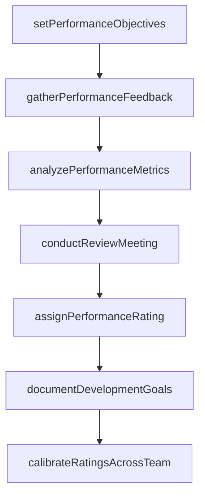
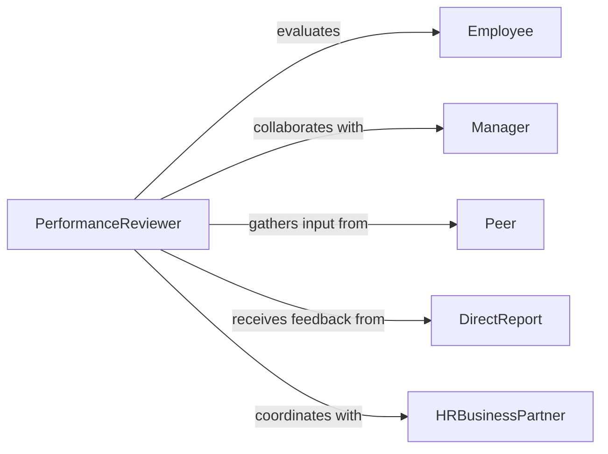

# Evaluate Employee Performance

> Business-as-Code definition for conducting employee performance reviews. Models the complete appraisal process from setting objectives through delivering feedback and ratings.

## Overview

Employee performance evaluation involves assessing work quality, productivity, and goal achievement against defined standards. This definition exposes actions for conducting reviews, gathering feedback, analyzing performance metrics, and documenting ratings to support compensation and development decisions.

## Actors

| Actor | Description |
|-------|-------------|
| Employee | Individual whose performance is being evaluated |
| Manager | Supervisor conducting the performance review |
| Peer | Colleague providing feedback on collaboration |
| DirectReport | Subordinate providing upward feedback |
| HRBusinessPartner | Human resources professional overseeing process |
| ExecutiveLeader | Reviews ratings for calibration and approval |

## Roles

| Role | Description |
|------|-------------|
| PerformanceReviewer | Conducts formal performance assessments |
| FeedbackProvider | Contributes input on employee performance |
| RatingCalibrator | Ensures consistency across reviews |
| CompensationAnalyst | Links performance to pay decisions |

## Entities

| Entity | Description |
|--------|-------------|
| PerformanceReview | Formal evaluation document |
| PerformanceObjective | Goal or target set for employee |
| FeedbackItem | Specific comment on performance |
| PerformanceRating | Numerical or categorical score |
| DevelopmentGoal | Area for improvement or growth |
| PerformanceMetric | Quantitative measure of productivity |

## Actions

| Action | Description |
|--------|-------------|
| setPerformanceObjectives | Define goals and expectations for period |
| gatherPerformanceFeedback | Collect input from manager, peers, and reports |
| analyzePerformanceMetrics | Review quantitative productivity data |
| conductReviewMeeting | Hold formal discussion with employee |
| assignPerformanceRating | Determine overall evaluation score |
| documentDevelopmentGoals | Record areas for improvement |
| calibrateRatingsAcrossTeam | Normalize scores for fairness |

## Events

| Event | Description |
|-------|-------------|
| performanceObjectivesSet | Goals established for review period |
| performanceFeedbackGathered | Input collected from stakeholders |
| performanceMetricsAnalyzed | Productivity data reviewed |
| reviewMeetingConducted | Formal discussion completed |
| performanceRatingAssigned | Evaluation score determined |
| developmentGoalsDocumented | Improvement areas recorded |
| ratingsCalibrated | Scores normalized across team |

## Searches

| Search | Description |
|--------|-------------|
| findPerformanceReviews | Retrieve evaluations by employee or period |
| getPerformanceMetrics | Search productivity data for analysis |
| getFeedbackItems | Retrieve comments by source or category |
| getRatingDistribution | Analyze rating patterns across organization |

## Workflow



## Actor Relationships



## Usage

### Calling Actions

```typescript
import { evaluateEmployeePerformance } from '@headlessly/evaluate-employee-performance'

const performance = evaluateEmployeePerformance()

// Set objectives for review period
const objectives = await performance.setPerformanceObjectives({
  employeeId: 'EMP-5432',
  period: { start: '2026-01-01', end: '2026-06-30' },
  objectives: [
    { description: 'Complete product launch', weight: 0.4 },
    { description: 'Improve team collaboration', weight: 0.3 },
    { description: 'Develop technical skills', weight: 0.3 }
  ]
})

// Gather 360-degree feedback
const feedback = await performance.gatherPerformanceFeedback({
  employeeId: 'EMP-5432',
  sources: ['manager', 'peers', 'direct-reports'],
  anonymize: true
})

// Analyze metrics and assign rating
const metrics = await performance.analyzePerformanceMetrics({
  employeeId: 'EMP-5432',
  metricTypes: ['project-completion', 'quality-score', 'collaboration-index']
})

const rating = await performance.assignPerformanceRating({
  employeeId: 'EMP-5432',
  overallRating: 4,
  ratingScale: '1-5',
  rationale: 'Exceeded expectations on product launch, strong peer feedback'
})
```

### Event-Driven Automation

```typescript
// Auto-schedule review meetings when feedback complete
performance.performanceFeedbackGathered(async ({ employeeId, feedbackCount }) => {
  if (feedbackCount >= 5) {
    await performance.conductReviewMeeting({
      employeeId,
      scheduledDate: getNextAvailableSlot(employeeId)
    })
  }
})

// Trigger calibration when all ratings assigned
performance.performanceRatingAssigned(async ({ teamId, ratingCount, totalEmployees }) => {
  if (ratingCount === totalEmployees) {
    await performance.calibrateRatingsAcrossTeam({
      teamId,
      targetDistribution: { exceptional: 0.15, exceeds: 0.25, meets: 0.5, needs: 0.1 }
    })
  }
})
```
