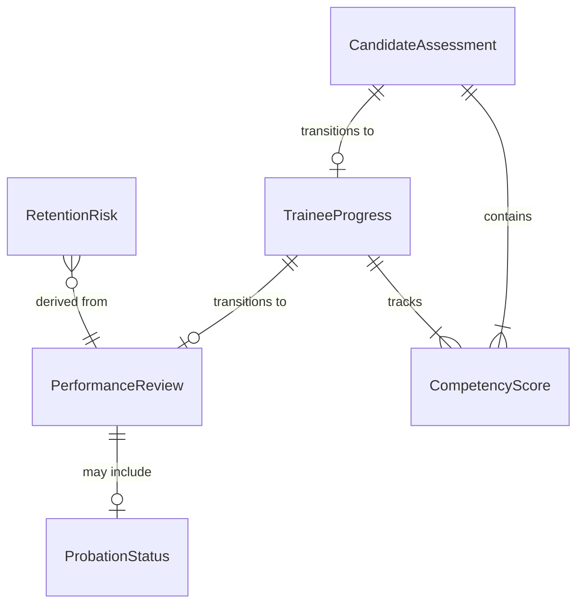
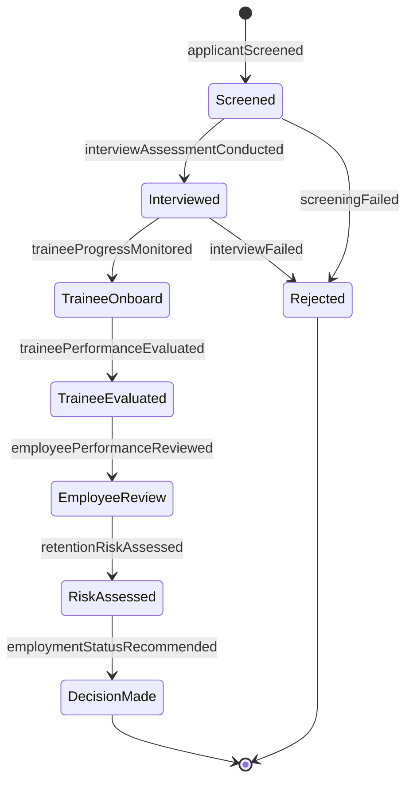
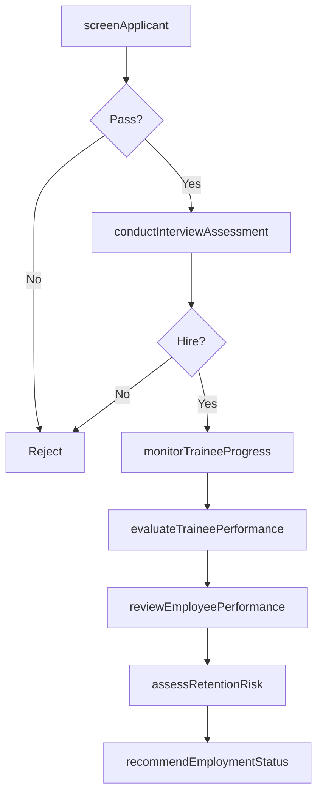
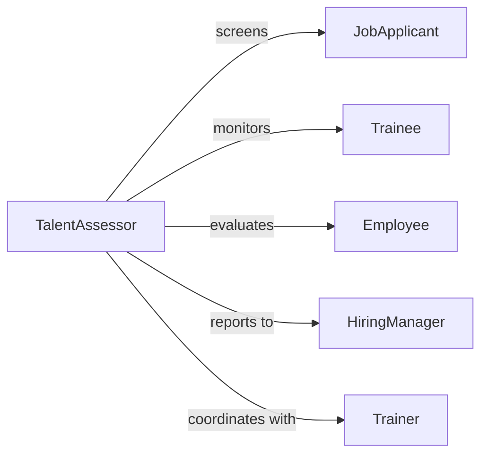

# Evaluate Performance Applicants Trainees Employees

> Business-as-Code definition for assessing performance across the talent lifecycle. Models evaluation processes for job candidates, trainees in development, and current employees.

## Overview

Performance evaluation for applicants, trainees, and employees involves assessing capabilities at different career stages. This definition exposes actions for screening candidates, monitoring trainee progress, and reviewing employee performance to support hiring, development, and retention decisions.

## Actors

| Actor | Description |
|-------|-------------|
| JobApplicant | Candidate being screened for position |
| Trainee | New hire in onboarding or development program |
| Employee | Current staff member undergoing review |
| HiringManager | Decision-maker for candidate selection |
| Trainer | Instructor evaluating trainee progress |
| Supervisor | Manager assessing employee performance |

## Roles

| Role | Description |
|------|-------------|
| TalentAssessor | Conducts evaluations across talent lifecycle |
| Interviewer | Screens and evaluates job candidates |
| TrainingCoordinator | Oversees trainee development programs |
| PerformanceManager | Manages ongoing employee reviews |

## Entities

| Entity | Description |
|--------|-------------|
| CandidateAssessment | Evaluation of job applicant qualifications |
| TraineeProgress | Record of learning and skill development |
| PerformanceReview | Formal evaluation of employee work |
| CompetencyScore | Rating on specific skill or capability |
| ProbationStatus | Evaluation during trial employment period |
| RetentionRisk | Assessment of likelihood employee will leave |

## Actions

| Action | Description |
|--------|-------------|
| screenApplicant | Evaluate candidate qualifications and fit |
| conductInterviewAssessment | Score candidate responses and capabilities |
| monitorTraineeProgress | Track learning milestones and skill development |
| evaluateTraineePerformance | Assess trainee competency at program completion |
| reviewEmployeePerformance | Conduct formal performance evaluation |
| assessRetentionRisk | Analyze likelihood of employee turnover |
| recommendEmploymentStatus | Make hire, promotion, or termination decision |

## Events

| Event | Description |
|-------|-------------|
| applicantScreened | Candidate qualification review completed |
| interviewAssessmentConducted | Interview evaluation documented |
| traineeProgressMonitored | Learning milestone tracked |
| traineePerformanceEvaluated | Training program assessment completed |
| employeePerformanceReviewed | Formal review finalized |
| retentionRiskAssessed | Turnover likelihood analyzed |
| employmentStatusRecommended | Personnel decision documented |

## Searches

| Search | Description |
|--------|-------------|
| findAssessments | Retrieve evaluations by person and stage |
| getTraineeProgress | Search trainee development records |
| getPerformanceHistory | Retrieve employee review records |
| getRetentionRisks | Find employees at risk of leaving |

## Entity Relationships



## State Diagram



## Workflow



## Actor Relationships



## Usage

### Calling Actions

```typescript
import { evaluatePerformanceApplicantsTraineesEmployees } from '@headlessly/evaluate-performance-applicants-trainees-employees'

const talent = evaluatePerformanceApplicantsTraineesEmployees()

// Screen job applicant
const screening = await talent.screenApplicant({
  applicantId: 'APP-9823',
  position: 'software-engineer',
  criteria: ['education', 'experience', 'technical-skills']
})

// Monitor trainee progress
const progress = await talent.monitorTraineeProgress({
  traineeId: 'TRN-4521',
  program: 'sales-onboarding',
  milestone: 'product-knowledge-test',
  score: 92
})

// Review employee performance
const review = await talent.reviewEmployeePerformance({
  employeeId: 'EMP-7234',
  period: 'annual',
  rating: 4,
  competencies: [
    { name: 'technical-skills', score: 5 },
    { name: 'collaboration', score: 4 },
    { name: 'leadership', score: 3 }
  ]
})

// Assess retention risk
const risk = await talent.assessRetentionRisk({
  employeeId: 'EMP-7234',
  factors: ['compensation', 'engagement', 'career-growth']
})
```

### Event-Driven Automation

```typescript
// Auto-advance candidates who pass screening
talent.applicantScreened(async ({ applicantId, score }) => {
  if (score >= 80) {
    await talent.conductInterviewAssessment({
      applicantId,
      interviewType: 'technical',
      scheduledDate: getNextInterviewSlot()
    })
  }
})

// Flag trainees struggling with program
talent.traineeProgressMonitored(async ({ traineeId, score }) => {
  if (score < 70) {
    await notify({
      to: 'training-coordinator',
      message: `Trainee ${traineeId} scored ${score} on milestone, may need additional support`
    })
  }
})

// Alert on high retention risk
talent.retentionRiskAssessed(async ({ employeeId, riskLevel }) => {
  if (riskLevel === 'high') {
    await notify({
      to: 'hr-manager',
      message: `Employee ${employeeId} has high turnover risk, recommend retention intervention`
    })
  }
})
```
