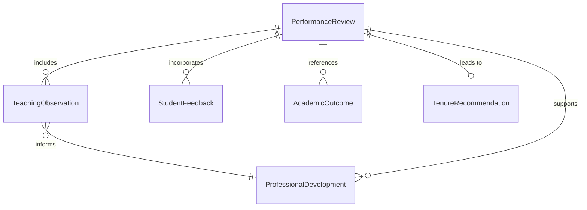
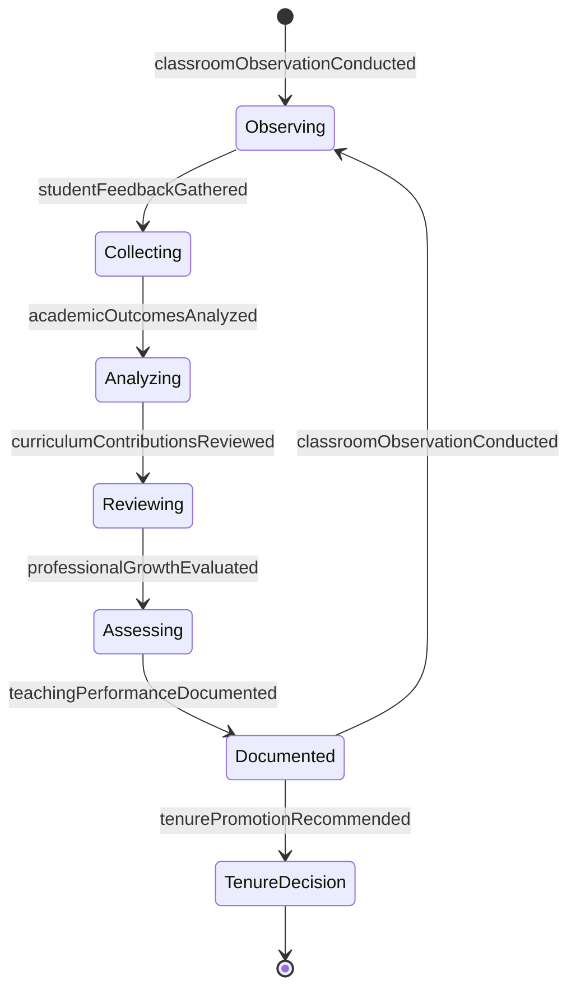
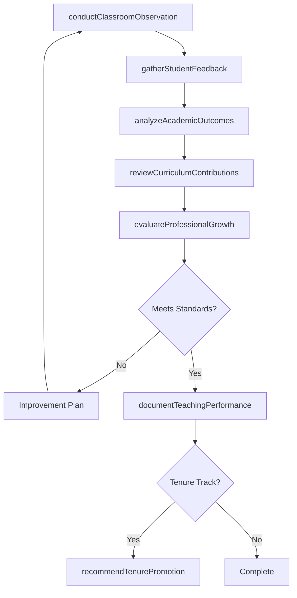
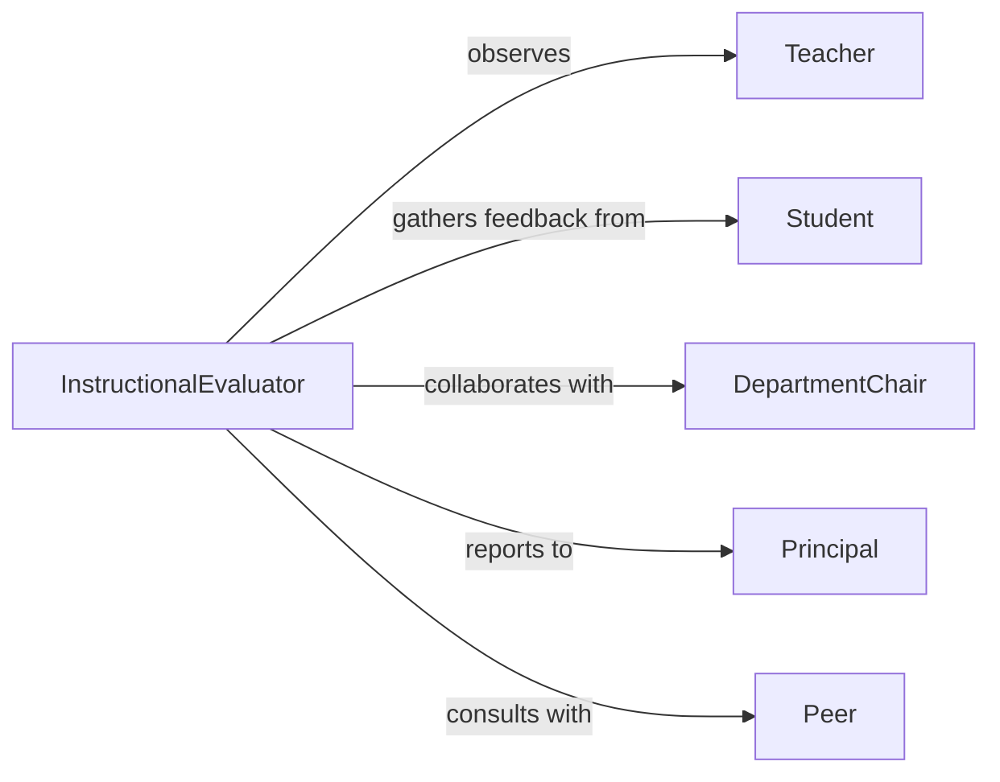

# Evaluate Performance Educational Staff

> Business-as-Code definition for assessing teacher and instructor performance. Models the evaluation process for faculty, administrators, and support staff in educational institutions.

## Overview

Educational staff performance evaluation involves assessing teaching effectiveness, curriculum development, student outcomes, and professional contributions. This definition exposes actions for conducting classroom observations, analyzing student feedback, reviewing academic outcomes, and documenting performance to support tenure, promotion, and development decisions.

## Actors

| Actor | Description |
|-------|-------------|
| Teacher | Instructor whose performance is being evaluated |
| Student | Learner providing feedback on instruction |
| DepartmentChair | Academic leader conducting faculty reviews |
| Principal | School administrator overseeing staff performance |
| Peer | Fellow teacher providing collegial feedback |
| Parent | Family member commenting on teacher effectiveness |

## Roles

| Role | Description |
|------|-------------|
| InstructionalEvaluator | Conducts classroom observations and assessments |
| AcademicSupervisor | Oversees faculty performance management |
| PeerReviewer | Provides professional feedback on teaching |
| PerformanceAnalyst | Analyzes student outcomes and teaching metrics |

## Entities

| Entity | Description |
|--------|-------------|
| TeachingObservation | Record of classroom instruction assessment |
| StudentFeedback | Evaluation comments from learners |
| AcademicOutcome | Student achievement and learning results |
| ProfessionalDevelopment | Record of training and growth activities |
| PerformanceReview | Formal evaluation document for educator |
| TenureRecommendation | Decision on permanent faculty status |

## Actions

| Action | Description |
|--------|-------------|
| conductClassroomObservation | Assess teaching effectiveness in live instruction |
| gatherStudentFeedback | Collect evaluations from learners |
| analyzeAcademicOutcomes | Review student achievement and test scores |
| reviewCurriculumContributions | Assess course design and materials development |
| evaluateProfessionalGrowth | Review continuing education and certifications |
| documentTeachingPerformance | Create formal evaluation report |
| recommendTenurePromotion | Make decision on faculty advancement |

## Events

| Event | Description |
|-------|-------------|
| classroomObservationConducted | Teaching assessment completed |
| studentFeedbackGathered | Learner evaluations collected |
| academicOutcomesAnalyzed | Student achievement reviewed |
| curriculumContributionsReviewed | Course development assessed |
| professionalGrowthEvaluated | Training and certifications reviewed |
| teachingPerformanceDocumented | Formal review finalized |
| tenurePromotionRecommended | Faculty advancement decision made |

## Searches

| Search | Description |
|--------|-------------|
| findTeachingObservations | Retrieve classroom assessment records |
| getStudentFeedback | Search learner evaluations by teacher |
| getAcademicOutcomes | Find student achievement data by instructor |
| getPerformanceReviews | Retrieve faculty evaluation documents |

## Entity Relationships



## State Diagram



## Workflow



## Actor Relationships



## Usage

### Calling Actions

```typescript
import { evaluatePerformanceEducationalStaff } from '@headlessly/evaluate-performance-educational-staff'

const education = evaluatePerformanceEducationalStaff()

// Conduct classroom observation
const observation = await education.conductClassroomObservation({
  teacherId: 'TCH-5621',
  date: '2026-02-15',
  lessonTopic: 'Algebra: Solving Linear Equations',
  rubricAreas: ['content-knowledge', 'student-engagement', 'classroom-management'],
  overallScore: 4.2
})

// Gather student feedback
const feedback = await education.gatherStudentFeedback({
  teacherId: 'TCH-5621',
  semester: 'spring-2026',
  courseIds: ['MATH-101', 'MATH-102'],
  responseRate: 0.87
})

// Analyze academic outcomes
const outcomes = await education.analyzeAcademicOutcomes({
  teacherId: 'TCH-5621',
  metrics: ['test-scores', 'pass-rate', 'grade-distribution'],
  comparisonGroup: 'department-average'
})

// Document performance and recommend tenure
const review = await education.documentTeachingPerformance({
  teacherId: 'TCH-5621',
  reviewPeriod: 'academic-year-2025-2026',
  overallRating: 'exceeds-expectations',
  strengths: ['student-engagement', 'innovative-teaching-methods'],
  areasForGrowth: ['integration-of-technology']
})

const tenure = await education.recommendTenurePromotion({
  teacherId: 'TCH-5621',
  decision: 'recommend-tenure',
  rationale: 'Consistently strong teaching evaluations, significant curriculum contributions'
})
```

### Event-Driven Automation

```typescript
// Flag low student feedback scores
education.studentFeedbackGathered(async ({ teacherId, averageRating }) => {
  if (averageRating < 3.0) {
    await notify({
      to: 'department-chair',
      message: `Teacher ${teacherId} received low student ratings (${averageRating}), may need support`
    })
  }
})

// Auto-schedule follow-up observation for improvement areas
education.classroomObservationConducted(async ({ teacherId, areasForImprovement }) => {
  if (areasForImprovement.length > 2) {
    await education.conductClassroomObservation({
      teacherId,
      scheduledDate: getDatePlusWeeks(6),
      focusAreas: areasForImprovement
    })
  }
})
```
