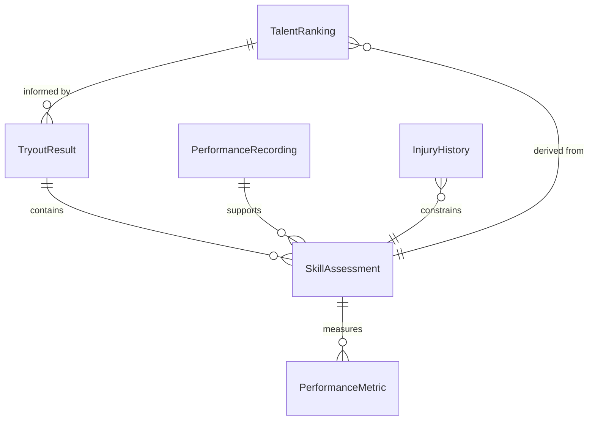
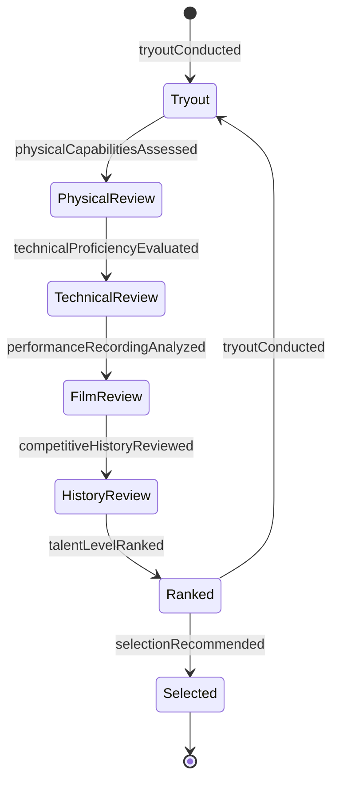
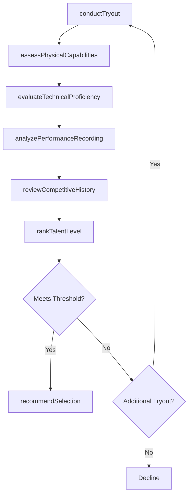
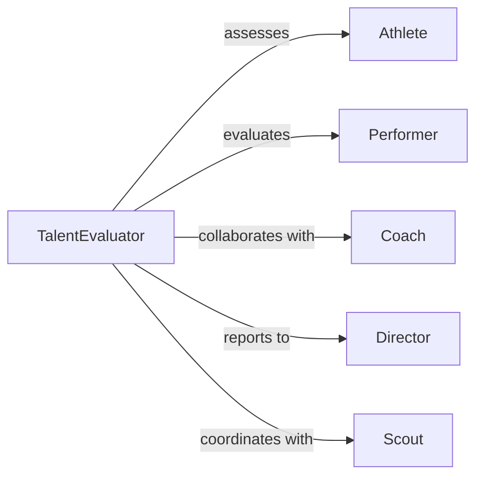

# Evaluate Skills Athletes Performers

> Business-as-Code definition for assessing athletic and performance capabilities. Models the evaluation process for athletes, artists, and entertainers to measure talent and track development.

## Overview

Athlete and performer skill evaluation involves assessing physical abilities, technical proficiency, artistic expression, and competitive performance. This definition exposes actions for conducting tryouts, analyzing performance metrics, reviewing recordings, and making selection or advancement decisions for sports teams, productions, and talent rosters.

## Actors

| Actor | Description |
|-------|-------------|
| Athlete | Sports competitor being evaluated |
| Performer | Artist or entertainer being assessed |
| Coach | Athletic trainer evaluating player skills |
| Director | Artistic leader assessing performer talent |
| Scout | Talent evaluator identifying prospects |
| SportsMedicineProvider | Healthcare professional assessing fitness |

## Roles

| Role | Description |
|------|-------------|
| TalentEvaluator | Conducts skill assessments and tryouts |
| PerformanceAnalyst | Analyzes metrics and recordings |
| SelectionCommittee | Makes roster or casting decisions |
| DevelopmentCoach | Identifies growth opportunities |

## Entities

| Entity | Description |
|--------|-------------|
| SkillAssessment | Evaluation of specific athletic or artistic abilities |
| PerformanceMetric | Quantitative measure of physical or artistic output |
| TryoutResult | Outcome of competitive evaluation session |
| PerformanceRecording | Video or audio of athlete or performer in action |
| InjuryHistory | Record of physical limitations or recovery |
| TalentRanking | Relative assessment compared to peers |

## Actions

| Action | Description |
|--------|-------------|
| conductTryout | Administer competitive evaluation session |
| assessPhysicalCapabilities | Measure strength, speed, endurance, or flexibility |
| evaluateTechnicalProficiency | Review skill execution and form |
| analyzePerformanceRecording | Assess video or audio of performance |
| reviewCompetitiveHistory | Examine past game or show results |
| rankTalentLevel | Compare skills to peer group |
| recommendSelection | Make roster or casting decision |

## Events

| Event | Description |
|-------|-------------|
| tryoutConducted | Competitive evaluation completed |
| physicalCapabilitiesAssessed | Physical measurement finished |
| technicalProficiencyEvaluated | Skill technique reviewed |
| performanceRecordingAnalyzed | Recording assessment completed |
| competitiveHistoryReviewed | Past results examined |
| talentLevelRanked | Peer comparison documented |
| selectionRecommended | Roster or casting decision made |

## Searches

| Search | Description |
|--------|-------------|
| findAssessments | Retrieve evaluations by athlete or performer |
| getPerformanceMetrics | Search physical or artistic measurements |
| getTryoutResults | Find competitive evaluation outcomes |
| getTalentRankings | Retrieve peer comparison data |

## Entity Relationships



## State Diagram



## Workflow



## Actor Relationships



## Usage

### Calling Actions

```typescript
import { evaluateSkillsAthletesPerformers } from '@headlessly/evaluate-skills-athletes-performers'

const talent = evaluateSkillsAthletesPerformers()

// Conduct athletic tryout
const tryout = await talent.conductTryout({
  athleteId: 'ATH-8923',
  sport: 'basketball',
  position: 'point-guard',
  drills: ['shooting', 'ball-handling', 'defense', 'court-vision'],
  date: '2026-02-20'
})

// Assess physical capabilities
const physical = await talent.assessPhysicalCapabilities({
  athleteId: 'ATH-8923',
  measurements: {
    speed: { fortyYardDash: 4.6 },
    verticalJump: 32,
    benchPress: 185,
    bodyFat: 8.2
  }
})

// Analyze performance recording
const recording = await talent.analyzePerformanceRecording({
  performerId: 'PERF-4521',
  recordingType: 'audition-video',
  piece: 'Hamlet Soliloquy',
  criteria: ['vocal-projection', 'emotional-range', 'character-interpretation'],
  overallScore: 4.5
})

// Rank talent and recommend selection
const ranking = await talent.rankTalentLevel({
  candidateId: 'ATH-8923',
  peerGroup: 'division-1-point-guards',
  percentile: 87
})

const selection = await talent.recommendSelection({
  candidateId: 'ATH-8923',
  decision: 'select',
  rationale: 'Strong physical tools, excellent ball-handling, high basketball IQ'
})
```

### Event-Driven Automation

```typescript
// Auto-flag injury concerns
talent.physicalCapabilitiesAssessed(async ({ athleteId, injuryHistory }) => {
  if (injuryHistory.length > 0) {
    await notify({
      to: 'sports-medicine',
      message: `Athlete ${athleteId} has injury history: ${injuryHistory.map(i => i.type).join(', ')}`
    })
  }
})

// Advance top performers to next round
talent.talentLevelRanked(async ({ candidateId, percentile }) => {
  if (percentile >= 90) {
    await talent.conductTryout({
      candidateId,
      round: 'final-callback',
      scheduledDate: getNextCallbackDate()
    })
  }
})
```
