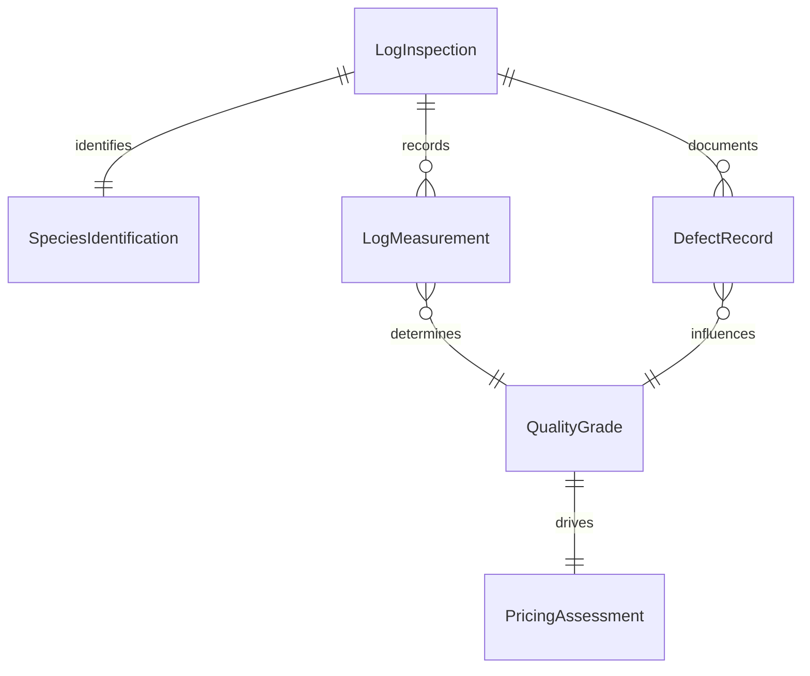
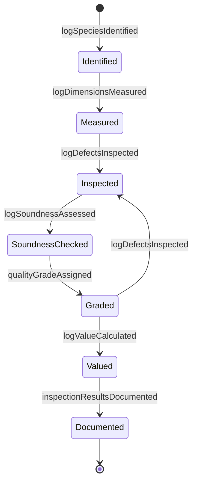
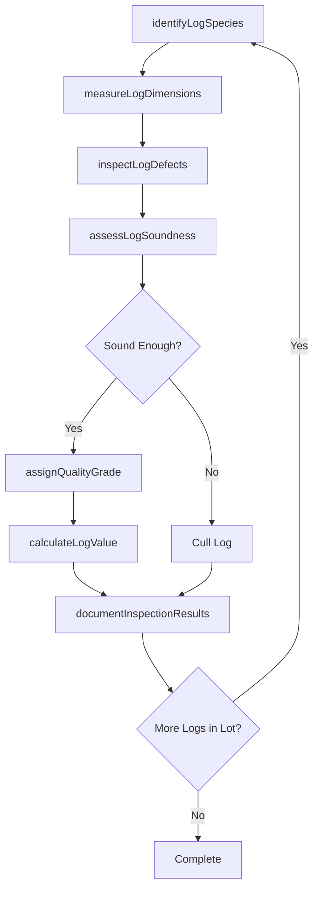
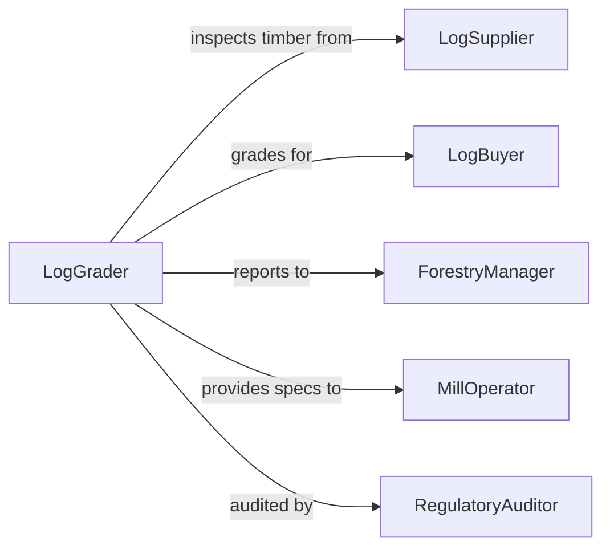

# Evaluate Log Quality

> Business-as-Code definition for assessing timber log quality in forestry operations. Models the grading process for harvested logs based on species, dimensions, defects, and market standards.

## Overview

Log quality evaluation involves inspecting harvested timber for species identification, dimensional measurements, defect assessment, and grade classification. This definition exposes actions for measuring logs, identifying defects, assigning grades, and determining pricing to support forestry purchasing and processing decisions.

## Actors

| Actor | Description |
|-------|-------------|
| LogSupplier | Forestry operation providing harvested timber |
| LogBuyer | Mill or processor purchasing timber |
| QualityInspector | Professional grading log quality |
| ForestryManager | Oversees timber harvesting operations |
| MillOperator | Processes logs into lumber products |
| RegulatoryAuditor | Ensures compliance with forestry standards |

## Roles

| Role | Description |
|------|-------------|
| LogGrader | Assigns quality grades to harvested timber |
| ScalingTechnician | Measures log dimensions for volume calculation |
| DefectAnalyst | Identifies and documents log imperfections |
| PricingSpecialist | Determines log value based on grade |

## Entities

| Entity | Description |
|--------|-------------|
| LogInspection | Record of quality assessment for timber |
| SpeciesIdentification | Classification of tree species |
| LogMeasurement | Dimensional data including length and diameter |
| DefectRecord | Documentation of knots, rot, splits, or other flaws |
| QualityGrade | Classification based on industry standards |
| PricingAssessment | Valuation based on grade and market conditions |

## Actions

| Action | Description |
|--------|-------------|
| identifyLogSpecies | Determine tree species of harvested timber |
| measureLogDimensions | Record length, diameter, and volume |
| inspectLogDefects | Identify knots, rot, splits, sweep, or damage |
| assessLogSoundness | Evaluate structural integrity and decay |
| assignQualityGrade | Classify log based on grading standards |
| calculateLogValue | Determine pricing based on grade and market |
| documentInspectionResults | Record findings in quality system |

## Events

| Event | Description |
|-------|-------------|
| logSpeciesIdentified | Tree species determined |
| logDimensionsMeasured | Size and volume recorded |
| logDefectsInspected | Imperfections documented |
| logSoundnessAssessed | Structural integrity evaluated |
| qualityGradeAssigned | Grade classification completed |
| logValueCalculated | Pricing determination finished |
| inspectionResultsDocumented | Findings recorded in system |

## Searches

| Search | Description |
|--------|-------------|
| findInspections | Retrieve quality assessments by lot or supplier |
| getGradeDistribution | Analyze grade mix for timber batch |
| getDefectPatterns | Identify common quality issues by source |
| getLogValuation | Retrieve pricing data by grade and species |

## Entity Relationships



## State Diagram



## Workflow



## Actor Relationships



## Usage

### Calling Actions

```typescript
import { evaluateLogQuality } from '@headlessly/evaluate-log-quality'

const logs = evaluateLogQuality()

// Identify species and measure dimensions
const species = await logs.identifyLogSpecies({
  lotId: 'LOT-2026-045',
  visualCharacteristics: ['bark-pattern', 'wood-color', 'grain'],
  determinedSpecies: 'Douglas Fir'
})

const measurements = await logs.measureLogDimensions({
  logId: 'LOG-45-001',
  length: 16.5,
  smallEndDiameter: 14,
  largeEndDiameter: 18,
  volumeBoardFeet: 185
})

// Inspect for defects and soundness
const defects = await logs.inspectLogDefects({
  logId: 'LOG-45-001',
  defectTypes: [
    { type: 'knot', severity: 'minor', count: 3 },
    { type: 'sweep', severity: 'moderate', deviationInches: 2 }
  ]
})

const soundness = await logs.assessLogSoundness({
  logId: 'LOG-45-001',
  rotPresent: false,
  splitDepth: 0.5,
  overallSoundness: 'good'
})

// Assign grade and calculate value
const grade = await logs.assignQualityGrade({
  logId: 'LOG-45-001',
  gradingStandard: 'WWPA-rules',
  assignedGrade: 'No-2-Sawlog'
})

const value = await logs.calculateLogValue({
  logId: 'LOG-45-001',
  grade: 'No-2-Sawlog',
  volumeBoardFeet: 185,
  marketPricePerMBF: 650,
  totalValue: 120.25
})
```

### Event-Driven Automation

```typescript
// Auto-reject logs with excessive defects
logs.logDefectsInspected(async ({ logId, defectTypes }) => {
  const severeDefects = defectTypes.filter(d => d.severity === 'severe')
  if (severeDefects.length > 2) {
    await logs.assignQualityGrade({
      logId,
      assignedGrade: 'cull',
      reason: 'Excessive severe defects'
    })
  }
})

// Flag below-grade lots for supplier review
logs.qualityGradeAssigned(async ({ lotId, gradeDistribution }) => {
  const cullPercentage = gradeDistribution.cull / gradeDistribution.total
  if (cullPercentage > 0.15) {
    await notify({
      to: 'forestry-manager',
      message: `Lot ${lotId} has ${cullPercentage * 100}% cull logs, review harvesting practices`
    })
  }
})
```
