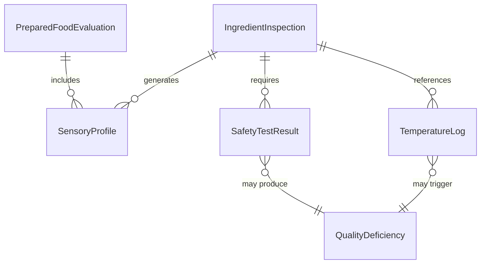
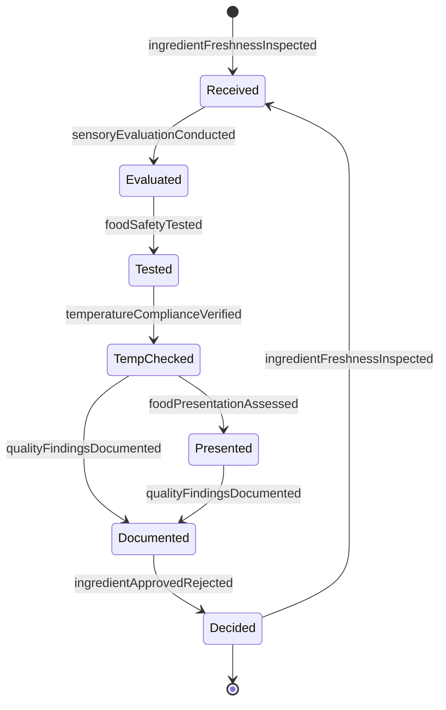
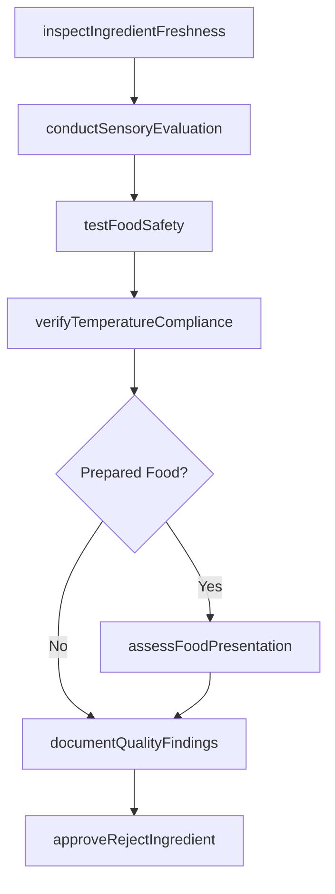
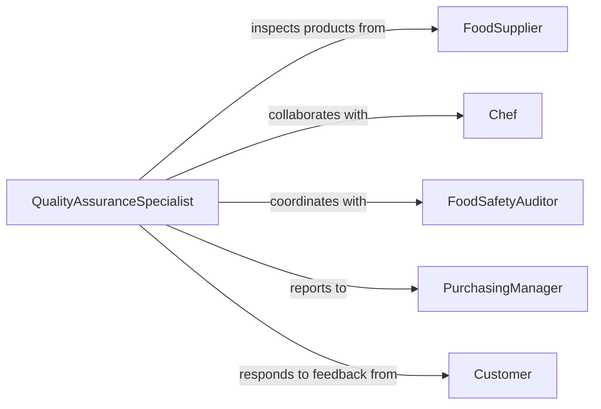

# Evaluate Quality Food Ingredients Prepared

> Business-as-Code definition for assessing food quality standards. Models the inspection process for raw ingredients and finished food products to ensure safety, freshness, and compliance.

## Overview

Food quality evaluation involves inspecting raw ingredients and prepared foods for freshness, safety, appearance, and compliance with standards. This definition exposes actions for conducting sensory assessments, testing for contamination, verifying temperatures, and documenting quality findings to support food safety and customer satisfaction.

## Actors

| Actor | Description |
|-------|-------------|
| FoodSupplier | Vendor providing ingredients or products |
| QualityInspector | Professional conducting food assessments |
| Chef | Culinary professional evaluating taste and preparation |
| FoodSafetyAuditor | Regulatory inspector ensuring compliance |
| PurchasingManager | Buyer approving ingredient quality |
| Customer | End consumer providing feedback |

## Roles

| Role | Description |
|------|-------------|
| QualityAssuranceSpecialist | Conducts systematic quality inspections |
| SensoryEvaluator | Assesses taste, aroma, and appearance |
| SafetyCompliance Officer | Ensures adherence to health standards |
| ReceivingClerk | Verifies incoming ingredient quality |

## Entities

| Entity | Description |
|--------|-------------|
| IngredientInspection | Record of raw material quality assessment |
| PreparedFoodEvaluation | Assessment of finished product quality |
| SensoryProfile | Description of taste, aroma, texture, appearance |
| SafetyTestResult | Lab findings for contamination or pathogens |
| TemperatureLog | Record of storage and holding temperatures |
| QualityDeficiency | Documentation of standards violation |

## Actions

| Action | Description |
|--------|-------------|
| inspectIngredientFreshness | Assess raw material condition and age |
| conductSensoryEvaluation | Evaluate taste, aroma, texture, and appearance |
| testFoodSafety | Screen for contamination, pathogens, or allergens |
| verifyTemperatureCompliance | Confirm proper storage and holding temperatures |
| assessFoodPresentation | Evaluate visual appeal and plating quality |
| documentQualityFindings | Record inspection results and deficiencies |
| approveRejectIngredient | Make acceptance decision for ingredients |

## Events

| Event | Description |
|-------|-------------|
| ingredientFreshnessInspected | Raw material condition assessed |
| sensoryEvaluationConducted | Taste and aroma evaluation completed |
| foodSafetyTested | Contamination screening finished |
| temperatureComplianceVerified | Temperature standards confirmed |
| foodPresentationAssessed | Visual quality evaluated |
| qualityFindingsDocumented | Inspection results recorded |
| ingredientApprovedRejected | Acceptance decision made |

## Searches

| Search | Description |
|--------|-------------|
| findInspections | Retrieve quality assessments by product or supplier |
| getQualityDeficiencies | Search documented standards violations |
| getTemperatureLogs | Find temperature records for compliance audit |
| getSafetyTestResults | Retrieve contamination screening results |

## Entity Relationships



## State Diagram



## Workflow



## Actor Relationships



## Usage

### Calling Actions

```typescript
import { evaluateQualityFoodIngredientsPrepared } from '@headlessly/evaluate-quality-food-ingredients-prepared'

const food = evaluateQualityFoodIngredientsPrepared()

// Inspect incoming ingredient freshness
const inspection = await food.inspectIngredientFreshness({
  ingredientId: 'ING-5423',
  name: 'organic-spinach',
  deliveryDate: '2026-02-05',
  expirationDate: '2026-02-12',
  visualCondition: 'bright-green-no-wilting',
  freshnessRating: 5
})

// Conduct sensory evaluation
const sensory = await food.conductSensoryEvaluation({
  productId: 'DISH-8821',
  dishName: 'grilled-salmon-with-vegetables',
  criteria: {
    appearance: 4.5,
    aroma: 4.8,
    taste: 4.7,
    texture: 4.6
  },
  overallScore: 4.65
})

// Test food safety
const safety = await food.testFoodSafety({
  sampleId: 'SAMPLE-2026-045',
  productId: 'ING-5423',
  tests: ['salmonella', 'e-coli', 'listeria'],
  results: { salmonella: 'negative', eColi: 'negative', listeria: 'negative' },
  approved: true
})

// Verify temperature compliance
const temp = await food.verifyTemperatureCompliance({
  locationId: 'cooler-3',
  requiredTempMax: 40,
  actualTemp: 38,
  compliant: true
})

// Approve or reject ingredient
const decision = await food.approveRejectIngredient({
  ingredientId: 'ING-5423',
  decision: 'approve',
  rationale: 'Excellent freshness, passed safety tests, proper temperature'
})
```

### Event-Driven Automation

```typescript
// Auto-reject ingredients failing safety tests
food.foodSafetyTested(async ({ productId, results, approved }) => {
  if (!approved) {
    await food.approveRejectIngredient({
      ingredientId: productId,
      decision: 'reject',
      rationale: `Failed safety test: ${Object.keys(results).filter(k => results[k] !== 'negative').join(', ')}`
    })
  }
})

// Alert on temperature non-compliance
food.temperatureComplianceVerified(async ({ locationId, actualTemp, requiredTempMax, compliant }) => {
  if (!compliant) {
    await notify({
      to: 'food-safety-manager',
      priority: 'urgent',
      message: `Temperature violation in ${locationId}: ${actualTemp}°F exceeds ${requiredTempMax}°F`
    })
  }
})

// Flag low sensory scores
food.sensoryEvaluationConducted(async ({ productId, overallScore }) => {
  if (overallScore < 3.5) {
    await notify({
      to: 'executive-chef',
      message: `Product ${productId} received low sensory score: ${overallScore}`
    })
  }
})
```
