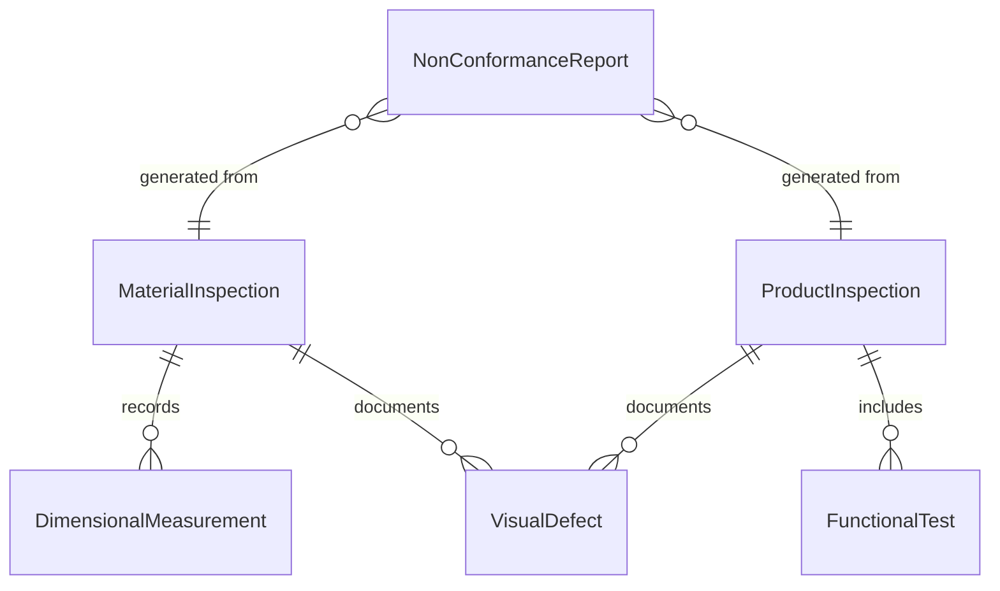
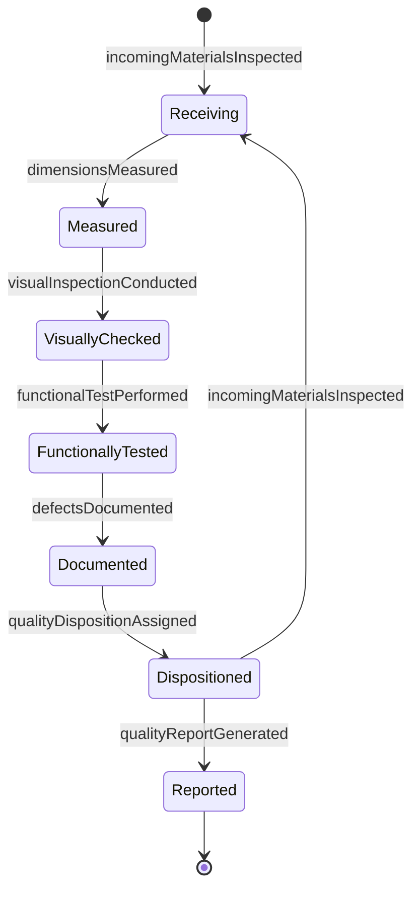
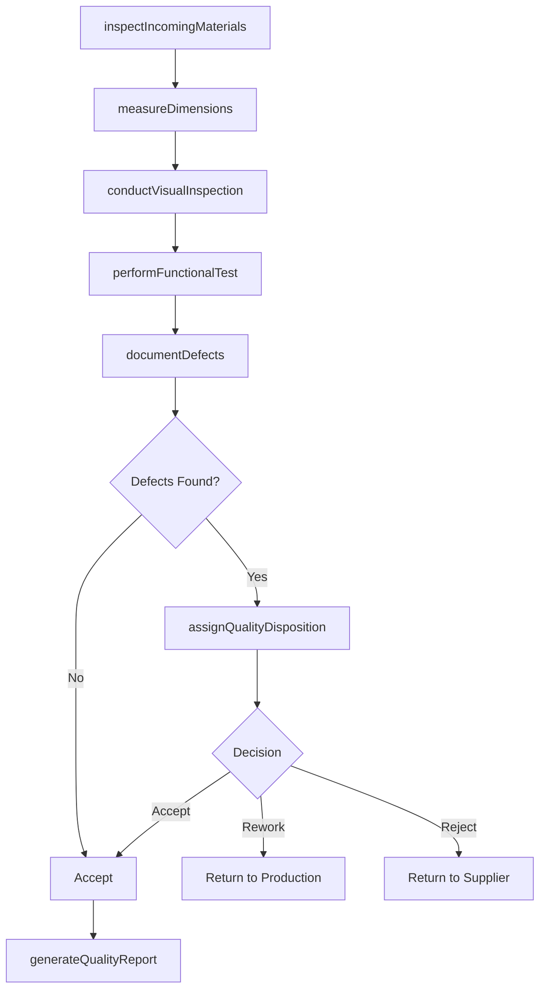
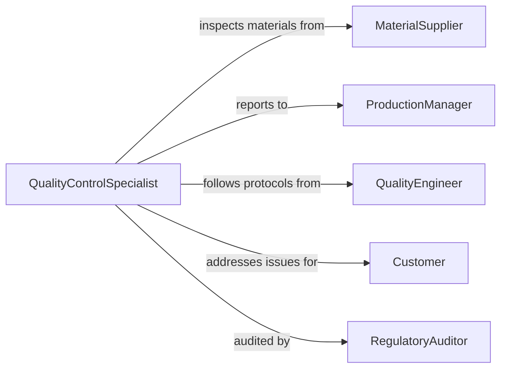

# Evaluate Quality Materials Products

> Business-as-Code definition for assessing material and product quality standards. Models the inspection process for raw materials and finished goods to ensure specifications, safety, and compliance.

## Overview

Material and product quality evaluation involves inspecting incoming materials, in-process work, and finished goods against specifications, tolerances, and standards. This definition exposes actions for conducting measurements, visual inspections, functional testing, and defect documentation to support manufacturing quality control and supplier management.

## Actors

| Actor | Description |
|-------|-------------|
| MaterialSupplier | Vendor providing raw materials or components |
| QualityInspector | Professional conducting quality assessments |
| ProductionManager | Oversees manufacturing quality standards |
| QualityEngineer | Designs testing protocols and acceptance criteria |
| Customer | End user receiving finished products |
| RegulatoryAuditor | Ensures compliance with industry standards |

## Roles

| Role | Description |
|------|-------------|
| QualityControlSpecialist | Conducts systematic product inspections |
| IncomingInspector | Verifies raw material quality at receiving |
| InProcessInspector | Monitors quality during manufacturing |
| FinalInspector | Validates finished product conformance |

## Entities

| Entity | Description |
|--------|-------------|
| MaterialInspection | Record of raw material quality assessment |
| ProductInspection | Evaluation of finished goods quality |
| DimensionalMeasurement | Physical dimensions compared to specifications |
| VisualDefect | Documentation of cosmetic or surface flaws |
| FunctionalTest | Performance validation against requirements |
| NonConformanceReport | Record of specifications deviation |

## Actions

| Action | Description |
|--------|-------------|
| inspectIncomingMaterials | Verify raw material quality at receiving |
| measureDimensions | Compare physical measurements to specifications |
| conductVisualInspection | Assess appearance for defects or damage |
| performFunctionalTest | Validate product operates per requirements |
| documentDefects | Record non-conformances and quality issues |
| assignQualityDisposition | Determine accept, rework, or reject status |
| generateQualityReport | Create formal inspection documentation |

## Events

| Event | Description |
|-------|-------------|
| incomingMaterialsInspected | Raw material assessment completed |
| dimensionsMeasured | Physical measurements recorded |
| visualInspectionConducted | Appearance evaluation finished |
| functionalTestPerformed | Performance validation completed |
| defectsDocumented | Non-conformances recorded |
| qualityDispositionAssigned | Accept/rework/reject decision made |
| qualityReportGenerated | Formal documentation created |

## Searches

| Search | Description |
|--------|-------------|
| findInspections | Retrieve quality assessments by product or lot |
| getDefectAnalysis | Search non-conformance patterns by type |
| getSupplierQuality | Analyze quality metrics by vendor |
| getQualityTrends | Retrieve quality performance over time |

## Entity Relationships



## State Diagram



## Workflow



## Actor Relationships



## Usage

### Calling Actions

```typescript
import { evaluateQualityMaterialsProducts } from '@headlessly/evaluate-quality-materials-products'

const quality = evaluateQualityMaterialsProducts()

// Inspect incoming raw materials
const incoming = await quality.inspectIncomingMaterials({
  materialId: 'MAT-7834',
  supplierLot: 'LOT-2026-234',
  partNumber: 'STEEL-PLATE-10GA',
  quantity: 500,
  sampleSize: 25
})

// Measure dimensions against specifications
const dimensions = await quality.measureDimensions({
  inspectionId: incoming.id,
  measurements: [
    { dimension: 'thickness', specified: 0.1345, actual: 0.1342, tolerance: 0.002, compliant: true },
    { dimension: 'width', specified: 48.0, actual: 48.1, tolerance: 0.125, compliant: true },
    { dimension: 'length', specified: 96.0, actual: 95.95, tolerance: 0.125, compliant: true }
  ]
})

// Conduct visual inspection
const visual = await quality.conductVisualInspection({
  inspectionId: incoming.id,
  defectsFound: [
    { type: 'surface-scratch', severity: 'minor', count: 2 },
    { type: 'edge-burr', severity: 'minor', count: 1 }
  ]
})

// Perform functional test on finished product
const functional = await quality.performFunctionalTest({
  productId: 'PROD-4521',
  testProtocol: 'load-bearing-test',
  specifications: { maxLoad: 5000, actualLoad: 5200 },
  passed: true
})

// Assign quality disposition
const disposition = await quality.assignQualityDisposition({
  inspectionId: incoming.id,
  decision: 'accept',
  rationale: 'Minor cosmetic defects within acceptable limits, dimensions compliant'
})
```

### Event-Driven Automation

```typescript
// Auto-reject materials exceeding dimensional tolerances
quality.dimensionsMeasured(async ({ inspectionId, measurements }) => {
  const outOfSpec = measurements.filter(m => !m.compliant)
  if (outOfSpec.length > 0) {
    await quality.assignQualityDisposition({
      inspectionId,
      decision: 'reject',
      rationale: `Dimensions out of specification: ${outOfSpec.map(m => m.dimension).join(', ')}`
    })
  }
})

// Flag supplier quality issues
quality.qualityDispositionAssigned(async ({ supplierId, decision }) => {
  if (decision === 'reject') {
    const recentRejects = await quality.getSupplierQuality({ supplierId, period: 'last-30-days' })
    if (recentRejects.rejectRate > 0.05) {
      await notify({
        to: 'purchasing-manager',
        message: `Supplier ${supplierId} reject rate is ${recentRejects.rejectRate * 100}%, review supplier performance`
      })
    }
  }
})

// Auto-generate quality reports for audits
quality.functionalTestPerformed(async ({ productId, lotId, passed }) => {
  if (!passed) {
    await quality.generateQualityReport({
      lotId,
      reportType: 'non-conformance',
      priority: 'high'
    })
  }
})
```
