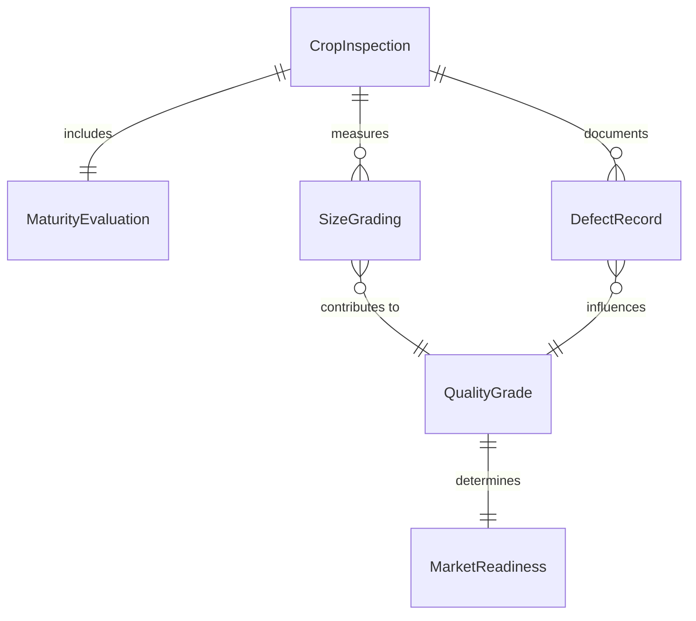
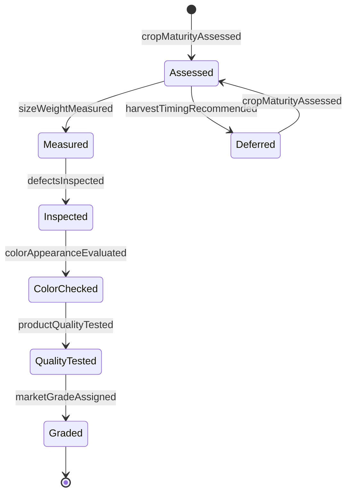
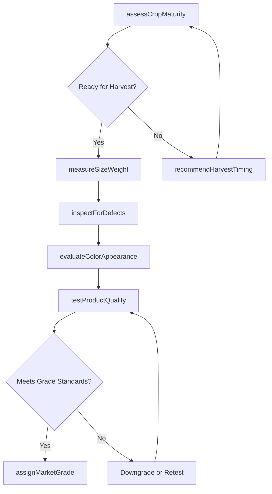
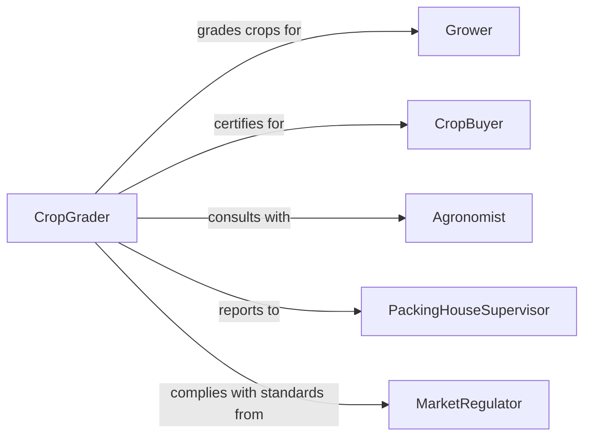

# Evaluate Quality Plants Crops

> Business-as-Code definition for assessing agricultural product quality. Models the inspection process for plants, crops, and produce to ensure grade standards, freshness, and market readiness.

## Overview

Plant and crop quality evaluation involves assessing agricultural products for maturity, size, color, defects, and grade standards. This definition exposes actions for conducting field inspections, measuring quality attributes, identifying disease or pest damage, and assigning market grades to support harvesting decisions and pricing.

## Actors

| Actor | Description |
|-------|-------------|
| Grower | Farmer producing crops for market |
| CropBuyer | Wholesaler or processor purchasing produce |
| QualityInspector | Professional grading agricultural products |
| Agronomist | Agricultural scientist advising on crop quality |
| PackingHouseSupervisor | Oversees post-harvest quality control |
| MarketRegulator | Government official enforcing grade standards |

## Roles

| Role | Description |
|------|-------------|
| CropGrader | Assigns quality grades to agricultural products |
| FieldInspector | Assesses crop maturity and readiness for harvest |
| PostHarvestEvaluator | Inspects produce after harvest |
| QualityAnalyst | Analyzes quality trends and defect patterns |

## Entities

| Entity | Description |
|--------|-------------|
| CropInspection | Record of plant or crop quality assessment |
| MaturityEvaluation | Assessment of ripeness and harvest readiness |
| SizeGrading | Classification by dimensions or weight |
| DefectRecord | Documentation of disease, pest damage, or flaws |
| QualityGrade | Classification based on USDA or market standards |
| MarketReadiness | Determination of suitability for sale |

## Actions

| Action | Description |
|--------|-------------|
| assessCropMaturity | Evaluate ripeness and optimal harvest timing |
| measureSizeWeight | Determine dimensions and mass for grading |
| inspectForDefects | Identify disease, pest damage, or physical flaws |
| evaluateColorAppearance | Assess visual quality and marketability |
| testProductQuality | Measure sugar content, moisture, or other attributes |
| assignMarketGrade | Classify crop based on quality standards |
| recommendHarvestTiming | Determine optimal harvest date |

## Events

| Event | Description |
|-------|-------------|
| cropMaturityAssessed | Ripeness evaluation completed |
| sizeWeightMeasured | Dimensions and mass recorded |
| defectsInspected | Disease or damage documented |
| colorAppearanceEvaluated | Visual quality assessed |
| productQualityTested | Chemical or physical attributes measured |
| marketGradeAssigned | Quality classification completed |
| harvestTimingRecommended | Optimal harvest date determined |

## Searches

| Search | Description |
|--------|-------------|
| findInspections | Retrieve quality assessments by crop or lot |
| getGradeDistribution | Analyze grade mix for harvest batch |
| getDefectPatterns | Identify common quality issues by field |
| getMarketPricing | Retrieve pricing data by grade and crop |

## Entity Relationships



## State Diagram



## Workflow



## Actor Relationships



## Usage

### Calling Actions

```typescript
import { evaluateQualityPlantsCrops } from '@headlessly/evaluate-quality-plants-crops'

const crops = evaluateQualityPlantsCrops()

// Assess crop maturity in field
const maturity = await crops.assessCropMaturity({
  cropType: 'washington-apples',
  fieldId: 'FIELD-23A',
  variety: 'honeycrisp',
  maturityIndicators: {
    daysFromBloom: 142,
    starchIndex: 5.2,
    firmness: 18.5
  },
  harvestReady: true
})

// Measure size and weight after harvest
const size = await crops.measureSizeWeight({
  lotId: 'LOT-2026-089',
  sampleSize: 100,
  measurements: {
    averageDiameter: 3.25,
    averageWeight: 0.42,
    sizeDistribution: { small: 5, medium: 45, large: 40, extraLarge: 10 }
  }
})

// Inspect for defects
const defects = await crops.inspectForDefects({
  lotId: 'LOT-2026-089',
  defectTypes: [
    { type: 'bruising', severity: 'minor', percentage: 3 },
    { type: 'sunscald', severity: 'minor', percentage: 2 },
    { type: 'insect-damage', severity: 'moderate', percentage: 1 }
  ]
})

// Test product quality
const quality = await crops.testProductQuality({
  lotId: 'LOT-2026-089',
  tests: {
    brixSugarContent: 14.2,
    firmness: 18.5,
    acidity: 0.42
  }
})

// Assign market grade
const grade = await crops.assignMarketGrade({
  lotId: 'LOT-2026-089',
  gradingStandard: 'USDA',
  assignedGrade: 'US-Extra-Fancy',
  pricePerPound: 1.85
})
```

### Event-Driven Automation

```typescript
// Auto-recommend harvest when maturity achieved
crops.cropMaturityAssessed(async ({ fieldId, harvestReady, maturityIndicators }) => {
  if (harvestReady) {
    await crops.recommendHarvestTiming({
      fieldId,
      recommendedDate: getNextAvailableHarvestDate(),
      rationale: `Optimal maturity indicators: starch ${maturityIndicators.starchIndex}, firmness ${maturityIndicators.firmness}`
    })
  }
})

// Flag high defect rates
crops.defectsInspected(async ({ lotId, defectTypes }) => {
  const totalDefects = defectTypes.reduce((sum, d) => sum + d.percentage, 0)
  if (totalDefects > 10) {
    await notify({
      to: 'quality-manager',
      message: `Lot ${lotId} has ${totalDefects}% defects, investigate harvesting or handling practices`
    })
  }
})

// Auto-price based on grade assignment
crops.marketGradeAssigned(async ({ lotId, assignedGrade }) => {
  const pricing = await crops.getMarketPricing({ grade: assignedGrade, crop: 'washington-apples' })
  await updateInventory({
    lotId,
    grade: assignedGrade,
    pricePerPound: pricing.currentMarketPrice
  })
})
```
