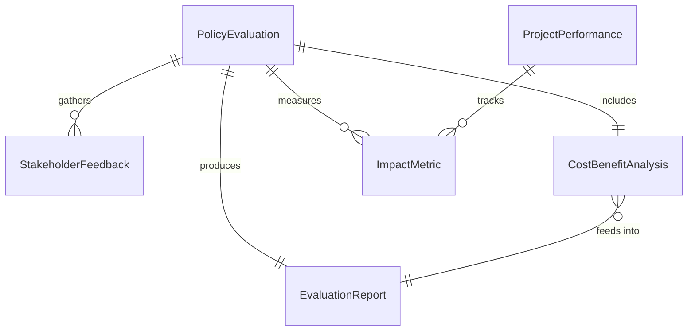
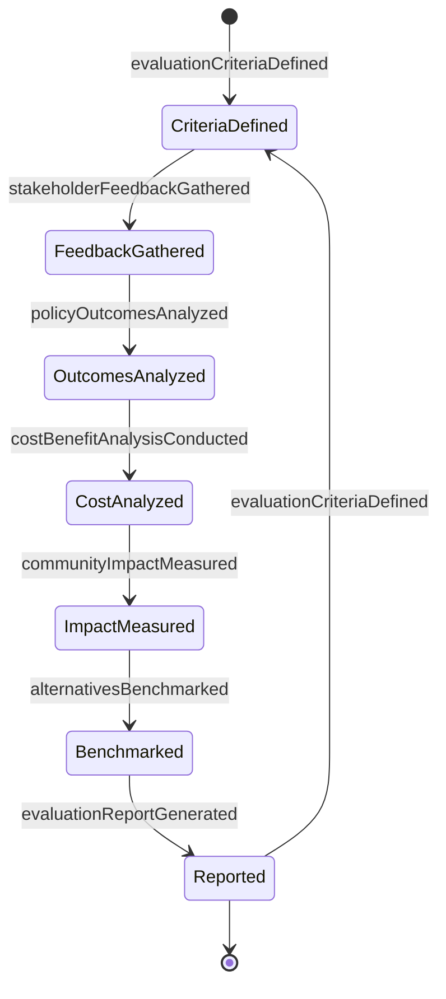
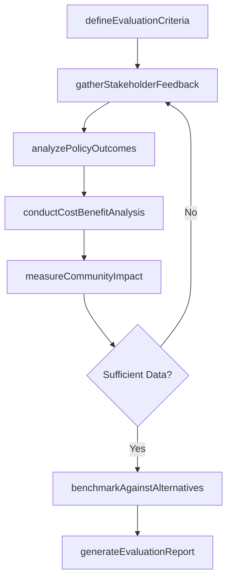
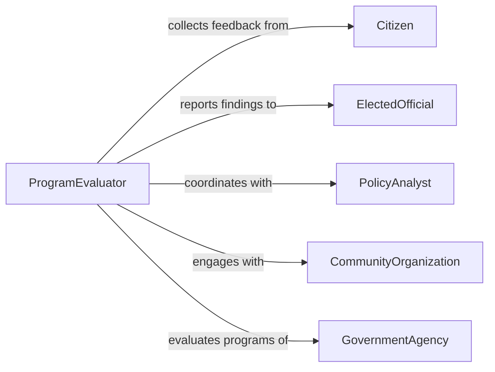

# Evaluate Civic Projects Public Policies

> Business-as-Code definition for assessing government programs and policy effectiveness. Models the evaluation process for civic initiatives, public infrastructure projects, and regulatory policies.

## Overview

Civic project and public policy evaluation involves assessing effectiveness, cost-benefit ratios, community impact, and alignment with public goals. This definition exposes actions for collecting stakeholder feedback, analyzing outcomes, measuring performance metrics, and generating evaluation reports to support government accountability and evidence-based policymaking.

## Actors

| Actor | Description |
|-------|-------------|
| Citizen | Community member affected by policies or projects |
| ElectedOfficial | Government representative accountable to voters |
| PolicyAnalyst | Professional evaluating program effectiveness |
| CommunityOrganization | Advocacy group representing stakeholder interests |
| GovernmentAgency | Department implementing policies or projects |
| IndependentAuditor | External reviewer assessing performance |

## Roles

| Role | Description |
|------|-------------|
| ProgramEvaluator | Conducts systematic assessments of civic initiatives |
| PolicyResearcher | Analyzes policy outcomes and effectiveness |
| StakeholderLiaison | Gathers input from affected communities |
| PerformanceAuditor | Reviews financial and operational metrics |

## Entities

| Entity | Description |
|--------|-------------|
| PolicyEvaluation | Assessment of regulatory or program effectiveness |
| ProjectPerformance | Measurement of civic infrastructure outcomes |
| StakeholderFeedback | Input from affected community members |
| CostBenefitAnalysis | Comparison of project costs to public benefits |
| ImpactMetric | Quantitative measure of policy or project outcomes |
| EvaluationReport | Formal documentation of findings |

## Actions

| Action | Description |
|--------|-------------|
| defineEvaluationCriteria | Establish metrics and standards for assessment |
| gatherStakeholderFeedback | Collect input from citizens and organizations |
| analyzePolicyOutcomes | Review results against stated objectives |
| conductCostBenefitAnalysis | Compare project costs to community benefits |
| measureCommunityImpact | Assess effects on affected populations |
| benchmarkAgainstAlternatives | Compare to other jurisdictions or approaches |
| generateEvaluationReport | Create formal findings document |

## Events

| Event | Description |
|-------|-------------|
| evaluationCriteriaDefined | Assessment standards established |
| stakeholderFeedbackGathered | Community input collected |
| policyOutcomesAnalyzed | Results review completed |
| costBenefitAnalysisConducted | Financial comparison finished |
| communityImpactMeasured | Population effects assessed |
| alternativesBenchmarked | Comparison analysis completed |
| evaluationReportGenerated | Formal findings published |

## Searches

| Search | Description |
|--------|-------------|
| findEvaluations | Retrieve assessments by policy or project |
| getStakeholderFeedback | Search community input by demographics |
| getImpactMetrics | Retrieve outcome measurements |
| getBenchmarkComparisons | Find peer jurisdiction performance data |

## Entity Relationships



## State Diagram



## Workflow



## Actor Relationships



## Usage

### Calling Actions

```typescript
import { evaluateCivicProjectsPublicPolicies } from '@headlessly/evaluate-civic-projects-public-policies'

const civic = evaluateCivicProjectsPublicPolicies()

// Define evaluation criteria for affordable housing policy
const criteria = await civic.defineEvaluationCriteria({
  policyId: 'POLICY-AFF-HOUSING-2024',
  policyName: 'Inclusionary Zoning Ordinance',
  evaluationMetrics: [
    'affordable-units-created',
    'cost-per-unit',
    'demographic-impact',
    'developer-compliance-rate'
  ],
  timeframe: '2024-2026'
})

// Gather stakeholder feedback
const feedback = await civic.gatherStakeholderFeedback({
  policyId: 'POLICY-AFF-HOUSING-2024',
  stakeholderGroups: ['residents', 'developers', 'housing-advocates'],
  feedbackChannels: ['public-hearing', 'online-survey', 'focus-groups'],
  totalResponses: 2340
})

// Analyze policy outcomes
const outcomes = await civic.analyzePolicyOutcomes({
  policyId: 'POLICY-AFF-HOUSING-2024',
  results: {
    affordableUnitsCreated: 482,
    targetUnits: 500,
    costPerUnit: 235000,
    complianceRate: 0.92
  }
})

// Conduct cost-benefit analysis
const costBenefit = await civic.conductCostBenefitAnalysis({
  policyId: 'POLICY-AFF-HOUSING-2024',
  costs: {
    adminCosts: 850000,
    incentivesProvided: 12000000,
    totalCosts: 12850000
  },
  benefits: {
    housingAccessValue: 45000000,
    economicStimulus: 8500000,
    totalBenefits: 53500000
  },
  benefitCostRatio: 4.16
})

// Generate evaluation report
const report = await civic.generateEvaluationReport({
  policyId: 'POLICY-AFF-HOUSING-2024',
  findings: 'Policy achieved 96% of target units, strong community support, positive benefit-cost ratio',
  recommendations: ['Extend program', 'Increase compliance monitoring', 'Expand geographic scope']
})
```

### Event-Driven Automation

```typescript
// Alert officials when outcomes fall short of targets
civic.policyOutcomesAnalyzed(async ({ policyId, results, targetUnits }) => {
  const achievementRate = results.affordableUnitsCreated / targetUnits
  if (achievementRate < 0.75) {
    await notify({
      to: 'policy-committee',
      message: `Policy ${policyId} achieved only ${achievementRate * 100}% of target, recommend program review`
    })
  }
})

// Auto-benchmark when evaluation complete
civic.communityImpactMeasured(async ({ policyId, jurisdiction }) => {
  await civic.benchmarkAgainstAlternatives({
    policyId,
    peerJurisdictions: ['similar-size-cities', 'regional-average'],
    benchmarkMetrics: ['cost-per-unit', 'compliance-rate', 'demographic-impact']
  })
})

// Publish reports when finalized
civic.evaluationReportGenerated(async ({ policyId, report }) => {
  await publishToOpenData({
    dataset: 'policy-evaluations',
    record: report,
    publicAccess: true
  })
})
```
