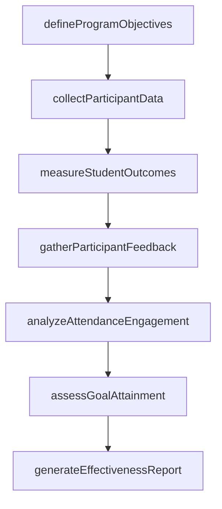
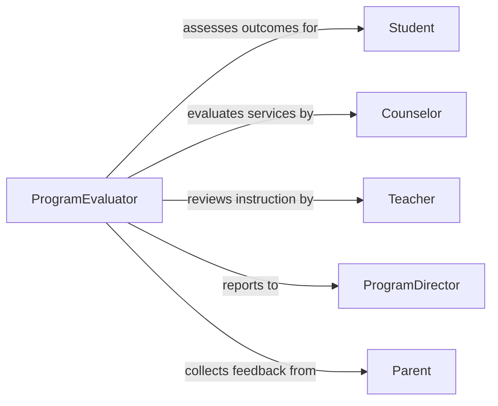

# Evaluate Effectiveness Counseling Educational Programs

> Business-as-Code definition for assessing counseling and educational program outcomes. Models the evaluation process for student services, curriculum effectiveness, and learning interventions.

## Overview

Counseling and educational program evaluation involves assessing participant outcomes, learning achievements, satisfaction levels, and goal attainment. This definition exposes actions for collecting program data, analyzing student performance, gathering feedback, and measuring effectiveness to support continuous improvement and evidence-based program design.

## Actors

| Actor | Description |
|-------|-------------|
| Student | Learner participating in educational program |
| Counselor | Professional providing guidance services |
| Teacher | Instructor delivering curriculum |
| ProgramDirector | Administrator overseeing program operations |
| Parent | Family member providing feedback on services |
| Accreditor | External body evaluating program standards |

## Roles

| Role | Description |
|------|-------------|
| ProgramEvaluator | Conducts systematic program assessments |
| OutcomesAnalyst | Analyzes student achievement and growth data |
| SurveyCoordinator | Collects feedback from participants |
| CurriculumSpecialist | Evaluates educational content effectiveness |

## Entities

| Entity | Description |
|--------|-------------|
| ProgramEvaluation | Assessment of educational or counseling initiative |
| StudentOutcome | Measurement of learning achievement or growth |
| ParticipantFeedback | Survey responses from students or families |
| AttendanceRecord | Documentation of program participation rates |
| GoalAttainment | Measurement of individual student objectives |
| EffectivenessMetric | Quantitative measure of program success |

## Actions

| Action | Description |
|--------|-------------|
| defineProgram Objectives | Establish measurable goals for evaluation |
| collectParticipantData | Gather demographics and baseline assessments |
| measureStudentOutcomes | Analyze learning gains or counseling results |
| gatherParticipantFeedback | Survey students, families, and staff |
| analyzeAttendanceEngagement | Review participation and retention rates |
| assessGoalAttainment | Measure achievement of individual objectives |
| generateEffectivenessReport | Create formal evaluation findings |

## Events

| Event | Description |
|-------|-------------|
| programObjectivesDefined | Evaluation goals established |
| participantDataCollected | Demographics and baselines gathered |
| studentOutcomesMeasured | Learning or counseling results analyzed |
| participantFeedbackGathered | Survey responses collected |
| attendanceEngagementAnalyzed | Participation patterns reviewed |
| goalAttainmentAssessed | Individual objectives measured |
| effectivenessReportGenerated | Formal findings published |

## Searches

| Search | Description |
|--------|-------------|
| findEvaluations | Retrieve program assessments by type or period |
| getStudentOutcomes | Search achievement data by program |
| getParticipantFeedback | Retrieve survey responses by demographics |
| getAttendanceMetrics | Find participation rates by program |

## Workflow



## Actor Relationships



## Usage

### Calling Actions

```typescript
import { evaluateEffectivenessCounselingEducationalPrograms } from '@headlessly/evaluate-effectiveness-counseling-educational-programs'

const programs = evaluateEffectivenessCounselingEducationalPrograms()

// Define objectives for college readiness program
const objectives = await programs.defineProgramObjectives({
  programId: 'PROG-COLLEGE-READY-2026',
  programName: 'College Readiness Initiative',
  targetPopulation: 'high-school-juniors-seniors',
  goals: [
    { metric: 'college-application-completion', target: 0.95 },
    { metric: 'fafsa-submission-rate', target: 0.90 },
    { metric: 'college-acceptance-rate', target: 0.85 }
  ]
})

// Collect participant baseline data
const participants = await programs.collectParticipantData({
  programId: 'PROG-COLLEGE-READY-2026',
  cohortSize: 240,
  demographics: {
    firstGeneration: 0.68,
    freeReducedLunch: 0.72,
    underrepresentedMinority: 0.58
  },
  baselineGPA: 2.84
})

// Measure student outcomes
const outcomes = await programs.measureStudentOutcomes({
  programId: 'PROG-COLLEGE-READY-2026',
  results: {
    applicationCompletionRate: 0.96,
    fafsaSubmissionRate: 0.91,
    collegeAcceptanceRate: 0.88,
    averageScholarshipAmount: 12500
  }
})

// Gather participant feedback
const feedback = await programs.gatherParticipantFeedback({
  programId: 'PROG-COLLEGE-READY-2026',
  surveyResponseRate: 0.83,
  satisfactionRating: 4.6,
  themes: ['helpful-counseling', 'application-support', 'financial-aid-guidance']
})

// Generate effectiveness report
const report = await programs.generateEffectivenessReport({
  programId: 'PROG-COLLEGE-READY-2026',
  findings: 'Program exceeded all target goals, strong participant satisfaction, significant impact on first-generation students',
  recommendations: ['Expand to additional high schools', 'Increase financial aid workshop frequency', 'Add peer mentoring component']
})
```

### Event-Driven Automation

```typescript
// Alert when outcomes fall short of goals
programs.studentOutcomesMeasured(async ({ programId, results, goals }) => {
  const missedGoals = goals.filter(g => results[g.metric] < g.target)
  if (missedGoals.length > 0) {
    await notify({
      to: 'program-director',
      message: `Program ${programId} missed ${missedGoals.length} outcome targets, recommend program review`
    })
  }
})

// Flag low attendance programs
programs.attendanceEngagementAnalyzed(async ({ programId, attendanceRate }) => {
  if (attendanceRate < 0.70) {
    await notify({
      to: 'program-team',
      message: `Program ${programId} has low attendance (${attendanceRate * 100}%), investigate engagement barriers`
    })
  }
})

// Auto-publish successful program evaluations
programs.effectivenessReportGenerated(async ({ programId, findings, results }) => {
  const allGoalsMet = Object.values(results).every((v, i) => v >= objectives.goals[i].target)
  if (allGoalsMet) {
    await publishReport({
      programId,
      report: findings,
      audience: 'stakeholders-and-funders'
    })
  }
})
```
