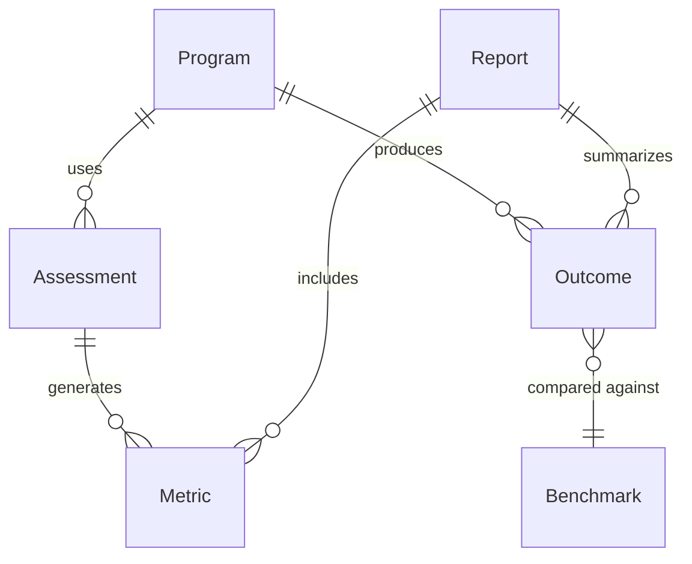
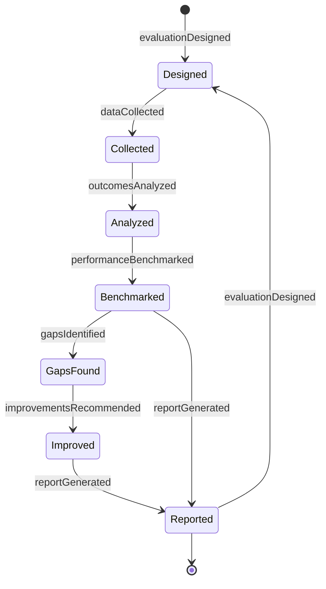
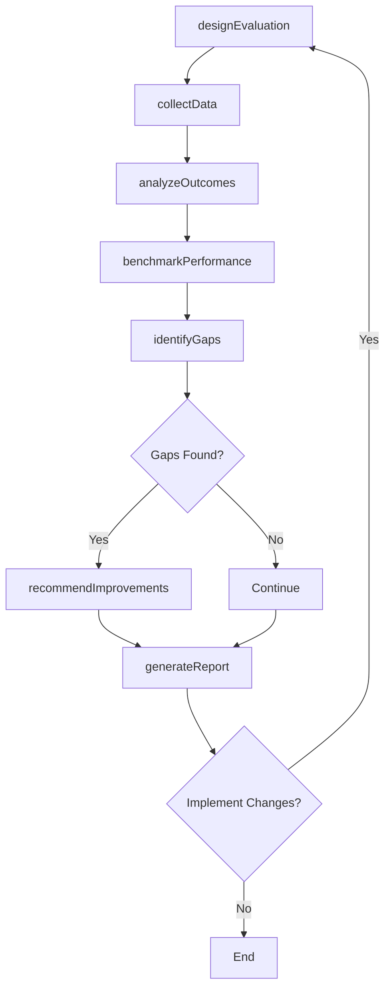
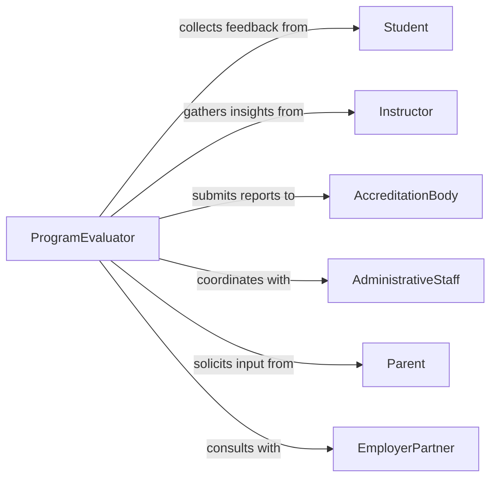

# Evaluate Effectiveness Educational Programs

> Business-as-Code definition for educational program evaluation. Models the assessment of learning outcomes, program impact, and continuous improvement through systematic measurement and analysis.

## Overview

Educational program effectiveness evaluation involves measuring learning outcomes, assessing instructional quality, analyzing student performance data, and identifying areas for improvement. This definition exposes actions for data collection, analysis, reporting, and evidence-based program enhancement.

## Actors

| Actor | Description |
|-------|-------------|
| Student | Participates in programs and provides performance data |
| Instructor | Delivers instruction and provides feedback on program |
| AccreditationBody | Reviews program against standards and requirements |
| AdministrativeStaff | Supports data collection and program operations |
| Parent | Provides feedback on student outcomes and satisfaction |
| EmployerPartner | Assesses graduate readiness and skill alignment |

## Roles

| Role | Description |
|------|-------------|
| ProgramEvaluator | Oversees evaluation design and implementation |
| InstructionalDesigner | Analyzes results and recommends improvements |
| DataAnalyst | Collects and analyzes performance metrics |
| CurriculumDirector | Makes decisions on program modifications |

## Entities

| Entity | Description |
|--------|-------------|
| Program | An educational offering with defined learning outcomes |
| Assessment | A test or evaluation instrument measuring learning |
| Outcome | A measurable result of program participation |
| Metric | A quantitative indicator of program performance |
| Report | A summary of evaluation findings and recommendations |
| Benchmark | A standard for comparing program performance |

## Actions

| Action | Description |
|--------|-------------|
| designEvaluation | Create evaluation framework and data collection plan |
| collectData | Gather assessment results and survey responses |
| analyzeOutcomes | Measure learning outcomes against objectives |
| benchmarkPerformance | Compare program results to standards or peers |
| identifyGaps | Find areas where program falls short of goals |
| generateReport | Produce evaluation findings and recommendations |
| recommendImprovements | Suggest evidence-based program enhancements |

## Events

| Event | Description |
|-------|-------------|
| evaluationDesigned | Evaluation framework has been created |
| dataCollected | Assessment and survey data has been gathered |
| outcomesAnalyzed | Learning outcomes have been measured |
| performanceBenchmarked | Program compared to standards or peers |
| gapsIdentified | Areas for improvement have been found |
| reportGenerated | Evaluation report has been published |
| improvementsRecommended | Enhancement suggestions have been documented |

## Searches

| Search | Description |
|--------|-------------|
| findPrograms | List programs by subject, level, or evaluation status |
| getOutcomes | Retrieve learning outcomes for specific programs |
| getMetrics | Find performance metrics by program or timeframe |
| getBenchmarks | Get comparison standards for program types |

## Entity Relationships



## State Diagram



## Workflow



## Actor Relationships



## Usage

### Calling Actions

```typescript
import { evaluateEffectivenessEducationalPrograms } from '@headlessly/evaluate-effectiveness-educational-programs'

const evaluation = evaluateEffectivenessEducationalPrograms()

// Design evaluation framework for a program
const framework = await evaluation.designEvaluation({
  programId: 'nursing-bsn-2026',
  outcomes: ['clinical-competency', 'critical-thinking', 'patient-safety'],
  methods: ['exams', 'simulations', 'surveys'],
  timeline: { start: '2026-01-01', end: '2026-06-30' }
})

// Collect performance data
await evaluation.collectData({
  evaluationId: framework.id,
  sources: ['final-exams', 'course-evaluations', 'employer-surveys']
})

// Analyze outcomes and benchmark
const analysis = await evaluation.analyzeOutcomes({
  evaluationId: framework.id,
  outcomeIds: ['clinical-competency', 'critical-thinking']
})

await evaluation.benchmarkPerformance({
  evaluationId: framework.id,
  benchmarkType: 'national-standards',
  comparisonSet: 'peer-institutions'
})
```

### Event-Driven Automation

```typescript
// Alert when gaps are identified
evaluation.gapsIdentified(async ({ evaluationId, gaps, program }) => {
  if (gaps.some(g => g.severity === 'critical')) {
    await notify({
      to: 'curriculum-director',
      message: `Critical gaps found in ${program.name}: ${gaps.map(g => g.area).join(', ')}`
    })
  }
})

// Generate report when analysis completes
evaluation.performanceBenchmarked(async ({ evaluationId }) => {
  const gaps = await evaluation.identifyGaps({ evaluationId })
  await evaluation.generateReport({ evaluationId, includeRecommendations: true })
})
```
