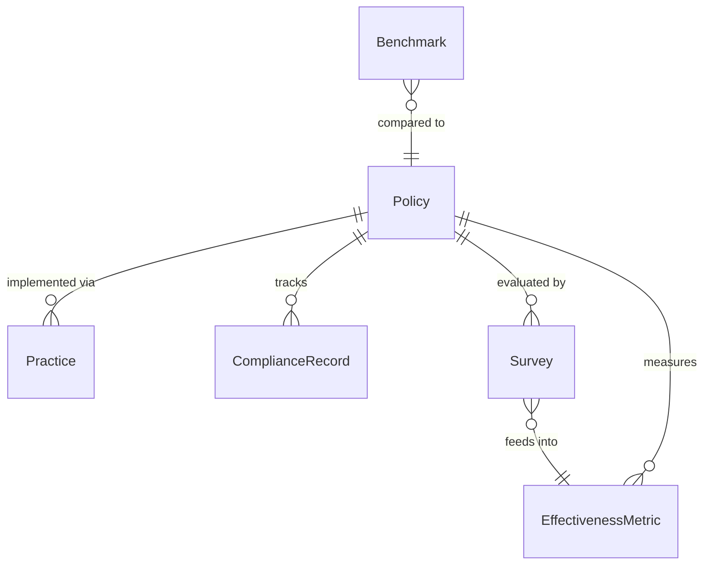
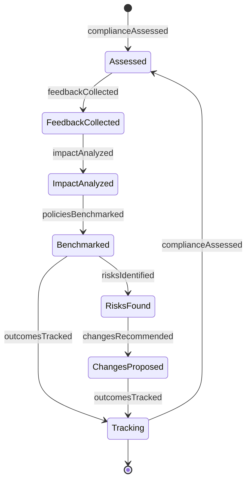
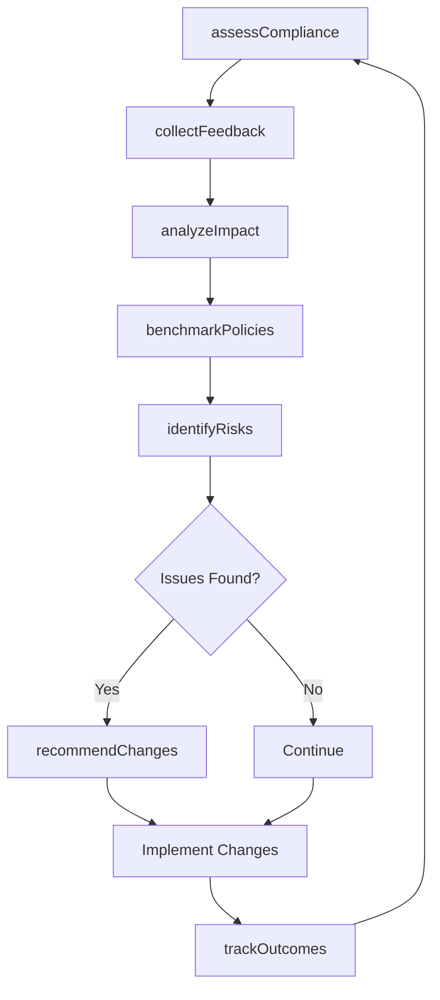
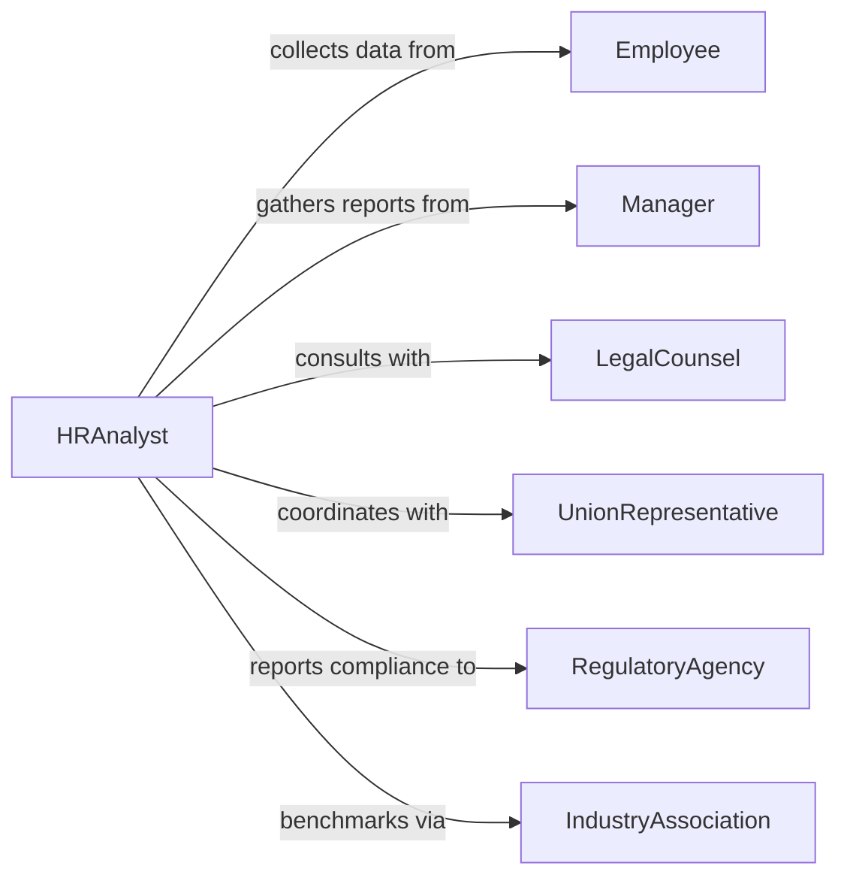

# Evaluate Effectiveness Personnel Policies Practices

> Business-as-Code definition for personnel policy evaluation. Models the systematic assessment of HR policies and practices through compliance monitoring, impact analysis, and continuous improvement.

## Overview

Personnel policy effectiveness evaluation involves measuring policy compliance, analyzing impact on employee outcomes, assessing legal alignment, and identifying opportunities for policy enhancement. This definition exposes actions for data collection, analysis, benchmarking, and evidence-based policy improvement across recruitment, retention, compensation, and workplace practices.

## Actors

| Actor | Description |
|-------|-------------|
| Employee | Subject to policies and provides compliance data |
| Manager | Implements policies and reports on effectiveness |
| LegalCounsel | Advises on regulatory compliance and risk |
| UnionRepresentative | Advocates for workforce interests in policy matters |
| RegulatoryAgency | Enforces labor laws and standards |
| IndustryAssociation | Provides benchmarking data and best practices |

## Roles

| Role | Description |
|------|-------------|
| HRAnalyst | Collects and analyzes policy effectiveness data |
| ComplianceOfficer | Monitors adherence to policies and regulations |
| HRDirector | Oversees policy evaluation and improvement |
| TalentManager | Assesses impact on recruitment and retention |

## Entities

| Entity | Description |
|--------|-------------|
| Policy | A formal rule governing personnel matters |
| Practice | A standard procedure for implementing policies |
| ComplianceRecord | Documentation of policy adherence or violations |
| EffectivenessMetric | A measure of policy impact on outcomes |
| Survey | Employee feedback on policy satisfaction |
| Benchmark | Industry or peer comparison standard |

## Actions

| Action | Description |
|--------|-------------|
| assessCompliance | Measure adherence to policies across organization |
| collectFeedback | Gather employee and manager input on policies |
| analyzeImpact | Measure policy effects on retention, satisfaction, and performance |
| benchmarkPolicies | Compare policies to industry standards and peers |
| identifyRisks | Find legal or operational risks in current policies |
| recommendChanges | Propose evidence-based policy modifications |
| trackOutcomes | Monitor results after policy changes |

## Events

| Event | Description |
|-------|-------------|
| complianceAssessed | Policy adherence has been measured |
| feedbackCollected | Employee input has been gathered |
| impactAnalyzed | Policy effects have been quantified |
| policiesBenchmarked | Comparison to standards completed |
| risksIdentified | Legal or operational issues found |
| changesRecommended | Policy modifications proposed |
| outcomesTracked | Post-implementation results recorded |

## Searches

| Search | Description |
|--------|-------------|
| findPolicies | List policies by type, department, or status |
| getCompliance | Retrieve compliance rates by policy or unit |
| getFeedback | Get employee survey results for policies |
| getBenchmarks | Find industry standards for policy comparison |

## Entity Relationships



## State Diagram



## Workflow



## Actor Relationships



## Usage

### Calling Actions

```typescript
import { evaluateEffectivenessPersonnelPoliciesPractices } from '@headlessly/evaluate-effectiveness-personnel-policies-practices'

const policies = evaluateEffectivenessPersonnelPoliciesPractices()

// Assess compliance across organization
const compliance = await policies.assessCompliance({
  policyIds: ['remote-work-2024', 'pto-accrual', 'performance-review'],
  period: { start: '2025-01-01', end: '2025-12-31' },
  units: ['engineering', 'sales', 'operations']
})

// Collect employee feedback
await policies.collectFeedback({
  surveyType: 'policy-satisfaction',
  policyIds: ['remote-work-2024'],
  targetPopulation: 'all-employees'
})

// Analyze impact on retention
const impact = await policies.analyzeImpact({
  policyId: 'remote-work-2024',
  metrics: ['turnover-rate', 'satisfaction-score', 'productivity-index'],
  comparisonPeriod: 'pre-policy'
})
```

### Event-Driven Automation

```typescript
// Alert on compliance issues
policies.risksIdentified(async ({ policyId, risks }) => {
  const criticalRisks = risks.filter(r => r.severity === 'high')
  if (criticalRisks.length > 0) {
    await notify({
      to: 'compliance-officer',
      message: `High-severity risks found in ${policyId}: ${criticalRisks.map(r => r.description).join(', ')}`
    })
  }
})

// Automatically track outcomes after changes
policies.changesRecommended(async ({ policyId, changes }) => {
  await scheduleTask({
    action: 'trackOutcomes',
    policyId,
    startDate: addMonths(new Date(), 3),
    frequency: 'quarterly'
  })
})
```
