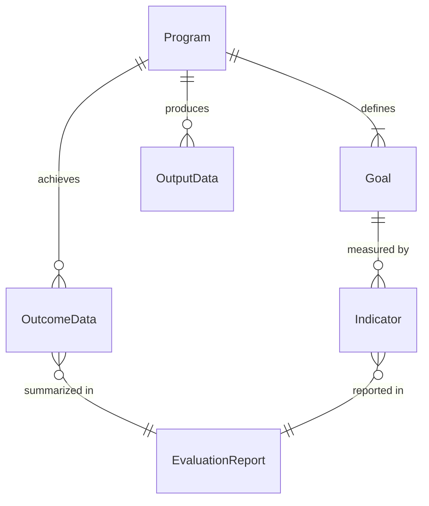
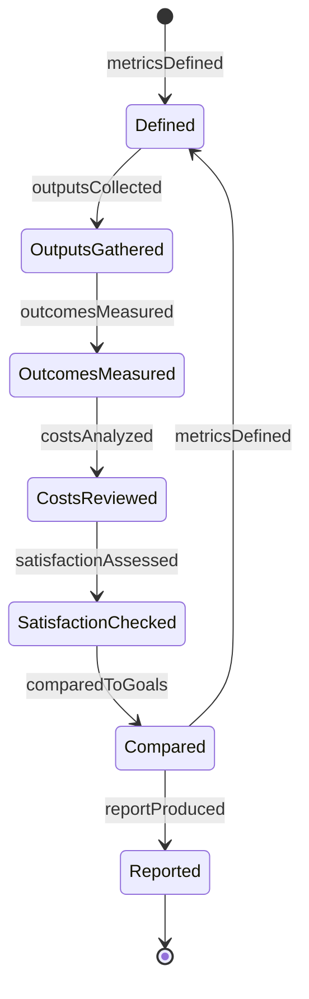
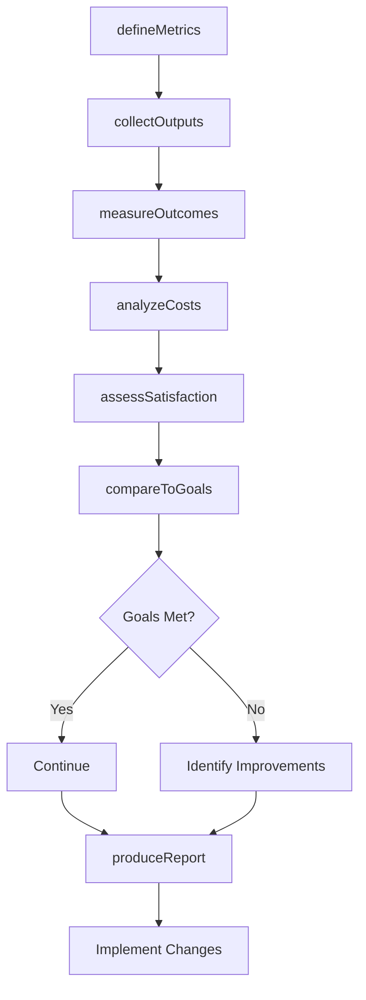
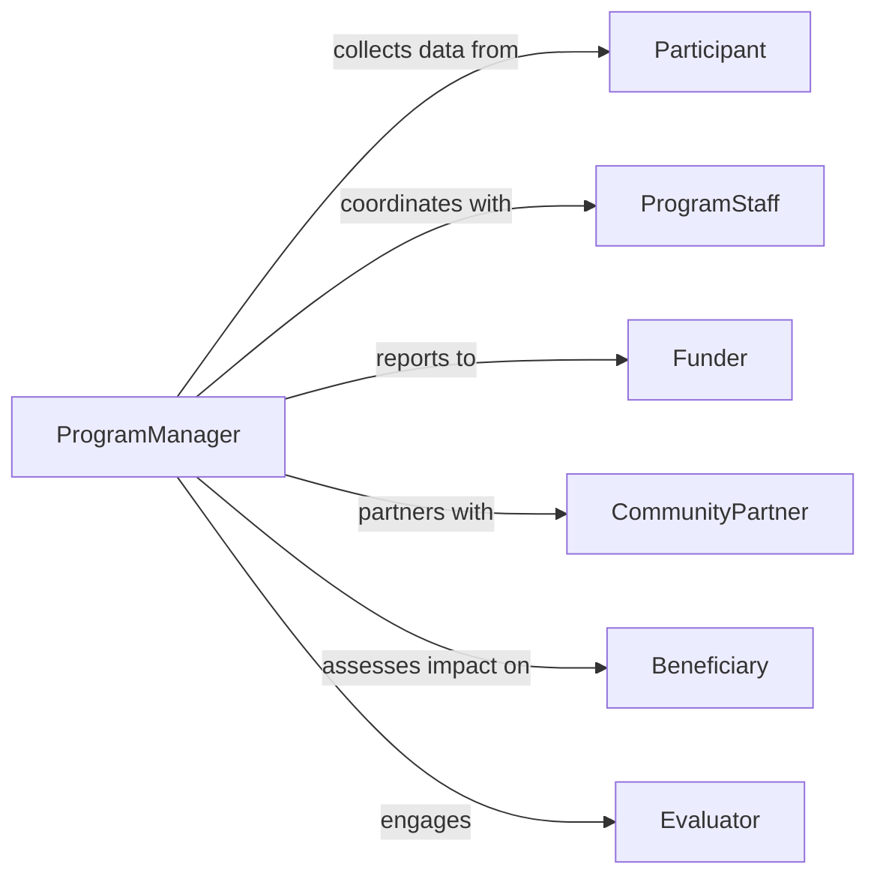

# Evaluate Program Effectiveness

> Business-as-Code definition for program effectiveness evaluation. Models the comprehensive assessment of program outcomes, ROI, stakeholder satisfaction, and impact against strategic objectives.

## Overview

Program effectiveness evaluation involves measuring program outcomes against goals, analyzing cost-benefit ratios, assessing stakeholder satisfaction, and identifying optimization opportunities. This definition exposes actions for outcome measurement, impact analysis, reporting, and continuous program improvement across operational, social, and strategic initiatives.

## Actors

| Actor | Description |
|-------|-------------|
| Participant | Receives program services and provides outcome data |
| ProgramStaff | Delivers program activities and reports on operations |
| Funder | Provides resources and requires accountability |
| CommunityPartner | Collaborates on delivery and shares impact data |
| Beneficiary | Receives indirect benefits from program activities |
| Evaluator | Conducts independent assessment of program |

## Roles

| Role | Description |
|------|-------------|
| ProgramManager | Oversees program operations and evaluation |
| DataAnalyst | Collects and analyzes program performance data |
| StakeholderLiaison | Gathers feedback from participants and partners |
| StrategicPlanner | Aligns program evaluation with organizational goals |

## Entities

| Entity | Description |
|--------|-------------|
| Program | An organized set of activities with defined objectives |
| Goal | A specific outcome the program aims to achieve |
| Indicator | A measurable sign of progress toward goals |
| OutputData | Quantitative measures of program activities |
| OutcomeData | Changes in participants resulting from program |
| EvaluationReport | Summary of findings and recommendations |

## Actions

| Action | Description |
|--------|-------------|
| defineMetrics | Establish indicators for measuring program success |
| collectOutputs | Gather data on program activities and reach |
| measureOutcomes | Assess changes in participants and beneficiaries |
| analyzeCosts | Calculate program expenses and cost-effectiveness |
| assessSatisfaction | Gather stakeholder feedback on program quality |
| compareToGoals | Measure actual results against stated objectives |
| produceReport | Generate evaluation findings and recommendations |

## Events

| Event | Description |
|-------|-------------|
| metricsDefined | Success indicators have been established |
| outputsCollected | Activity data has been gathered |
| outcomesMeasured | Participant changes have been assessed |
| costsAnalyzed | Financial analysis is complete |
| satisfactionAssessed | Stakeholder feedback collected |
| comparedToGoals | Results measured against objectives |
| reportProduced | Evaluation report has been published |

## Searches

| Search | Description |
|--------|-------------|
| findPrograms | List programs by type, status, or focus area |
| getOutputs | Retrieve activity data for specific programs |
| getOutcomes | Find outcome data by program or participant group |
| getReports | Access evaluation reports by program or timeframe |

## Entity Relationships



## State Diagram



## Workflow



## Actor Relationships



## Usage

### Calling Actions

```typescript
import { evaluateProgramEffectiveness } from '@headlessly/evaluate-program-effectiveness'

const evaluation = evaluateProgramEffectiveness()

// Define metrics for a youth workforce program
const metrics = await evaluation.defineMetrics({
  programId: 'youth-workforce-2026',
  goals: ['job-placement', 'skill-development', 'employer-satisfaction'],
  indicators: [
    { goal: 'job-placement', metric: 'employment-rate', target: 0.75 },
    { goal: 'skill-development', metric: 'certification-attainment', target: 0.80 },
    { goal: 'employer-satisfaction', metric: 'average-rating', target: 4.0 }
  ]
})

// Collect outputs and measure outcomes
await evaluation.collectOutputs({
  programId: 'youth-workforce-2026',
  period: { start: '2026-01-01', end: '2026-06-30' },
  metrics: ['participants-enrolled', 'training-hours-delivered']
})

const outcomes = await evaluation.measureOutcomes({
  programId: 'youth-workforce-2026',
  indicators: ['employment-rate', 'certification-attainment'],
  followUpPeriod: '90-days'
})

// Compare to goals and produce report
await evaluation.compareToGoals({ programId: 'youth-workforce-2026' })
```

### Event-Driven Automation

```typescript
// Alert when goals are not met
evaluation.comparedToGoals(async ({ programId, results }) => {
  const unmetGoals = results.filter(r => r.actual < r.target)
  if (unmetGoals.length > 0) {
    await notify({
      to: 'program-manager',
      message: `Program ${programId} did not meet ${unmetGoals.length} goals`
    })
  }
})

// Automatically produce report after assessment
evaluation.satisfactionAssessed(async ({ programId }) => {
  await evaluation.compareToGoals({ programId })
  await evaluation.produceReport({
    programId,
    includeRecommendations: true,
    format: 'executive-summary'
  })
})
```
