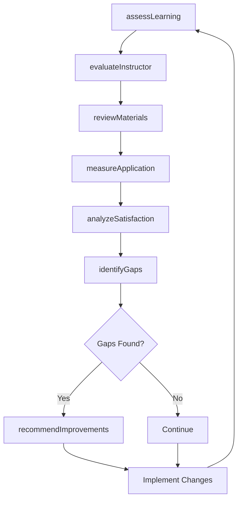
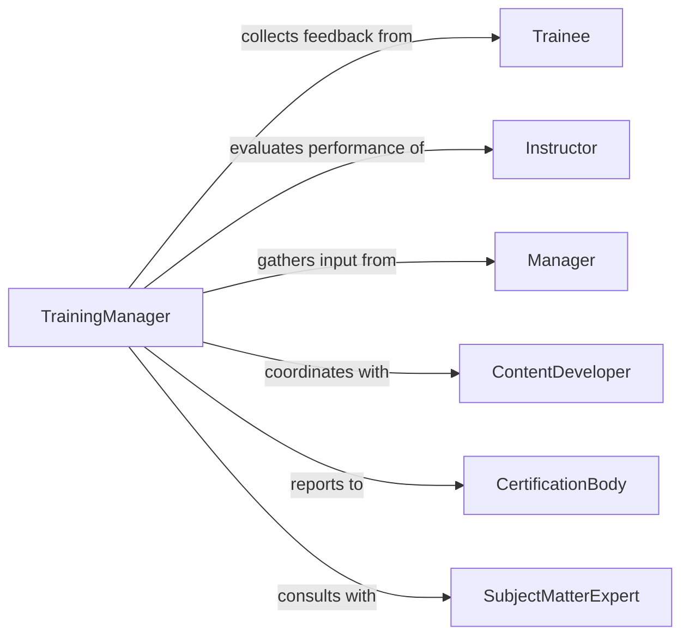

# Evaluate Training Programs Instructors Materials

> Business-as-Code definition for training evaluation. Models the systematic assessment of training effectiveness, instructor performance, and material quality through learner feedback, competency measurement, and continuous improvement.

## Overview

Training program evaluation involves measuring learning outcomes, assessing instructor effectiveness, reviewing material quality, analyzing participant satisfaction, and identifying improvement opportunities. This definition exposes actions for data collection, competency assessment, instructor evaluation, and evidence-based training enhancement across onboarding, compliance, and skill development programs.

## Actors

| Actor | Description |
|-------|-------------|
| Trainee | Participates in training and provides performance data |
| Instructor | Delivers training and receives evaluation feedback |
| Manager | Requests training and assesses on-job application |
| ContentDeveloper | Creates training materials and updates curriculum |
| CertificationBody | Validates training quality against standards |
| SubjectMatterExpert | Provides technical review of content accuracy |

## Roles

| Role | Description |
|------|-------------|
| TrainingManager | Oversees training evaluation and quality |
| InstructionalDesigner | Analyzes results and redesigns content |
| EvaluationSpecialist | Designs assessment instruments and collects data |
| CompetencyAnalyst | Measures skill development and application |

## Entities

| Entity | Description |
|--------|-------------|
| TrainingProgram | A structured learning intervention with objectives |
| Course | A specific session or module within a program |
| Material | Content resources used in training delivery |
| Assessment | A test or evaluation measuring learning |
| Feedback | Participant ratings and comments on training |
| CompetencyRecord | Documentation of skill mastery and application |

## Actions

| Action | Description |
|--------|-------------|
| assessLearning | Measure knowledge and skill acquisition |
| evaluateInstructor | Gather feedback on instructor effectiveness |
| reviewMaterials | Assess content quality, accuracy, and relevance |
| measureApplication | Track on-job use of trained skills |
| analyzeSatisfaction | Review participant ratings and feedback |
| identifyGaps | Find areas where training falls short |
| recommendImprovements | Propose evidence-based training enhancements |

## Events

| Event | Description |
|-------|-------------|
| learningAssessed | Knowledge and skills have been measured |
| instructorEvaluated | Instructor feedback has been collected |
| materialsReviewed | Content quality has been assessed |
| applicationMeasured | On-job skill use has been tracked |
| satisfactionAnalyzed | Participant ratings have been reviewed |
| gapsIdentified | Training deficiencies have been found |
| improvementsRecommended | Enhancement proposals documented |

## Searches

| Search | Description |
|--------|-------------|
| findPrograms | List training programs by topic, level, or status |
| getFeedback | Retrieve participant ratings for courses or instructors |
| getAssessments | Find learning assessment results by program |
| getInstructors | List instructors with performance ratings |

## Workflow



## Actor Relationships



## Usage

### Calling Actions

```typescript
import { evaluateTrainingProgramsInstructorsMaterials } from '@headlessly/evaluate-training-programs-instructors-materials'

const training = evaluateTrainingProgramsInstructorsMaterials()

// Assess learning from a compliance training
const learning = await training.assessLearning({
  programId: 'safety-compliance-2026',
  courseId: 'hazmat-handling',
  trainees: ['emp-1234', 'emp-5678'],
  assessmentType: 'post-test',
  passingScore: 80
})

// Evaluate instructor effectiveness
await training.evaluateInstructor({
  instructorId: 'inst-101',
  courseId: 'hazmat-handling',
  evaluationDate: '2026-06-15',
  participants: ['emp-1234', 'emp-5678'],
  criteria: ['clarity', 'engagement', 'knowledge', 'responsiveness']
})

// Review training materials
const materials = await training.reviewMaterials({
  programId: 'safety-compliance-2026',
  reviewers: ['sme-202', 'id-303'],
  criteria: ['accuracy', 'relevance', 'clarity', 'accessibility']
})

// Measure on-job application
await training.measureApplication({
  programId: 'safety-compliance-2026',
  trainees: ['emp-1234'],
  observationPeriod: '30-days',
  competencies: ['proper-ppe-use', 'spill-response']
})
```

### Event-Driven Automation

```typescript
// Alert on low instructor ratings
training.instructorEvaluated(async ({ instructorId, courseId, ratings }) => {
  const avgRating = ratings.reduce((sum, r) => sum + r.score, 0) / ratings.length
  if (avgRating < 3.5) {
    await notify({
      to: 'training-manager',
      message: `Instructor ${instructorId} rated ${avgRating}/5 in ${courseId}`
    })
  }
})

// Automatically recommend improvements when gaps found
training.gapsIdentified(async ({ programId, gaps }) => {
  const recommendations = gaps.map(gap => ({
    area: gap.area,
    suggestion: generateRecommendation(gap)
  }))
  await training.recommendImprovements({ programId, recommendations })
})
```
