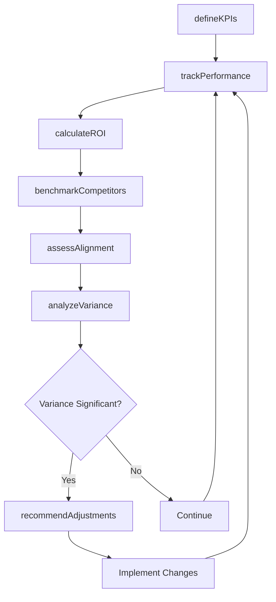
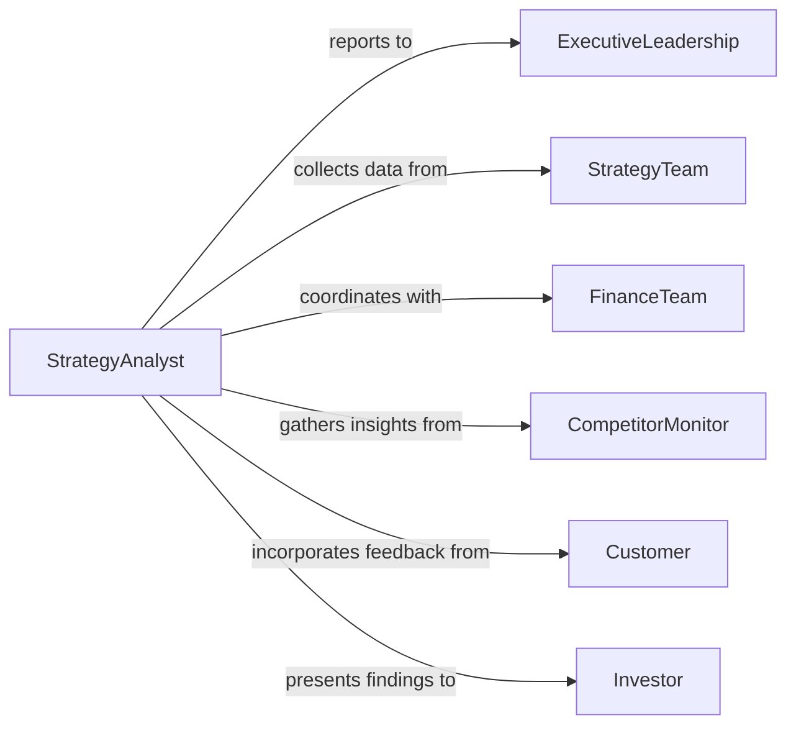

# Measure Effectiveness Business Strategies Practices

> Business-as-Code definition for business strategy measurement. Models the systematic evaluation of strategy performance through KPI tracking, ROI analysis, competitive benchmarking, and strategic alignment assessment.

## Overview

Business strategy effectiveness measurement involves tracking key performance indicators, analyzing return on strategic investments, assessing competitive positioning, and measuring alignment with organizational objectives. This definition exposes actions for metric definition, data collection, performance analysis, and evidence-based strategy adjustment across market expansion, operational efficiency, and innovation initiatives.

## Actors

| Actor | Description |
|-------|-------------|
| ExecutiveLeadership | Sets strategy and reviews performance |
| StrategyTeam | Implements strategic initiatives and reports progress |
| FinanceTeam | Provides financial data and ROI analysis |
| CompetitorMonitor | Tracks competitive landscape and benchmarks |
| Customer | Provides market feedback on strategic positioning |
| Investor | Evaluates strategy effectiveness and returns |

## Roles

| Role | Description |
|------|-------------|
| StrategyAnalyst | Measures strategy performance against targets |
| PerformanceManager | Oversees KPI tracking and reporting |
| BusinessIntelligence | Analyzes market data and competitive position |
| ChiefStrategyOfficer | Owns strategy evaluation and adjustment |

## Entities

| Entity | Description |
|--------|-------------|
| Strategy | A high-level plan for achieving business objectives |
| Initiative | A specific project or program executing strategy |
| KPI | A key performance indicator measuring strategy progress |
| Metric | A quantitative measure of business performance |
| Benchmark | A comparison standard for industry or competitors |
| Dashboard | A visualization of strategy performance data |

## Actions

| Action | Description |
|--------|-------------|
| defineKPIs | Establish metrics for measuring strategy success |
| trackPerformance | Collect and monitor data on strategic indicators |
| calculateROI | Measure financial return on strategic investments |
| benchmarkCompetitors | Compare performance to industry peers |
| assessAlignment | Evaluate strategy fit with organizational goals |
| analyzeVariance | Identify gaps between planned and actual results |
| recommendAdjustments | Propose evidence-based strategy modifications |

## Events

| Event | Description |
|-------|-------------|
| kpisDefined | Success metrics have been established |
| performanceTracked | Strategic indicator data collected |
| roiCalculated | Financial returns have been measured |
| competitorsBenchmarked | Comparison to peers completed |
| alignmentAssessed | Strategy-goal fit evaluated |
| varianceAnalyzed | Performance gaps identified |
| adjustmentsRecommended | Strategy changes proposed |

## Searches

| Search | Description |
|--------|-------------|
| findStrategies | List strategies by type, status, or focus area |
| getKPIs | Retrieve performance indicators for strategies |
| getMetrics | Find performance data by strategy or timeframe |
| getBenchmarks | Access competitive comparison data |

## Workflow



## Actor Relationships



## Usage

### Calling Actions

```typescript
import { measureEffectivenessBusinessStrategiesPractices } from '@headlessly/measure-effectiveness-business-strategies-practices'

const strategy = measureEffectivenessBusinessStrategiesPractices()

// Define KPIs for market expansion strategy
const kpis = await strategy.defineKPIs({
  strategyId: 'apac-expansion-2026',
  objectives: ['revenue-growth', 'market-share', 'customer-acquisition'],
  indicators: [
    { objective: 'revenue-growth', kpi: 'apac-revenue', target: 50000000, unit: 'usd' },
    { objective: 'market-share', kpi: 'market-penetration', target: 0.15, unit: 'percentage' },
    { objective: 'customer-acquisition', kpi: 'new-customers', target: 5000, unit: 'count' }
  ]
})

// Track performance and calculate ROI
await strategy.trackPerformance({
  strategyId: 'apac-expansion-2026',
  period: { start: '2026-01-01', end: '2026-06-30' },
  kpiIds: ['apac-revenue', 'market-penetration', 'new-customers']
})

const roi = await strategy.calculateROI({
  strategyId: 'apac-expansion-2026',
  investment: 10000000,
  returns: { revenue: 25000000, costSavings: 0 },
  timeframe: '6-months'
})

// Benchmark against competitors
await strategy.benchmarkCompetitors({
  strategyId: 'apac-expansion-2026',
  competitors: ['competitor-a', 'competitor-b'],
  metrics: ['market-share', 'revenue-growth']
})
```

### Event-Driven Automation

```typescript
// Alert on significant variance
strategy.varianceAnalyzed(async ({ strategyId, variances }) => {
  const significantGaps = variances.filter(v => Math.abs(v.percentDiff) > 20)
  if (significantGaps.length > 0) {
    await notify({
      to: 'chief-strategy-officer',
      message: `Strategy ${strategyId} has ${significantGaps.length} KPIs off target by >20%`
    })
  }
})

// Automatically recommend adjustments for underperforming strategies
strategy.competitorsBenchmarked(async ({ strategyId, comparison }) => {
  const underperforming = comparison.metrics.filter(m => m.rank > 3)
  if (underperforming.length > 0) {
    await strategy.recommendAdjustments({
      strategyId,
      focus: underperforming.map(m => m.name),
      rationale: 'competitive-positioning'
    })
  }
})
```
