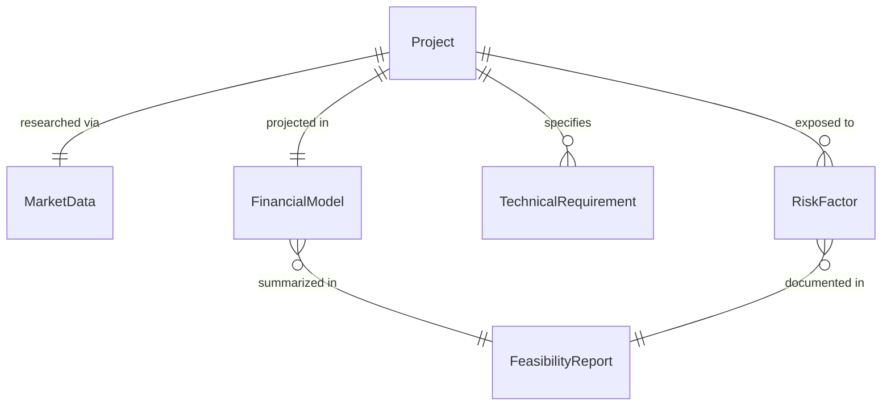
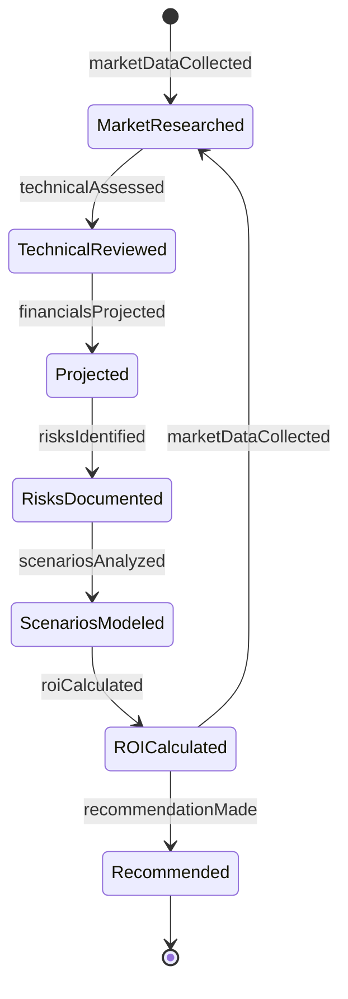
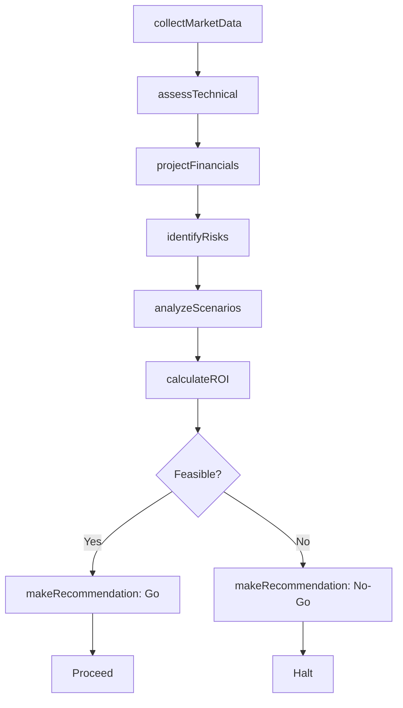
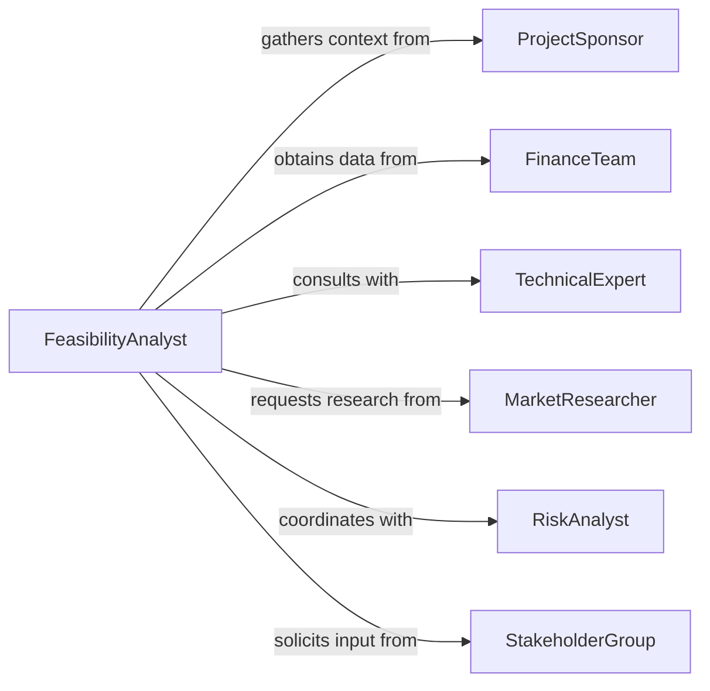

# Analyze Data Determine Project Feasibility

> Business-as-Code definition for project feasibility analysis. Models the systematic evaluation of project viability through market data, financial projections, technical assessment, and risk analysis.

## Overview

Project feasibility analysis involves collecting and analyzing market research, financial data, technical requirements, and risk factors to determine whether a proposed project should proceed. This definition exposes actions for data collection, financial modeling, risk assessment, and feasibility determination across product launches, capital projects, and strategic initiatives.

## Actors

| Actor | Description |
|-------|-------------|
| ProjectSponsor | Proposes project and provides strategic context |
| FinanceTeam | Provides financial data and budget constraints |
| TechnicalExpert | Assesses technical requirements and challenges |
| MarketResearcher | Supplies market data and competitive intelligence |
| RiskAnalyst | Identifies and quantifies project risks |
| StakeholderGroup | Represents affected parties and provides input |

## Roles

| Role | Description |
|------|-------------|
| FeasibilityAnalyst | Leads analysis and synthesizes findings |
| DataAnalyst | Collects and processes feasibility data |
| FinancialModeler | Develops financial projections and scenarios |
| DecisionMaker | Reviews analysis and approves project decisions |

## Entities

| Entity | Description |
|--------|-------------|
| Project | A proposed initiative requiring feasibility assessment |
| MarketData | Research on demand, competition, and trends |
| FinancialModel | Projections of costs, revenues, and returns |
| TechnicalRequirement | Specifications and capabilities needed |
| RiskFactor | A potential threat to project success |
| FeasibilityReport | Summary of analysis and recommendations |

## Actions

| Action | Description |
|--------|-------------|
| collectMarketData | Gather research on demand and competition |
| assessTechnical | Evaluate technical requirements and feasibility |
| projectFinancials | Model costs, revenues, and investment returns |
| identifyRisks | Find threats to project success |
| analyzeScenarios | Test project viability under different conditions |
| calculateROI | Determine expected return on investment |
| makeRecommendation | Propose go/no-go decision with rationale |

## Events

| Event | Description |
|-------|-------------|
| marketDataCollected | Market research has been gathered |
| technicalAssessed | Technical feasibility evaluated |
| financialsProjected | Financial models completed |
| risksIdentified | Threat factors documented |
| scenariosAnalyzed | Multiple scenarios tested |
| roiCalculated | Return on investment determined |
| recommendationMade | Feasibility decision proposed |

## Searches

| Search | Description |
|--------|-------------|
| findProjects | List projects by status, type, or sponsor |
| getMarketData | Retrieve research data for specific markets |
| getFinancials | Access financial projections for projects |
| getRisks | Find risk factors by project or category |

## Entity Relationships



## State Diagram



## Workflow



## Actor Relationships



## Usage

### Calling Actions

```typescript
import { analyzeDataDetermineProjectFeasibility } from '@headlessly/analyze-data-determine-project-feasibility'

const feasibility = analyzeDataDetermineProjectFeasibility()

// Collect market data for new product launch
const marketData = await feasibility.collectMarketData({
  projectId: 'ai-assistant-launch',
  market: 'enterprise-productivity',
  scope: ['demand-forecast', 'competitor-analysis', 'pricing-research'],
  sources: ['gartner', 'idc', 'customer-surveys']
})

// Assess technical requirements
await feasibility.assessTechnical({
  projectId: 'ai-assistant-launch',
  requirements: ['model-hosting', 'api-infrastructure', 'data-security'],
  constraints: { timeline: '6-months', budget: 2000000 }
})

// Project financials and calculate ROI
await feasibility.projectFinancials({
  projectId: 'ai-assistant-launch',
  costs: { development: 2000000, marketing: 500000, operations: 300000 },
  revenue: { year1: 1000000, year2: 3000000, year3: 6000000 }
})

const roi = await feasibility.calculateROI({
  projectId: 'ai-assistant-launch',
  investmentPeriod: '3-years',
  discountRate: 0.10
})

// Analyze scenarios
await feasibility.analyzeScenarios({
  projectId: 'ai-assistant-launch',
  scenarios: [
    { name: 'optimistic', assumptions: { marketShare: 0.10, churnRate: 0.05 } },
    { name: 'baseline', assumptions: { marketShare: 0.05, churnRate: 0.10 } },
    { name: 'pessimistic', assumptions: { marketShare: 0.02, churnRate: 0.20 } }
  ]
})
```

### Event-Driven Automation

```typescript
// Alert on high-risk projects
feasibility.risksIdentified(async ({ projectId, risks }) => {
  const highRisks = risks.filter(r => r.severity === 'high')
  if (highRisks.length > 3) {
    await notify({
      to: 'decision-maker',
      message: `Project ${projectId} has ${highRisks.length} high-severity risks`
    })
  }
})

// Automatically make recommendation when ROI calculated
feasibility.roiCalculated(async ({ projectId, roi }) => {
  const decision = roi.npv > 0 && roi.irr > 0.15 ? 'go' : 'no-go'
  await feasibility.makeRecommendation({
    projectId,
    decision,
    rationale: `NPV: $${roi.npv.toLocaleString()}, IRR: ${(roi.irr * 100).toFixed(1)}%`
  })
})
```
