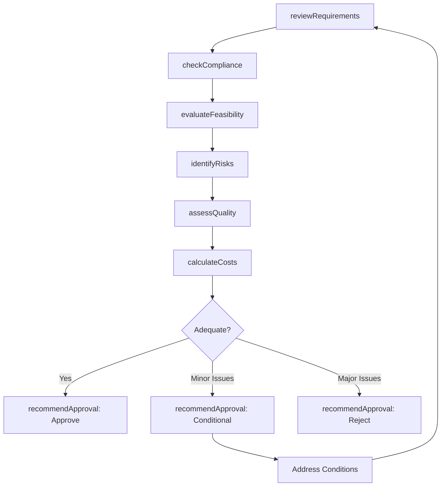
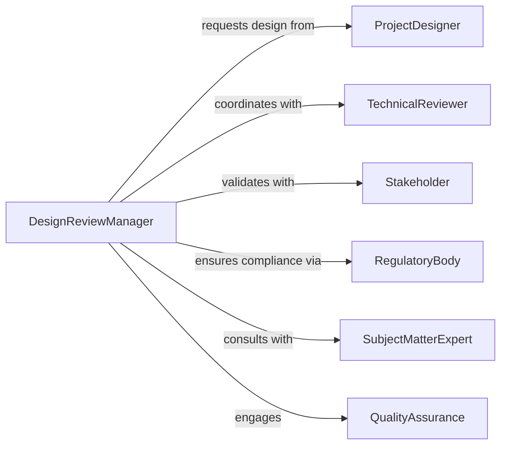

# Evaluate Project Designs Determine Adequacy

> Business-as-Code definition for project design evaluation. Models the comprehensive review of project plans against requirements, standards, constraints, and best practices to determine design adequacy and feasibility.

## Overview

Project design evaluation involves reviewing architectural plans, technical specifications, resource allocations, and timelines to determine whether a project design meets requirements and constraints. This definition exposes actions for requirements verification, standards compliance checking, risk assessment, and design approval across engineering, construction, IT, and business transformation projects.

## Actors

| Actor | Description |
|-------|-------------|
| ProjectDesigner | Creates project plans and specifications |
| TechnicalReviewer | Assesses technical aspects of design |
| Stakeholder | Provides requirements and acceptance criteria |
| RegulatoryBody | Enforces codes, standards, and regulations |
| SubjectMatterExpert | Validates domain-specific design elements |
| QualityAssurance | Reviews design for completeness and quality |

## Roles

| Role | Description |
|------|-------------|
| DesignReviewManager | Oversees evaluation process and decisions |
| RequirementsAnalyst | Verifies design against stated requirements |
| ComplianceOfficer | Checks adherence to standards and regulations |
| ArchitecturalReviewer | Evaluates overall design structure and approach |

## Entities

| Entity | Description |
|--------|-------------|
| ProjectDesign | A complete set of plans and specifications |
| Requirement | A stated need the design must satisfy |
| Standard | An industry or organizational guideline |
| Constraint | A limitation on project scope, cost, or schedule |
| ReviewCriteria | Specific measures for evaluating design |
| Finding | An issue or gap identified during review |

## Actions

| Action | Description |
|--------|-------------|
| reviewRequirements | Verify design satisfies all stated requirements |
| checkCompliance | Assess adherence to standards and regulations |
| evaluateFeasibility | Determine if design can be executed within constraints |
| identifyRisks | Find technical or operational threats in design |
| assessQuality | Review design completeness and documentation |
| calculateCosts | Estimate resources needed to execute design |
| recommendApproval | Propose approval, conditional approval, or rejection |

## Events

| Event | Description |
|-------|-------------|
| requirementsReviewed | Requirement verification completed |
| complianceChecked | Standards adherence assessed |
| feasibilityEvaluated | Executability determined |
| risksIdentified | Design threats documented |
| qualityAssessed | Completeness and quality reviewed |
| costsCalculated | Resource estimates completed |
| approvalRecommended | Approval decision proposed |

## Searches

| Search | Description |
|--------|-------------|
| findDesigns | List project designs by status, type, or designer |
| getRequirements | Retrieve requirements for specific projects |
| getFindings | Access review issues by design or severity |
| getStandards | Find applicable standards for project types |

## Workflow



## Actor Relationships



## Usage

### Calling Actions

```typescript
import { evaluateProjectDesignsDetermineAdequacy } from '@headlessly/evaluate-project-designs-determine-adequacy'

const designReview = evaluateProjectDesignsDetermineAdequacy()

// Review requirements for data center expansion
const requirements = await designReview.reviewRequirements({
  projectId: 'datacenter-expansion-2026',
  designVersion: 'v3.2',
  requirementIds: ['capacity-5mw', 'tier3-uptime', 'pue-1.4', 'n+1-redundancy']
})

// Check compliance with industry standards
await designReview.checkCompliance({
  projectId: 'datacenter-expansion-2026',
  standards: ['tia-942-rated-3', 'iso-27001', 'leed-gold'],
  regulations: ['local-building-code', 'electrical-code']
})

// Evaluate feasibility within constraints
const feasibility = await designReview.evaluateFeasibility({
  projectId: 'datacenter-expansion-2026',
  constraints: {
    budget: 50000000,
    timeline: '18-months',
    footprint: '100000-sqft'
  }
})

// Identify risks and assess quality
await designReview.identifyRisks({
  projectId: 'datacenter-expansion-2026',
  categories: ['technical', 'schedule', 'cost', 'operational']
})

const quality = await designReview.assessQuality({
  projectId: 'datacenter-expansion-2026',
  aspects: ['completeness', 'documentation', 'clarity', 'consistency']
})
```

### Event-Driven Automation

```typescript
// Alert on compliance failures
designReview.complianceChecked(async ({ projectId, results }) => {
  const failures = results.filter(r => r.status === 'non-compliant')
  if (failures.length > 0) {
    await notify({
      to: 'compliance-officer',
      message: `Design ${projectId} fails ${failures.length} compliance checks: ${failures.map(f => f.standard).join(', ')}`
    })
  }
})

// Automatically recommend approval based on evaluation
designReview.qualityAssessed(async ({ projectId, score }) => {
  const risks = await designReview.identifyRisks({ projectId })
  const highRisks = risks.filter(r => r.severity === 'high')

  let recommendation
  if (score > 90 && highRisks.length === 0) {
    recommendation = 'approve'
  } else if (score > 75 && highRisks.length < 3) {
    recommendation = 'conditional'
  } else {
    recommendation = 'reject'
  }

  await designReview.recommendApproval({ projectId, recommendation })
})
```
