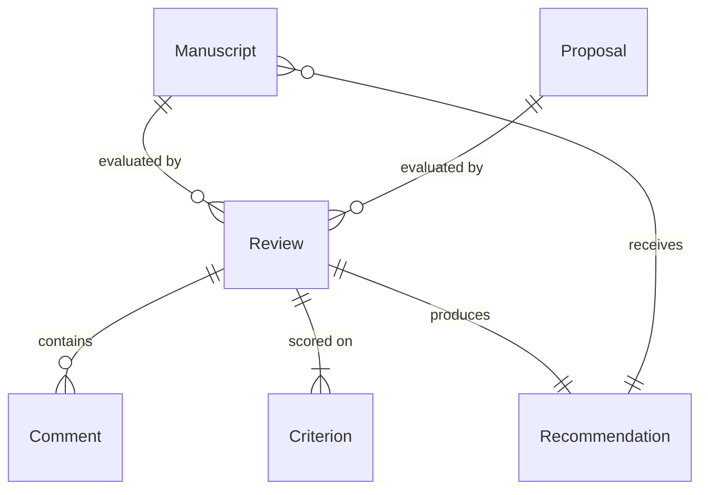
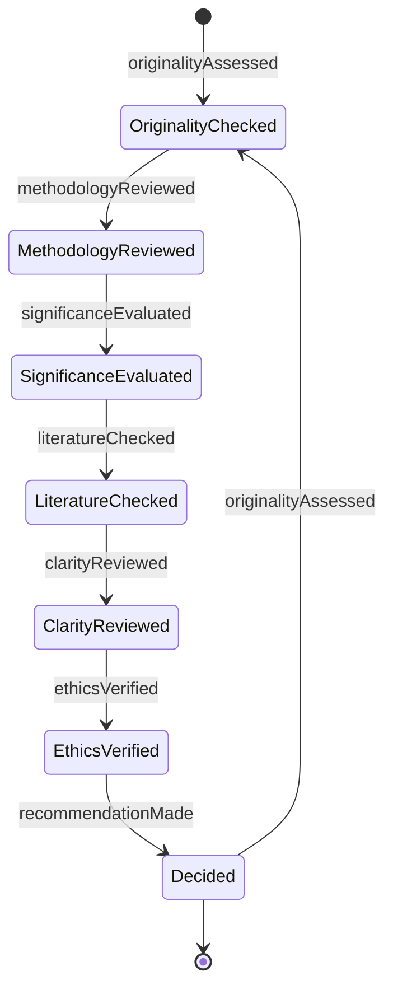
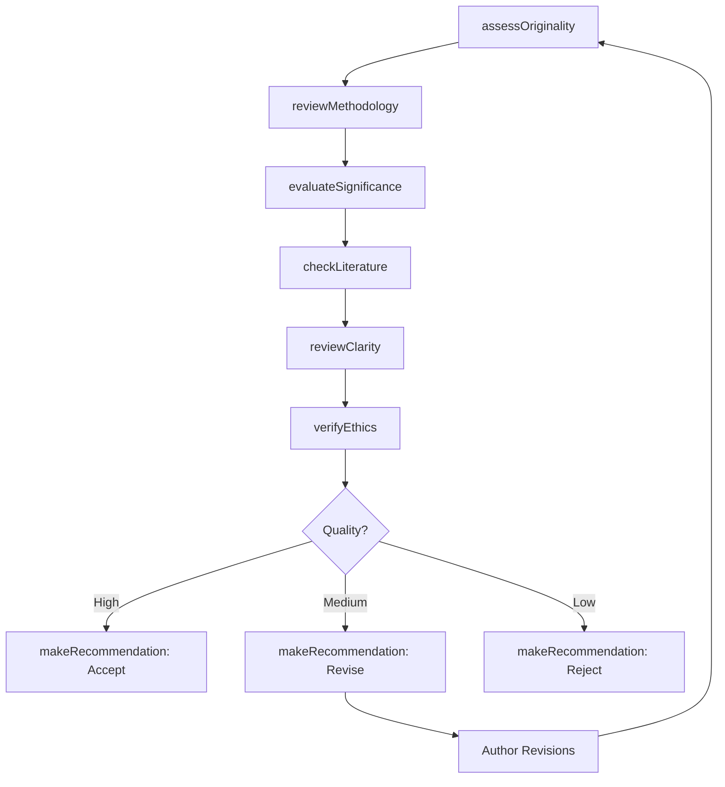
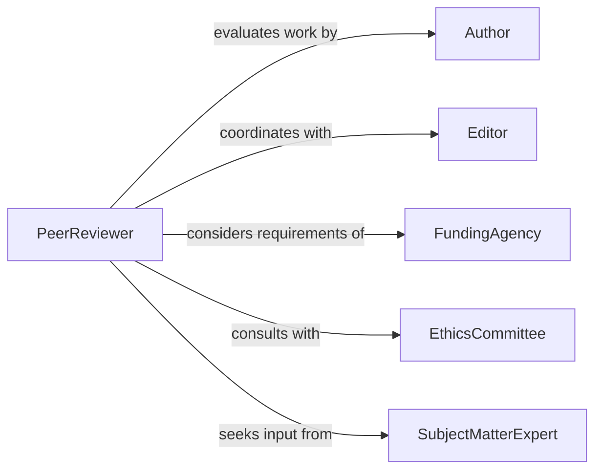

# Evaluate Scholarly Materials

> Business-as-Code definition for scholarly evaluation. Models the systematic peer review of research manuscripts, grant proposals, and academic work through methodological rigor assessment, originality evaluation, and publication recommendation.

## Overview

Scholarly materials evaluation involves assessing research quality, methodological soundness, originality, significance, and clarity of academic work for publication, funding, or presentation. This definition exposes actions for manuscript review, methodology critique, literature assessment, and recommendation generation across journals, conferences, and funding agencies.

## Actors

| Actor | Description |
|-------|-------------|
| Author | Creates scholarly work and responds to feedback |
| Reviewer | Evaluates work and provides expert assessment |
| Editor | Manages review process and makes publication decisions |
| FundingAgency | Evaluates proposals for grant awards |
| EthicsCommittee | Reviews research for ethical compliance |
| SubjectMatterExpert | Provides specialized domain expertise |

## Roles

| Role | Description |
|------|-------------|
| PeerReviewer | Conducts detailed evaluation of scholarly work |
| EditorialManager | Oversees review workflow and quality |
| MethodsSpecialist | Assesses research design and statistical rigor |
| EthicsReviewer | Evaluates compliance with research standards |

## Entities

| Entity | Description |
|--------|-------------|
| Manuscript | A scholarly paper submitted for publication |
| Proposal | A grant application requesting research funding |
| Review | A detailed evaluation of scholarly work |
| Criterion | A specific dimension for assessing quality |
| Comment | Feedback provided to authors for improvement |
| Recommendation | A decision on acceptance, revision, or rejection |

## Actions

| Action | Description |
|--------|-------------|
| assessOriginality | Evaluate novelty and contribution to field |
| reviewMethodology | Critique research design and analytical approach |
| evaluateSignificance | Determine importance and impact of findings |
| checkLiterature | Assess citation completeness and currency |
| reviewClarity | Evaluate writing quality and presentation |
| verifyEthics | Confirm compliance with research ethics standards |
| makeRecommendation | Propose acceptance, revision, or rejection |

## Events

| Event | Description |
|-------|-------------|
| originalityAssessed | Novelty evaluation completed |
| methodologyReviewed | Research design critiqued |
| significanceEvaluated | Impact assessment completed |
| literatureChecked | Citation review finished |
| clarityReviewed | Writing quality assessed |
| ethicsVerified | Ethics compliance confirmed |
| recommendationMade | Publication decision proposed |

## Searches

| Search | Description |
|--------|-------------|
| findSubmissions | List manuscripts or proposals by status or topic |
| getReviews | Retrieve reviewer assessments for submissions |
| getRecommendations | Access publication decisions by journal or date |
| getReviewers | Find available reviewers by expertise area |

## Entity Relationships



## State Diagram



## Workflow



## Actor Relationships



## Usage

### Calling Actions

```typescript
import { evaluateScholarlyMaterials } from '@headlessly/evaluate-scholarly-materials'

const scholarly = evaluateScholarlyMaterials()

// Assess originality of a manuscript
const originality = await scholarly.assessOriginality({
  submissionId: 'jcb-2026-1234',
  title: 'Novel CRISPR-Cas9 Mechanism for Gene Regulation',
  abstract: '...',
  keywords: ['CRISPR', 'gene-regulation', 'epigenetics'],
  comparisonScope: 'last-5-years'
})

// Review methodology
await scholarly.reviewMethodology({
  submissionId: 'jcb-2026-1234',
  researchDesign: 'experimental',
  aspects: ['sample-size', 'controls', 'statistical-methods', 'replicability'],
  rigorLevel: 'high'
})

// Evaluate significance
const significance = await scholarly.evaluateSignificance({
  submissionId: 'jcb-2026-1234',
  dimensions: ['theoretical-contribution', 'practical-application', 'field-advancement'],
  scope: 'field-wide'
})

// Check literature and verify ethics
await scholarly.checkLiterature({
  submissionId: 'jcb-2026-1234',
  criteria: ['completeness', 'currency', 'relevance', 'balance']
})

await scholarly.verifyEthics({
  submissionId: 'jcb-2026-1234',
  aspects: ['irb-approval', 'informed-consent', 'data-privacy', 'conflict-of-interest']
})
```

### Event-Driven Automation

```typescript
// Alert on ethics concerns
scholarly.ethicsVerified(async ({ submissionId, results }) => {
  const concerns = results.filter(r => r.status === 'concern')
  if (concerns.length > 0) {
    await notify({
      to: 'ethics-committee',
      message: `Submission ${submissionId} has ethics concerns: ${concerns.map(c => c.issue).join(', ')}`
    })
  }
})

// Automatically make recommendation when all reviews complete
scholarly.clarityReviewed(async ({ submissionId }) => {
  const originality = await scholarly.getScore({ submissionId, criterion: 'originality' })
  const methodology = await scholarly.getScore({ submissionId, criterion: 'methodology' })
  const significance = await scholarly.getScore({ submissionId, criterion: 'significance' })

  const avgScore = (originality + methodology + significance) / 3

  let decision
  if (avgScore >= 4.0) decision = 'accept'
  else if (avgScore >= 3.0) decision = 'revise-resubmit'
  else decision = 'reject'

  await scholarly.makeRecommendation({ submissionId, decision, rationale: `Average score: ${avgScore.toFixed(1)}/5` })
})
```
