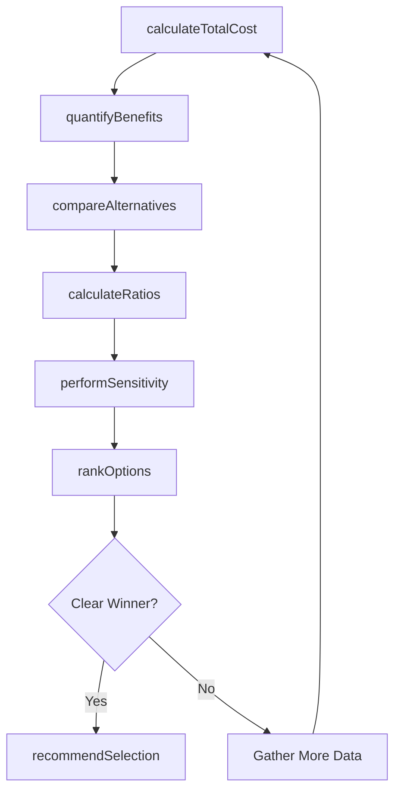
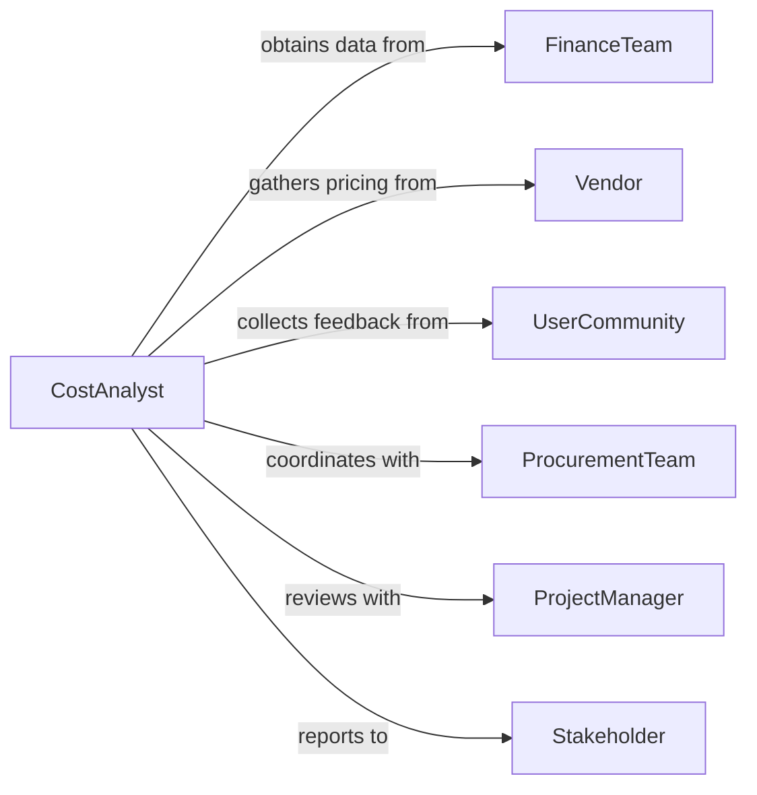

# Assess Cost Effectiveness Products Projects

> Business-as-Code definition for cost-effectiveness assessment. Models the systematic evaluation of value delivered relative to costs through total cost of ownership analysis, benefit quantification, and alternative comparison.

## Overview

Cost-effectiveness assessment involves measuring total costs, quantifying benefits, calculating value ratios, and comparing alternatives to determine which products, projects, or services deliver optimal value. This definition exposes actions for cost analysis, benefit measurement, ratio calculation, and recommendation generation across procurement, capital investments, and strategic decisions.

## Actors

| Actor | Description |
|-------|-------------|
| FinanceTeam | Provides cost data and financial analysis |
| Vendor | Supplies pricing and product information |
| UserCommunity | Provides benefit realization and satisfaction data |
| ProcurementTeam | Evaluates purchasing options and negotiates |
| ProjectManager | Reports on project costs and outcomes |
| Stakeholder | Receives value from products or projects |

## Roles

| Role | Description |
|------|-------------|
| CostAnalyst | Calculates total cost of ownership and expenses |
| ValueAnalyst | Measures and quantifies benefits delivered |
| ProcurementSpecialist | Evaluates vendor offerings and alternatives |
| DecisionMaker | Reviews analysis and approves selections |

## Entities

| Entity | Description |
|--------|-------------|
| Product | A good or service under evaluation |
| Project | An initiative requiring cost-effectiveness assessment |
| CostComponent | An individual expense element in total cost |
| Benefit | A measurable value delivered by product or project |
| Alternative | A competing option for comparison |
| CostEffectivenessRatio | A metric comparing costs to benefits |

## Actions

| Action | Description |
|--------|-------------|
| calculateTotalCost | Determine all costs including acquisition, operation, and disposal |
| quantifyBenefits | Measure value delivered in financial and non-financial terms |
| compareAlternatives | Evaluate multiple options against each other |
| calculateRatios | Compute cost per benefit unit or benefit per dollar |
| performSensitivity | Test results under different assumptions |
| rankOptions | Order alternatives by cost-effectiveness |
| recommendSelection | Propose best-value option with rationale |

## Events

| Event | Description |
|-------|-------------|
| totalCostCalculated | All costs have been determined |
| benefitsQuantified | Value has been measured |
| alternativesCompared | Options evaluated against each other |
| ratiosCalculated | Cost-effectiveness metrics computed |
| sensitivityPerformed | Assumption testing completed |
| optionsRanked | Alternatives ordered by value |
| selectionRecommended | Best-value choice proposed |

## Searches

| Search | Description |
|--------|-------------|
| findAssessments | List evaluations by type, status, or date |
| getAlternatives | Retrieve options for specific product category |
| getRatios | Access cost-effectiveness metrics by assessment |
| getCosts | Find cost breakdowns for products or projects |

## Workflow



## Actor Relationships



## Usage

### Calling Actions

```typescript
import { assessCostEffectivenessProductsProjects } from '@headlessly/assess-cost-effectiveness-products-projects'

const costEffectiveness = assessCostEffectivenessProductsProjects()

// Calculate total cost for CRM system options
const totalCost = await costEffectiveness.calculateTotalCost({
  assessmentId: 'crm-selection-2026',
  alternatives: [
    { id: 'vendor-a', acquisition: 50000, annualLicense: 12000, implementation: 30000, training: 8000 },
    { id: 'vendor-b', acquisition: 0, annualLicense: 24000, implementation: 45000, training: 12000 },
    { id: 'vendor-c', acquisition: 75000, annualLicense: 8000, implementation: 20000, training: 5000 }
  ],
  period: '5-years',
  includeIndirect: true
})

// Quantify benefits
await costEffectiveness.quantifyBenefits({
  assessmentId: 'crm-selection-2026',
  benefits: [
    { type: 'revenue-increase', estimate: 500000, confidence: 'medium' },
    { type: 'productivity-gain', estimate: 200000, confidence: 'high' },
    { type: 'customer-satisfaction', estimate: 100000, confidence: 'low' }
  ]
})

// Calculate ratios and rank options
await costEffectiveness.calculateRatios({
  assessmentId: 'crm-selection-2026',
  metrics: ['cost-benefit-ratio', 'net-present-value', 'payback-period']
})

const ranking = await costEffectiveness.rankOptions({
  assessmentId: 'crm-selection-2026',
  primaryMetric: 'net-present-value',
  secondaryMetric: 'payback-period'
})

// Perform sensitivity analysis
await costEffectiveness.performSensitivity({
  assessmentId: 'crm-selection-2026',
  variables: ['revenue-increase', 'implementation-cost'],
  ranges: { 'revenue-increase': [0.75, 1.25], 'implementation-cost': [0.9, 1.3] }
})
```

### Event-Driven Automation

```typescript
// Alert on unfavorable cost-effectiveness
costEffectiveness.ratiosCalculated(async ({ assessmentId, ratios }) => {
  const unfavorable = ratios.filter(r => r.costBenefitRatio > 1.0)
  if (unfavorable.length > 0) {
    await notify({
      to: 'decision-maker',
      message: `Assessment ${assessmentId}: ${unfavorable.length} options have costs exceeding benefits`
    })
  }
})

// Automatically recommend selection after ranking
costEffectiveness.optionsRanked(async ({ assessmentId, ranking }) => {
  const topOption = ranking[0]
  await costEffectiveness.recommendSelection({
    assessmentId,
    selectedId: topOption.id,
    rationale: `Best NPV: $${topOption.npv.toLocaleString()}, Payback: ${topOption.payback} months`
  })
})
```
