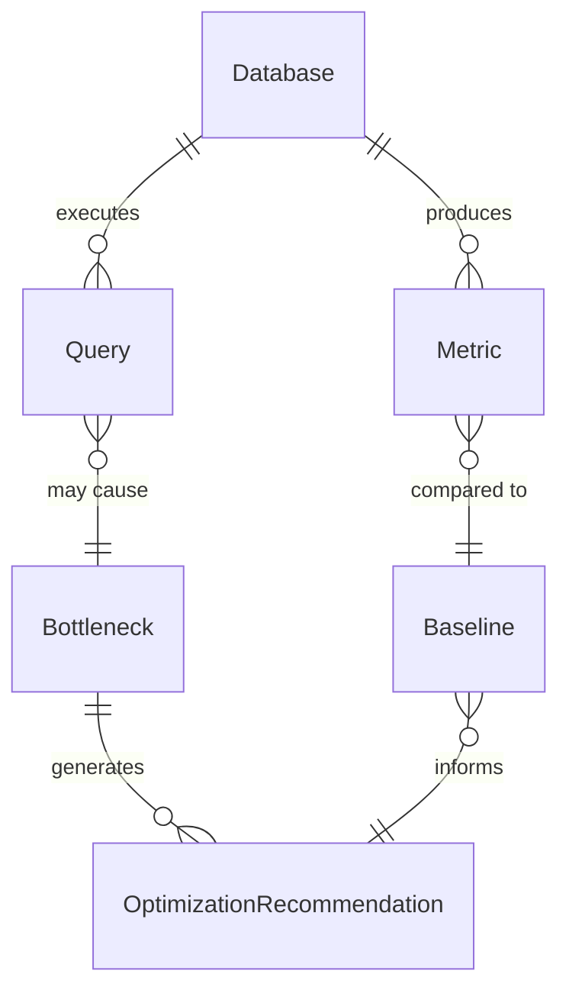
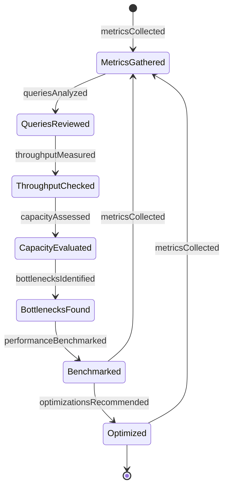
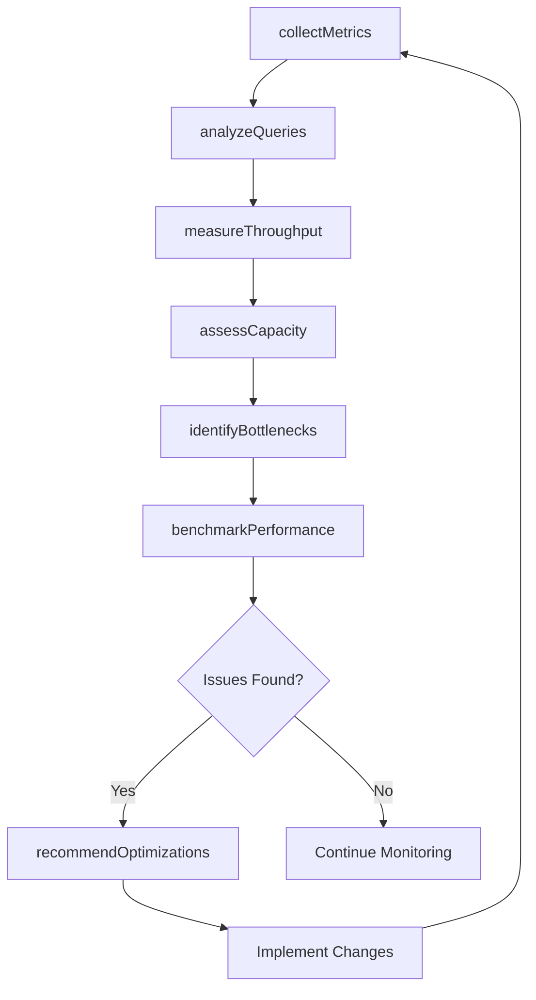
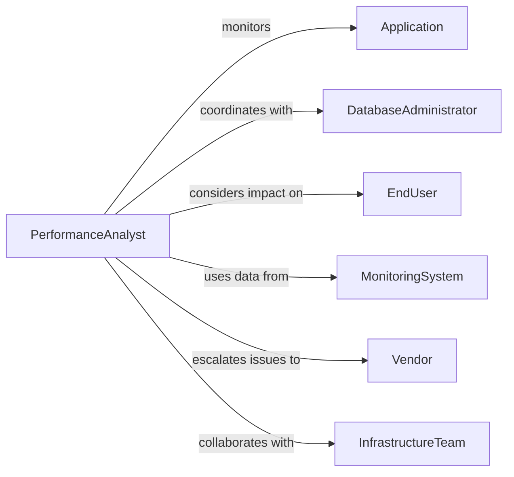

# Assess Database Performance

> Business-as-Code definition for database performance assessment. Models the systematic evaluation of database health, query efficiency, resource utilization, and optimization opportunities through monitoring, benchmarking, and tuning.

## Overview

Database performance assessment involves monitoring query execution times, analyzing resource consumption, identifying bottlenecks, benchmarking against baselines, and recommending optimization strategies. This definition exposes actions for metrics collection, query analysis, capacity planning, and performance tuning across relational, NoSQL, and distributed database systems.

## Actors

| Actor | Description |
|-------|-------------|
| Application | Generates database workload and query patterns |
| DatabaseAdministrator | Manages database configuration and tuning |
| EndUser | Experiences performance impact of database operations |
| MonitoringSystem | Collects performance metrics and alerts |
| Vendor | Provides database software and support |
| InfrastructureTeam | Manages underlying compute and storage resources |

## Roles

| Role | Description |
|------|-------------|
| PerformanceAnalyst | Evaluates database metrics and identifies issues |
| DatabaseEngineer | Implements optimizations and tuning |
| CapacityPlanner | Forecasts resource needs and scaling requirements |
| IncidentResponder | Addresses performance degradations and outages |

## Entities

| Entity | Description |
|--------|-------------|
| Database | A system storing and retrieving data |
| Query | A statement requesting data from database |
| Metric | A quantitative measure of database performance |
| Baseline | A performance standard for comparison |
| Bottleneck | A resource constraint limiting performance |
| OptimizationRecommendation | A suggested improvement to enhance performance |

## Actions

| Action | Description |
|--------|-------------|
| collectMetrics | Gather performance data on queries, resources, and latency |
| analyzeQueries | Identify slow or inefficient database queries |
| measureThroughput | Calculate transaction rate and data volume processed |
| assessCapacity | Evaluate resource utilization and headroom |
| identifyBottlenecks | Find constraints limiting database performance |
| benchmarkPerformance | Compare current metrics to baselines or targets |
| recommendOptimizations | Propose indexing, tuning, or architectural changes |

## Events

| Event | Description |
|-------|-------------|
| metricsCollected | Performance data has been gathered |
| queriesAnalyzed | Query efficiency assessed |
| throughputMeasured | Transaction rates calculated |
| capacityAssessed | Resource utilization evaluated |
| bottlenecksIdentified | Performance constraints found |
| performanceBenchmarked | Comparison to standards completed |
| optimizationsRecommended | Improvement suggestions documented |

## Searches

| Search | Description |
|--------|-------------|
| findDatabases | List databases by type, status, or environment |
| getMetrics | Retrieve performance data by database or timeframe |
| getSlowQueries | Find queries exceeding latency thresholds |
| getBottlenecks | Access identified performance constraints |

## Entity Relationships



## State Diagram



## Workflow



## Actor Relationships



## Usage

### Calling Actions

```typescript
import { assessDatabasePerformance } from '@headlessly/assess-database-performance'

const dbPerformance = assessDatabasePerformance()

// Collect performance metrics for production database
const metrics = await dbPerformance.collectMetrics({
  databaseId: 'prod-postgres-01',
  period: { start: '2026-06-01T00:00:00Z', end: '2026-06-01T23:59:59Z' },
  metrics: ['query-latency', 'cpu-utilization', 'memory-usage', 'connection-count', 'transaction-rate']
})

// Analyze slow queries
const slowQueries = await dbPerformance.analyzeQueries({
  databaseId: 'prod-postgres-01',
  threshold: '1000ms',
  limit: 20,
  includeExecutionPlans: true
})

// Measure throughput and assess capacity
await dbPerformance.measureThroughput({
  databaseId: 'prod-postgres-01',
  period: '24-hours',
  metrics: ['transactions-per-second', 'queries-per-second', 'data-volume-processed']
})

const capacity = await dbPerformance.assessCapacity({
  databaseId: 'prod-postgres-01',
  resources: ['cpu', 'memory', 'disk-io', 'network'],
  projectionPeriod: '6-months'
})

// Identify bottlenecks and benchmark
const bottlenecks = await dbPerformance.identifyBottlenecks({
  databaseId: 'prod-postgres-01',
  categories: ['cpu', 'memory', 'disk', 'network', 'locking']
})

await dbPerformance.benchmarkPerformance({
  databaseId: 'prod-postgres-01',
  baseline: 'Q1-2026',
  targetLatency: { p50: 50, p95: 200, p99: 500 }
})
```

### Event-Driven Automation

```typescript
// Alert on performance degradation
dbPerformance.performanceBenchmarked(async ({ databaseId, comparison }) => {
  if (comparison.latencyP95 > comparison.baselineP95 * 1.5) {
    await notify({
      to: 'incident-responder',
      message: `Database ${databaseId} P95 latency degraded 50% vs baseline: ${comparison.latencyP95}ms`
    })
  }
})

// Automatically recommend optimizations when bottlenecks found
dbPerformance.bottlenecksIdentified(async ({ databaseId, bottlenecks }) => {
  const criticalBottlenecks = bottlenecks.filter(b => b.severity === 'critical')
  if (criticalBottlenecks.length > 0) {
    await dbPerformance.recommendOptimizations({
      databaseId,
      focus: criticalBottlenecks.map(b => b.resource),
      priority: 'high'
    })
  }
})
```
