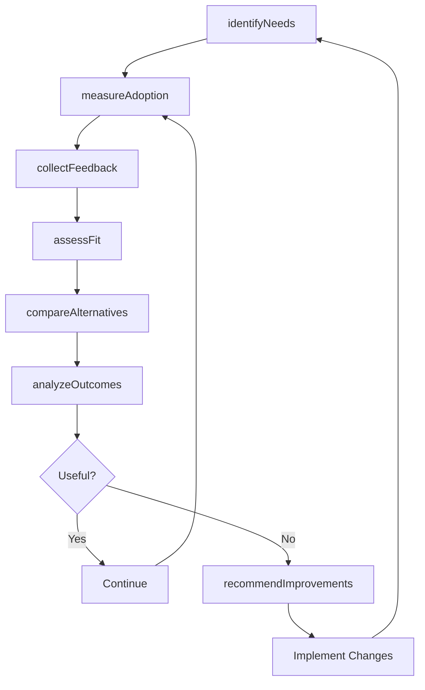
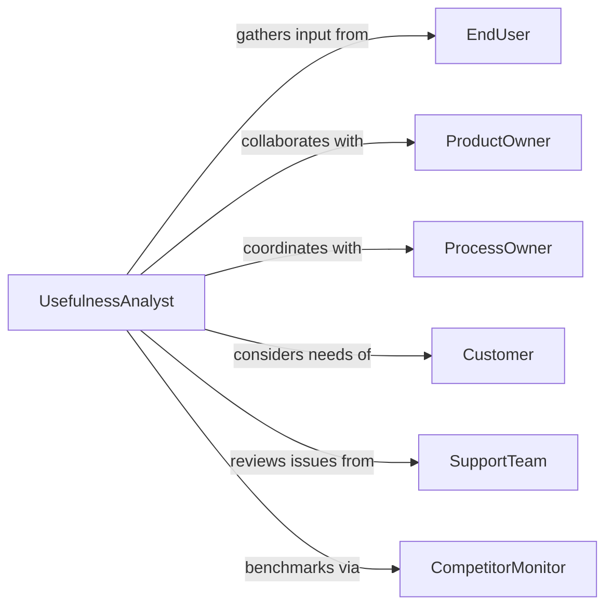

# Assess Product Process Usefulness

> Business-as-Code definition for usefulness assessment. Models the evaluation of how well products or processes meet user needs, solve problems, and deliver value through fit-for-purpose analysis, user feedback, and outcome measurement.

## Overview

Product and process usefulness assessment involves evaluating alignment with user needs, measuring problem-solving effectiveness, analyzing adoption patterns, gathering user feedback, and determining value delivered. This definition exposes actions for needs analysis, effectiveness measurement, usability evaluation, and improvement recommendation across product development, process engineering, and operational excellence initiatives.

## Actors

| Actor | Description |
|-------|-------------|
| EndUser | Uses product or process and provides feedback |
| ProductOwner | Defines product requirements and success criteria |
| ProcessOwner | Manages process design and performance |
| Customer | Purchases product or requests process outcomes |
| SupportTeam | Assists users and reports issues |
| CompetitorMonitor | Tracks alternative solutions in market |

## Roles

| Role | Description |
|------|-------------|
| UsefulnessAnalyst | Evaluates product or process fit-for-purpose |
| UserResearcher | Gathers user feedback and usage data |
| ProcessEngineer | Analyzes process efficiency and effectiveness |
| ProductManager | Makes decisions on product improvements |

## Entities

| Entity | Description |
|--------|-------------|
| Product | A good or service under evaluation |
| Process | A series of steps to accomplish an objective |
| UserNeed | A requirement or problem the product addresses |
| UseCase | A specific scenario where product is applied |
| Feedback | User input on product or process usefulness |
| UsefulnessMetric | A measure of value delivered to users |

## Actions

| Action | Description |
|--------|-------------|
| identifyNeeds | Determine user requirements and problems to solve |
| measureAdoption | Track usage patterns and user engagement |
| collectFeedback | Gather user input on usefulness and value |
| assessFit | Evaluate how well product meets identified needs |
| compareAlternatives | Benchmark against competing solutions |
| analyzeOutcomes | Measure results achieved by users |
| recommendImprovements | Propose enhancements to increase usefulness |

## Events

| Event | Description |
|-------|-------------|
| needsIdentified | User requirements have been determined |
| adoptionMeasured | Usage patterns have been tracked |
| feedbackCollected | User input has been gathered |
| fitAssessed | Needs alignment evaluated |
| alternativesCompared | Benchmarking against competitors completed |
| outcomesAnalyzed | User results measured |
| improvementsRecommended | Enhancement proposals documented |

## Searches

| Search | Description |
|--------|-------------|
| findProducts | List products by category, status, or user segment |
| getNeeds | Retrieve user requirements for specific contexts |
| getFeedback | Access user input by product, rating, or theme |
| getMetrics | Find usefulness measurements by product or period |

## Workflow



## Actor Relationships



## Usage

### Calling Actions

```typescript
import { assessProductProcessUsefulness } from '@headlessly/assess-product-process-usefulness'

const usefulness = assessProductProcessUsefulness()

// Identify needs for project management tool
const needs = await usefulness.identifyNeeds({
  productId: 'project-mgmt-tool',
  userSegments: ['software-teams', 'marketing-teams', 'operations-teams'],
  methods: ['interviews', 'surveys', 'usage-analysis']
})

// Measure adoption
await usefulness.measureAdoption({
  productId: 'project-mgmt-tool',
  period: { start: '2026-01-01', end: '2026-06-30' },
  metrics: ['active-users', 'session-frequency', 'feature-usage', 'retention-rate']
})

// Collect feedback and assess fit
const feedback = await usefulness.collectFeedback({
  productId: 'project-mgmt-tool',
  channels: ['in-app-survey', 'support-tickets', 'user-interviews'],
  questions: ['solves-my-problem', 'easy-to-use', 'worth-the-cost']
})

const fit = await usefulness.assessFit({
  productId: 'project-mgmt-tool',
  needs: needs.map(n => n.id),
  evaluationCriteria: ['completeness', 'ease-of-use', 'performance']
})

// Compare alternatives and analyze outcomes
await usefulness.compareAlternatives({
  productId: 'project-mgmt-tool',
  competitors: ['asana', 'monday', 'jira'],
  dimensions: ['feature-coverage', 'usability', 'pricing']
})

const outcomes = await usefulness.analyzeOutcomes({
  productId: 'project-mgmt-tool',
  metrics: ['projects-completed-on-time', 'team-collaboration-score', 'time-saved']
})
```

### Event-Driven Automation

```typescript
// Alert on low usefulness scores
usefulness.feedbackCollected(async ({ productId, feedback }) => {
  const lowRatings = feedback.filter(f => f.rating < 3)
  const percentage = (lowRatings.length / feedback.length) * 100

  if (percentage > 30) {
    await notify({
      to: 'product-manager',
      message: `Product ${productId}: ${percentage.toFixed(0)}% of users rate usefulness below 3/5`
    })
  }
})

// Automatically recommend improvements when fit is poor
usefulness.fitAssessed(async ({ productId, fitScore, gaps }) => {
  if (fitScore < 60) {
    await usefulness.recommendImprovements({
      productId,
      priority: 'high',
      focus: gaps.map(g => g.needArea),
      rationale: `Fit score ${fitScore}/100 indicates significant gaps`
    })
  }
})
```
