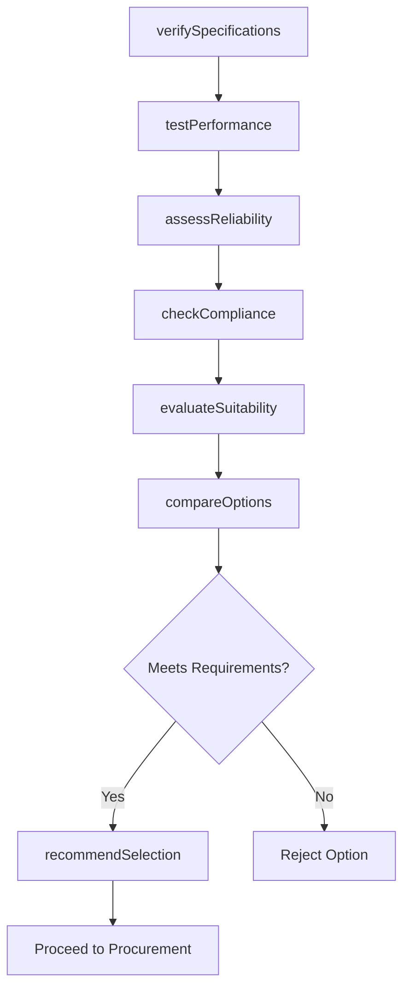
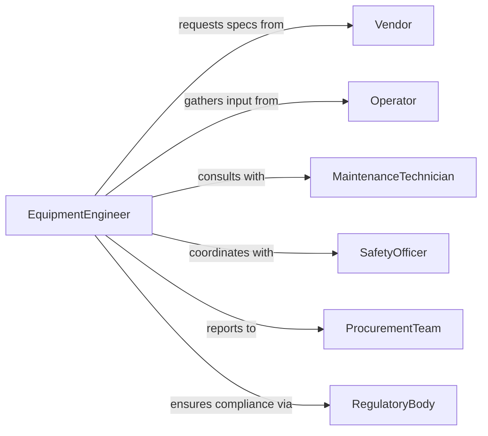

# Evaluate Characteristics Equipment Systems

> Business-as-Code definition for equipment and system evaluation. Models the comprehensive assessment of technical specifications, operational performance, reliability, and suitability through testing, benchmarking, and criteria-based analysis.

## Overview

Equipment and system characteristics evaluation involves measuring technical specifications, testing operational performance, assessing reliability and maintainability, evaluating compliance with standards, and determining suitability for intended applications. This definition exposes actions for specification verification, performance testing, reliability analysis, and selection recommendation across manufacturing equipment, IT systems, and infrastructure.

## Actors

| Actor | Description |
|-------|-------------|
| Vendor | Supplies equipment and provides specifications |
| Operator | Uses equipment in production or operations |
| MaintenanceTechnician | Services equipment and reports issues |
| SafetyOfficer | Ensures equipment meets safety standards |
| ProcurementTeam | Evaluates options and makes purchase decisions |
| RegulatoryBody | Enforces compliance with industry standards |

## Roles

| Role | Description |
|------|-------------|
| EquipmentEngineer | Evaluates technical characteristics and performance |
| TestSpecialist | Conducts performance and reliability testing |
| ReliabilityAnalyst | Assesses failure rates and maintainability |
| ProcurementSpecialist | Compares options and recommends selections |

## Entities

| Entity | Description |
|--------|-------------|
| Equipment | A physical device or machine under evaluation |
| System | An integrated set of components working together |
| Specification | A technical characteristic or capability |
| TestResult | Data from performance or reliability testing |
| Standard | An industry requirement or guideline |
| EvaluationCriterion | A measure for comparing equipment options |

## Actions

| Action | Description |
|--------|-------------|
| verifySpecifications | Confirm technical characteristics match requirements |
| testPerformance | Measure operational capabilities under various conditions |
| assessReliability | Evaluate failure rates, uptime, and maintainability |
| checkCompliance | Verify adherence to safety and regulatory standards |
| evaluateSuitability | Determine fit for intended application |
| compareOptions | Benchmark multiple equipment choices |
| recommendSelection | Propose best option based on evaluation |

## Events

| Event | Description |
|-------|-------------|
| specificationsVerified | Technical characteristics confirmed |
| performanceTested | Operational capabilities measured |
| reliabilityAssessed | Failure analysis completed |
| complianceChecked | Standards adherence verified |
| suitabilityEvaluated | Application fit determined |
| optionsCompared | Benchmarking finished |
| selectionRecommended | Equipment choice proposed |

## Searches

| Search | Description |
|--------|-------------|
| findEquipment | List equipment by type, vendor, or status |
| getSpecifications | Retrieve technical characteristics for equipment |
| getTestResults | Access performance data by equipment or test type |
| getStandards | Find applicable standards for equipment category |

## Workflow



## Actor Relationships



## Usage

### Calling Actions

```typescript
import { evaluateCharacteristicsEquipmentSystems } from '@headlessly/evaluate-characteristics-equipment-systems'

const equipment = evaluateCharacteristicsEquipmentSystems()

// Verify specifications for CNC machine options
const specs = await equipment.verifySpecifications({
  equipmentCategory: 'cnc-milling-machine',
  options: [
    { vendor: 'vendor-a', model: 'model-x', specs: { workEnvelope: '1000x500x500mm', spindle: '15000rpm', accuracy: '0.005mm' } },
    { vendor: 'vendor-b', model: 'model-y', specs: { workEnvelope: '1200x600x600mm', spindle: '12000rpm', accuracy: '0.008mm' } }
  ],
  requirements: { minWorkEnvelope: '1000x500x500mm', minSpindle: 12000, maxAccuracy: 0.01 }
})

// Test performance
const performance = await equipment.testPerformance({
  equipmentId: 'vendor-a-model-x',
  tests: [
    { type: 'cutting-speed', conditions: { material: 'aluminum', depth: '2mm' } },
    { type: 'surface-finish', conditions: { feedRate: '500mm/min' } },
    { type: 'dimensional-accuracy', conditions: { tolerance: '0.01mm' } }
  ]
})

// Assess reliability
await equipment.assessReliability({
  equipmentId: 'vendor-a-model-x',
  metrics: ['mtbf', 'mttr', 'availability'],
  dataSources: ['vendor-warranty', 'industry-benchmarks', 'customer-reviews']
})

// Check compliance and evaluate suitability
await equipment.checkCompliance({
  equipmentId: 'vendor-a-model-x',
  standards: ['iso-230-2', 'ce-marking', 'osha-safety'],
  certifications: true
})

const suitability = await equipment.evaluateSuitability({
  equipmentId: 'vendor-a-model-x',
  application: 'precision-aerospace-parts',
  criteria: ['accuracy', 'repeatability', 'material-compatibility', 'production-volume']
})

// Compare options
await equipment.compareOptions({
  category: 'cnc-milling-machine',
  optionIds: ['vendor-a-model-x', 'vendor-b-model-y'],
  weights: { performance: 0.4, reliability: 0.3, cost: 0.2, compliance: 0.1 }
})
```

### Event-Driven Automation

```typescript
// Alert on compliance failures
equipment.complianceChecked(async ({ equipmentId, results }) => {
  const failures = results.filter(r => r.status === 'non-compliant')
  if (failures.length > 0) {
    await notify({
      to: 'procurement-team',
      message: `Equipment ${equipmentId} fails compliance: ${failures.map(f => f.standard).join(', ')}`
    })
  }
})

// Automatically recommend selection after comparison
equipment.optionsCompared(async ({ category, ranking }) => {
  const topOption = ranking[0]
  if (topOption.score > 80) {
    await equipment.recommendSelection({
      category,
      equipmentId: topOption.equipmentId,
      rationale: `Highest score (${topOption.score}/100) across weighted criteria`
    })
  }
})
```
