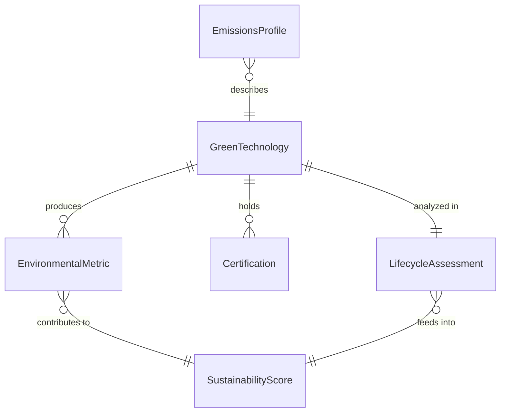
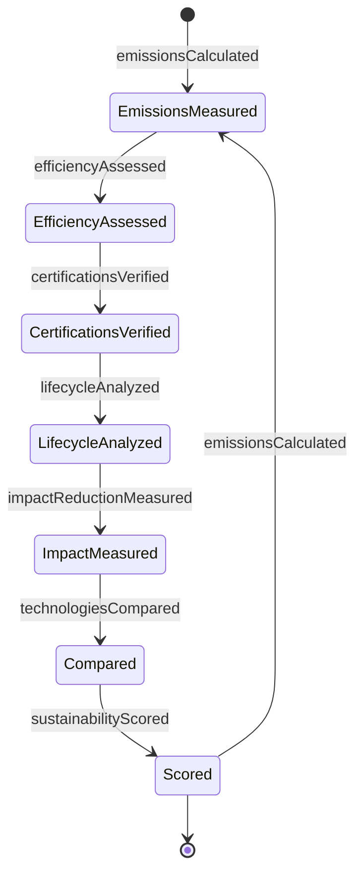
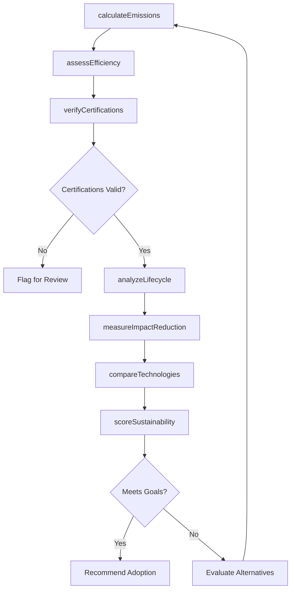
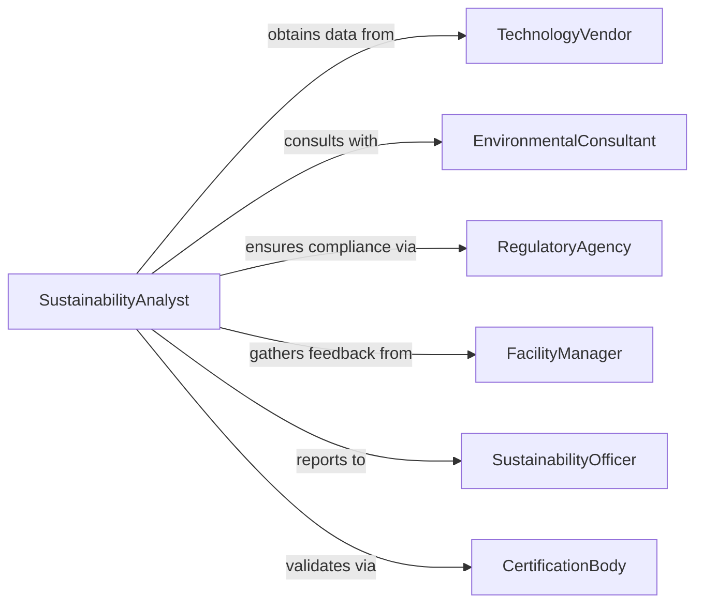

# Evaluate Characteristics Green Technologies

> Business-as-Code definition for green technology evaluation. Models the assessment of environmental impact, sustainability performance, resource efficiency, and lifecycle characteristics of eco-friendly technologies through emissions analysis, certification verification, and comparative benchmarking.

## Overview

Green technology characteristics evaluation involves measuring environmental impact reduction, assessing resource efficiency, verifying sustainability certifications, analyzing lifecycle emissions, and comparing alternatives to determine optimal environmental outcomes. This definition exposes actions for emissions calculation, efficiency measurement, certification validation, and sustainability scoring across renewable energy, waste reduction, and clean production technologies.

## Actors

| Actor | Description |
|-------|-------------|
| TechnologyVendor | Supplies green technology and environmental data |
| EnvironmentalConsultant | Provides expertise on sustainability assessment |
| RegulatoryAgency | Enforces environmental standards and certifications |
| FacilityManager | Operates technology and tracks performance |
| SustainabilityOfficer | Oversees organizational environmental goals |
| CertificationBody | Validates environmental claims and certifications |

## Roles

| Role | Description |
|------|-------------|
| SustainabilityAnalyst | Evaluates environmental characteristics and impact |
| LifecycleAssessor | Conducts cradle-to-grave environmental analysis |
| EnergyAuditor | Measures efficiency and resource consumption |
| GreenProcurementSpecialist | Compares options and recommends selections |

## Entities

| Entity | Description |
|--------|-------------|
| GreenTechnology | An environmentally-beneficial technology or system |
| EnvironmentalMetric | A measure of environmental performance |
| Certification | A verified claim of environmental compliance |
| EmissionsProfile | Greenhouse gas and pollutant output data |
| LifecycleAssessment | Cradle-to-grave environmental impact analysis |
| SustainabilityScore | A composite rating of environmental performance |

## Actions

| Action | Description |
|--------|-------------|
| calculateEmissions | Measure greenhouse gas and pollutant output |
| assessEfficiency | Evaluate resource consumption and waste reduction |
| verifyCertifications | Confirm validity of environmental claims and labels |
| analyzeLifecycle | Assess environmental impact from production to disposal |
| measureImpactReduction | Quantify improvement over conventional technologies |
| compareTechnologies | Benchmark multiple green technology options |
| scoreSustainability | Generate composite environmental performance rating |

## Events

| Event | Description |
|-------|-------------|
| emissionsCalculated | Greenhouse gas output measured |
| efficiencyAssessed | Resource consumption evaluated |
| certificationsVerified | Environmental claims confirmed |
| lifecycleAnalyzed | Cradle-to-grave assessment completed |
| impactReductionMeasured | Environmental improvement quantified |
| technologiesCompared | Benchmarking finished |
| sustainabilityScored | Composite rating generated |

## Searches

| Search | Description |
|--------|-------------|
| findTechnologies | List green technologies by category or certification |
| getMetrics | Retrieve environmental performance data |
| getCertifications | Access verified environmental claims |
| getAssessments | Find lifecycle analyses for technologies |

## Entity Relationships



## State Diagram



## Workflow



## Actor Relationships



## Usage

### Calling Actions

```typescript
import { evaluateCharacteristicsGreenTechnologies } from '@headlessly/evaluate-characteristics-green-technologies'

const greenTech = evaluateCharacteristicsGreenTechnologies()

// Calculate emissions for solar panel options
const emissions = await greenTech.calculateEmissions({
  technologyCategory: 'solar-pv',
  options: [
    { vendor: 'vendor-a', model: 'monocrystalline-400w', scope: 'manufacturing-operation-disposal' },
    { vendor: 'vendor-b', model: 'polycrystalline-380w', scope: 'manufacturing-operation-disposal' }
  ],
  lifetime: '25-years',
  location: 'california'
})

// Assess efficiency
await greenTech.assessEfficiency({
  technologyId: 'vendor-a-monocrystalline',
  metrics: ['energy-conversion', 'land-use', 'water-consumption', 'material-efficiency'],
  benchmarkType: 'industry-average'
})

// Verify certifications
const certifications = await greenTech.verifyCertifications({
  technologyId: 'vendor-a-monocrystalline',
  claims: ['energy-star', 'cradle-to-cradle', 'carbon-neutral', 'iso-14001'],
  verificationLevel: 'third-party'
})

// Analyze lifecycle and measure impact reduction
await greenTech.analyzeLifecycle({
  technologyId: 'vendor-a-monocrystalline',
  phases: ['raw-material-extraction', 'manufacturing', 'transportation', 'operation', 'disposal'],
  impactCategories: ['carbon-footprint', 'water-usage', 'toxicity', 'resource-depletion']
})

const impactReduction = await greenTech.measureImpactReduction({
  technologyId: 'vendor-a-monocrystalline',
  baseline: 'coal-power-generation',
  metrics: ['co2-avoided', 'water-saved', 'pollution-reduced'],
  period: '25-years'
})

// Compare technologies and score sustainability
await greenTech.compareTechnologies({
  category: 'solar-pv',
  optionIds: ['vendor-a-monocrystalline', 'vendor-b-polycrystalline'],
  weights: { emissions: 0.35, efficiency: 0.30, lifecycle: 0.25, cost: 0.10 }
})

const score = await greenTech.scoreSustainability({
  technologyId: 'vendor-a-monocrystalline',
  framework: 'leed-v4.1',
  includeBreakdown: true
})
```

### Event-Driven Automation

```typescript
// Alert on certification failures
greenTech.certificationsVerified(async ({ technologyId, results }) => {
  const unverified = results.filter(r => r.status !== 'verified')
  if (unverified.length > 0) {
    await notify({
      to: 'sustainability-officer',
      message: `Technology ${technologyId} has unverified claims: ${unverified.map(u => u.certification).join(', ')}`
    })
  }
})

// Automatically recommend based on sustainability score
greenTech.sustainabilityScored(async ({ technologyId, score, breakdown }) => {
  if (score > 85 && breakdown.emissions < 20) {
    await notify({
      to: 'green-procurement-specialist',
      message: `Technology ${technologyId} achieves high sustainability score (${score}/100) with low emissions profile`
    })
  }
})
```
