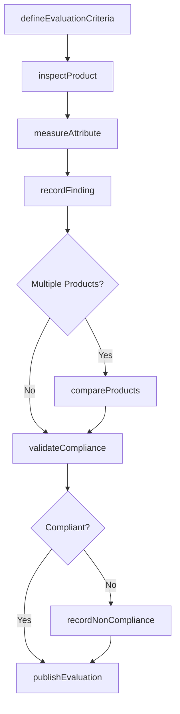
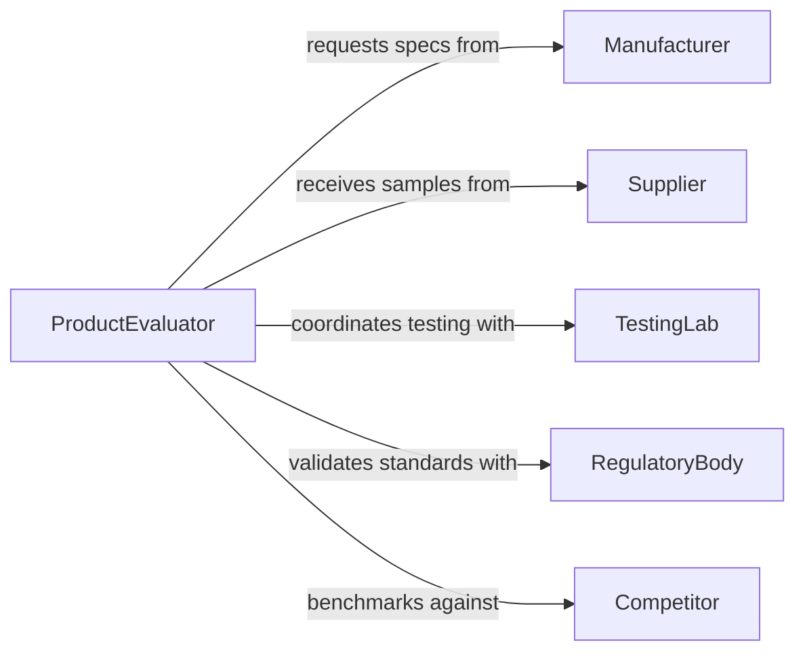

# Evaluate Characteristics Products

> Business-as-Code definition for product characteristics evaluation. Models systematic assessment of physical, functional, and quality attributes of products.

## Overview

Product characteristics evaluation involves systematic assessment of features, specifications, and quality attributes to determine suitability for intended use. This definition exposes actions for conducting evaluations, capturing findings, and comparing products against criteria and benchmarks.

## Actors

| Actor | Description |
|-------|-------------|
| Manufacturer | Provides product specifications and documentation |
| Supplier | Offers products for evaluation and testing |
| Customer | Requests specific product characteristics and requirements |
| RegulatoryBody | Defines compliance standards for product characteristics |
| TestingLab | Conducts independent verification of product attributes |
| Competitor | Produces alternative products for comparison |

## Roles

| Role | Description |
|------|-------------|
| ProductEvaluator | Conducts systematic assessment of product characteristics |
| QualityAnalyst | Analyzes quality attributes and compliance |
| TechnicalReviewer | Reviews technical specifications and performance |
| ProcurementSpecialist | Evaluates products for purchasing decisions |

## Entities

| Entity | Description |
|--------|-------------|
| Product | Item being evaluated for characteristics |
| Characteristic | Specific attribute or feature being assessed |
| EvaluationCriteria | Standards and requirements for assessment |
| Finding | Documented observation from evaluation |
| Measurement | Quantitative data from product testing |
| Comparison | Side-by-side analysis of multiple products |

## Actions

| Action | Description |
|--------|-------------|
| defineEvaluationCriteria | Establish standards for product assessment |
| inspectProduct | Examine physical and functional characteristics |
| measureAttribute | Quantify specific product characteristics |
| recordFinding | Document observations from evaluation |
| compareProducts | Analyze characteristics across multiple products |
| validateCompliance | Verify product meets required standards |
| publishEvaluation | Share evaluation results with stakeholders |

## Events

| Event | Description |
|-------|-------------|
| criteriaDefinedEvent | Evaluation standards have been established |
| productInspectedEvent | Physical examination has been completed |
| attributeMeasuredEvent | Quantitative measurement has been recorded |
| findingRecordedEvent | Observation has been documented |
| productsComparedEvent | Comparative analysis has been completed |
| complianceValidatedEvent | Standards verification is complete |
| evaluationPublishedEvent | Results have been shared with stakeholders |

## Searches

| Search | Description |
|--------|-------------|
| findEvaluations | Retrieve product evaluations by criteria or date |
| getFindings | Search documented observations by product or attribute |
| compareByAttribute | List products ranked by specific characteristic |
| getComplianceStatus | Check products against regulatory standards |

## Workflow



## Actor Relationships



## Usage

### Calling Actions

```typescript
import { evaluateCharacteristicsProducts } from '@headlessly/evaluate-characteristics-products'

const evaluator = evaluateCharacteristicsProducts()

// Define evaluation criteria for a product category
const criteria = await evaluator.defineEvaluationCriteria({
  productCategory: 'IndustrialPump',
  attributes: ['flowRate', 'pressureRating', 'energyEfficiency', 'durability'],
  standards: ['ISO 9906', 'API 610']
})

// Inspect and measure product characteristics
const inspection = await evaluator.inspectProduct({
  productId: 'PUMP-XR500',
  evaluationId: criteria.id
})

await evaluator.measureAttribute({
  inspectionId: inspection.id,
  attribute: 'flowRate',
  value: 250,
  unit: 'gallonsPerMinute'
})

// Compare multiple products
const comparison = await evaluator.compareProducts({
  evaluationId: criteria.id,
  productIds: ['PUMP-XR500', 'PUMP-ZT400', 'PUMP-LM300'],
  attributes: ['flowRate', 'energyEfficiency', 'cost']
})
```

### Event-Driven Automation

```typescript
// Auto-notify stakeholders when evaluation is complete
evaluator.evaluationPublishedEvent(async ({ evaluationId, productId }) => {
  const evaluation = await evaluator.getEvaluation({ evaluationId })

  await notify({
    to: 'procurement-team',
    subject: `Product Evaluation Complete: ${productId}`,
    body: `Evaluation results available for review`
  })
})

// Flag non-compliant products for review
evaluator.complianceValidatedEvent(async ({ productId, compliant, findings }) => {
  if (!compliant) {
    await createTask({
      type: 'ComplianceReview',
      priority: 'high',
      product: productId,
      issues: findings.filter(f => f.status === 'nonCompliant')
    })
  }
})
```
