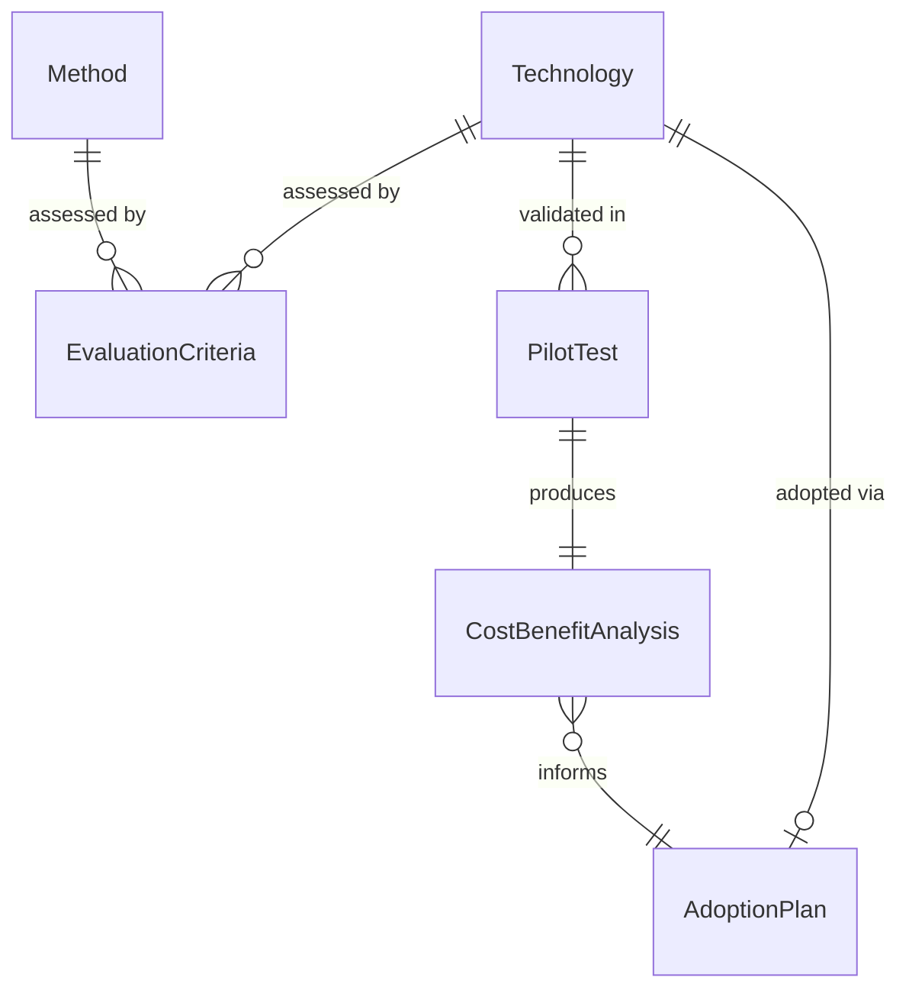
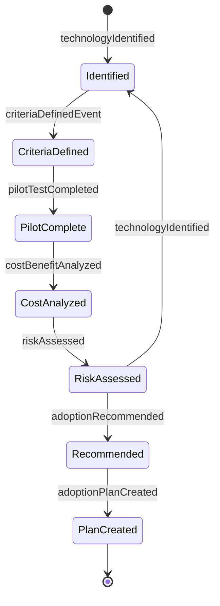
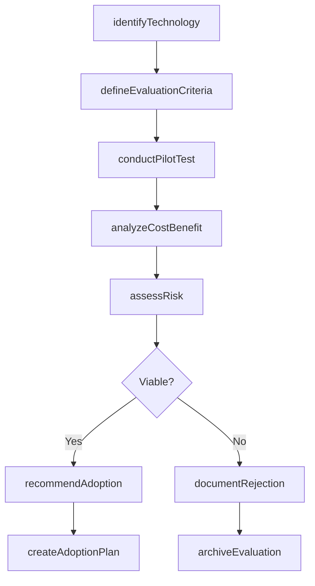
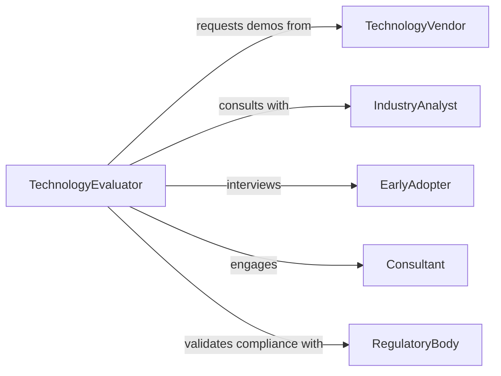

# Evaluate New Technologies Methods

> Business-as-Code definition for technology and methodology evaluation. Models systematic assessment of emerging technologies and innovative methods for potential adoption.

## Overview

Technology and methodology evaluation involves assessing new approaches, tools, and techniques to determine their suitability for organizational implementation. This definition exposes actions for pilot testing, cost-benefit analysis, and adoption decision-making across emerging technologies and process innovations.

## Actors

| Actor | Description |
|-------|-------------|
| TechnologyVendor | Provides new technology solutions and demonstrations |
| IndustryAnalyst | Offers market research and technology assessments |
| EarlyAdopter | Shares experience from implementing similar technologies |
| Consultant | Provides expertise on technology evaluation and implementation |
| RegulatoryBody | Defines compliance requirements for new technologies |
| InternalStakeholder | Representatives from departments affected by new technology |

## Roles

| Role | Description |
|------|-------------|
| TechnologyEvaluator | Conducts systematic assessment of new technologies |
| InnovationManager | Oversees evaluation and adoption of new methods |
| TechnicalArchitect | Assesses technical feasibility and integration requirements |
| BusinessAnalyst | Analyzes cost-benefit and business impact |

## Entities

| Entity | Description |
|--------|-------------|
| Technology | New tool, platform, or system being evaluated |
| Method | Innovative process or approach under consideration |
| EvaluationCriteria | Standards for assessing new technologies and methods |
| PilotTest | Limited deployment to validate technology in real conditions |
| CostBenefitAnalysis | Financial and operational impact assessment |
| AdoptionPlan | Roadmap for implementing approved technology |

## Actions

| Action | Description |
|--------|-------------|
| identifyTechnology | Research and shortlist emerging technologies or methods |
| defineEvaluationCriteria | Establish standards for technology assessment |
| conductPilotTest | Deploy technology in limited scope to validate performance |
| analyzeCostBenefit | Assess financial and operational impact of adoption |
| assessRisk | Identify potential risks and mitigation strategies |
| recommendAdoption | Make formal recommendation on technology implementation |
| createAdoptionPlan | Develop roadmap for full-scale deployment |

## Events

| Event | Description |
|-------|-------------|
| technologyIdentified | New technology has been shortlisted for evaluation |
| criteriaDefinedEvent | Assessment standards have been established |
| pilotTestCompleted | Limited deployment testing has finished |
| costBenefitAnalyzed | Financial analysis has been completed |
| riskAssessed | Risk evaluation has been documented |
| adoptionRecommended | Formal recommendation has been made |
| adoptionPlanCreated | Implementation roadmap has been developed |

## Searches

| Search | Description |
|--------|-------------|
| findEvaluations | Retrieve technology evaluations by category or status |
| getPilotResults | Search pilot test outcomes and performance data |
| getCostAnalyses | List cost-benefit analyses by technology type |
| getRecommendations | Find adoption recommendations by criteria |

## Entity Relationships



## State Diagram



## Workflow



## Actor Relationships



## Usage

### Calling Actions

```typescript
import { evaluateNewTechnologiesMethods } from '@headlessly/evaluate-new-technologies-methods'

const evaluator = evaluateNewTechnologiesMethods()

// Identify and begin evaluation of new technology
const evaluation = await evaluator.identifyTechnology({
  name: 'AI-Powered Quality Inspection System',
  category: 'Manufacturing Automation',
  vendor: 'VisionTech Solutions',
  proposedBenefit: 'Reduce defect rate by 40% and inspection time by 60%'
})

// Define criteria for evaluation
await evaluator.defineEvaluationCriteria({
  evaluationId: evaluation.id,
  criteria: {
    accuracy: { target: 0.98, weight: 0.3 },
    speed: { target: '100 units per hour', weight: 0.25 },
    costSavings: { target: '200000 USD annual', weight: 0.25 },
    integrationEffort: { threshold: 'medium', weight: 0.2 }
  }
})

// Conduct pilot test
const pilot = await evaluator.conductPilotTest({
  evaluationId: evaluation.id,
  scope: 'Production Line 3',
  duration: '90 days',
  metrics: ['accuracy', 'speed', 'downtime', 'defectRate']
})

// Analyze results and make recommendation
const analysis = await evaluator.analyzeCostBenefit({
  evaluationId: evaluation.id,
  implementationCost: 450000,
  annualSavings: 280000,
  paybackPeriod: '19 months'
})
```

### Event-Driven Automation

```typescript
// Auto-generate adoption plan for approved technologies
evaluator.adoptionRecommended(async ({ evaluationId, recommendation }) => {
  if (recommendation.decision === 'approve') {
    await evaluator.createAdoptionPlan({
      evaluationId,
      phases: ['procurement', 'infrastructure', 'training', 'deployment'],
      timeline: recommendation.timeline
    })
  }
})

// Alert stakeholders on pilot completion
evaluator.pilotTestCompleted(async ({ evaluationId, results }) => {
  await notify({
    to: 'innovation-committee',
    subject: `Pilot Test Complete: ${results.technologyName}`,
    body: `Results available for review. Success rate: ${results.successRate}%`
  })
})
```
