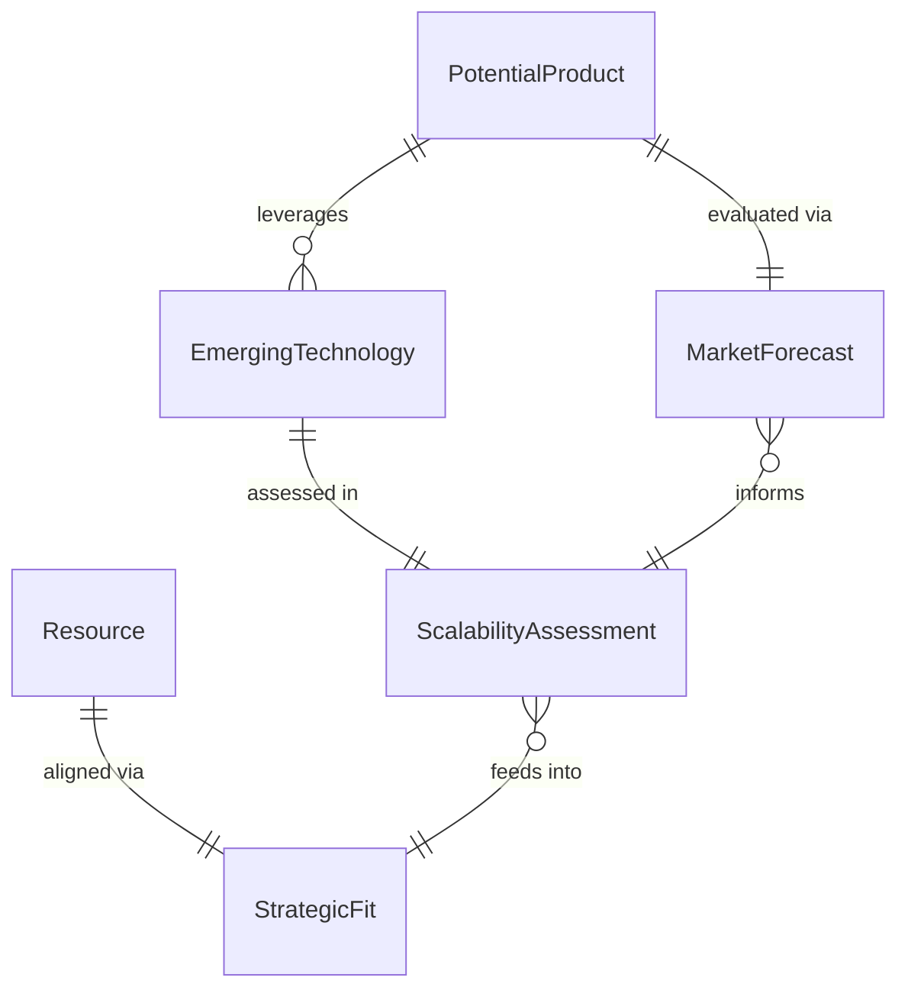
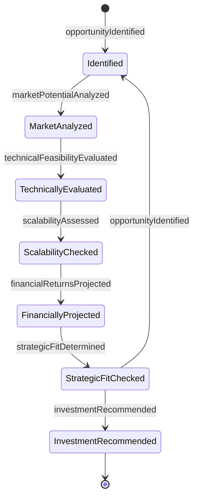
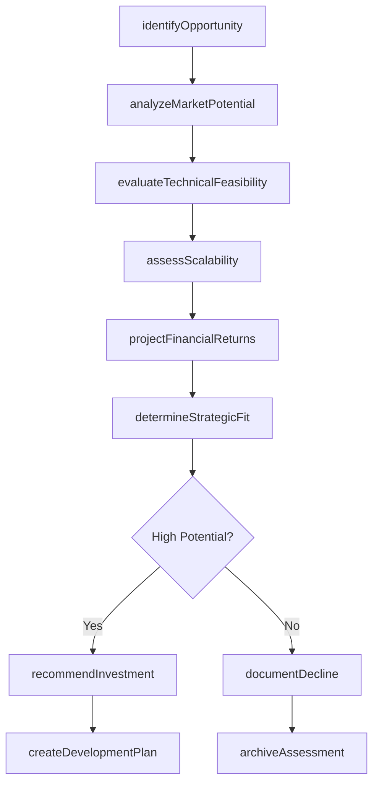
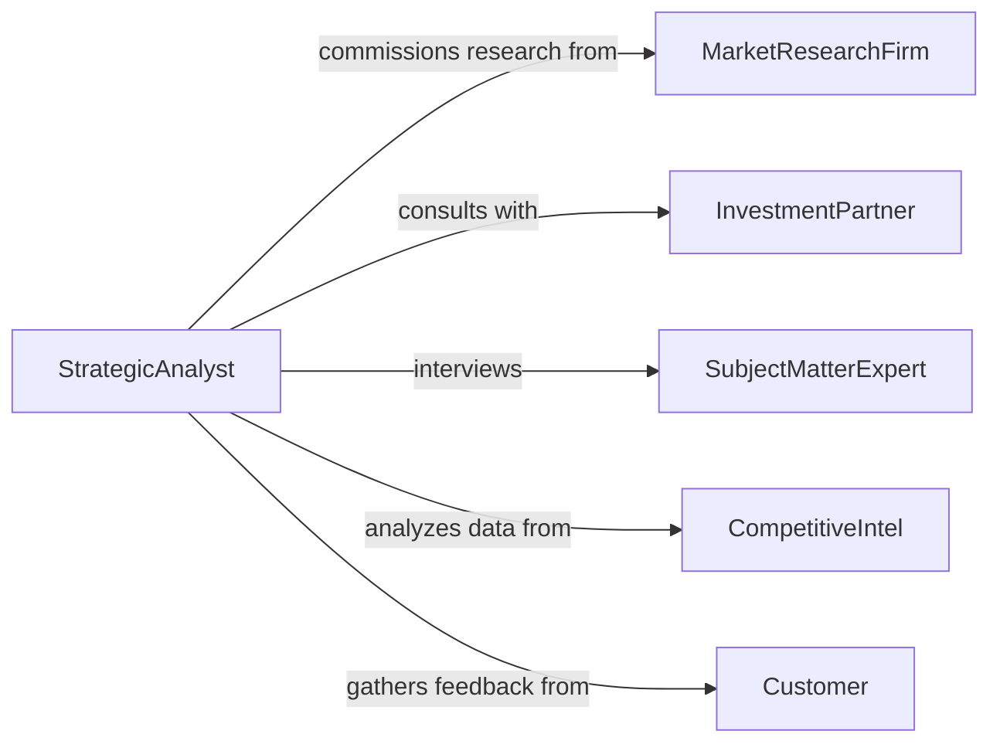

# Evaluate Potential Products Technologies Resources

> Business-as-Code definition for potential evaluation. Models strategic assessment of future value, scalability, and viability of products, technologies, and resources.

## Overview

Potential evaluation involves forecasting future value and assessing long-term viability of products, technologies, and resources. This definition exposes actions for market analysis, scalability assessment, and strategic fit determination to guide investment and development decisions.

## Actors

| Actor | Description |
|-------|-------------|
| MarketResearchFirm | Provides industry trends and market forecasts |
| InvestmentPartner | Evaluates financial potential and funding opportunities |
| SubjectMatterExpert | Offers domain expertise on specific technologies or markets |
| CompetitiveIntel | Tracks competitor activities and market positioning |
| Customer | Provides feedback on product needs and future requirements |
| TechnologyPartner | Collaborates on emerging technology assessments |

## Roles

| Role | Description |
|------|-------------|
| StrategicAnalyst | Evaluates long-term potential and strategic fit |
| MarketAnalyst | Assesses market opportunity and demand forecasts |
| TechnicalAssessor | Evaluates technical feasibility and scalability |
| FinancialAnalyst | Projects financial returns and resource requirements |

## Entities

| Entity | Description |
|--------|-------------|
| PotentialProduct | Product concept being evaluated for development |
| EmergingTechnology | Technology being assessed for future application |
| Resource | Material, capability, or asset under consideration |
| MarketForecast | Projected market size and growth trends |
| ScalabilityAssessment | Analysis of growth potential and expansion capability |
| StrategicFit | Alignment with organizational goals and capabilities |

## Actions

| Action | Description |
|--------|-------------|
| identifyOpportunity | Research and shortlist potential products or technologies |
| analyzeMarketPotential | Assess market size, growth, and demand trends |
| evaluateTechnicalFeasibility | Determine technical viability and development requirements |
| assessScalability | Analyze growth potential and expansion capability |
| projectFinancialReturns | Forecast revenue, costs, and profitability |
| determineStrategicFit | Evaluate alignment with organizational strategy |
| recommendInvestment | Make formal recommendation on pursuit or development |

## Events

| Event | Description |
|-------|-------------|
| opportunityIdentified | Potential product or technology has been shortlisted |
| marketPotentialAnalyzed | Market assessment has been completed |
| technicalFeasibilityEvaluated | Technical viability has been determined |
| scalabilityAssessed | Growth potential analysis is complete |
| financialReturnsProjected | Financial forecasts have been developed |
| strategicFitDetermined | Alignment assessment has been completed |
| investmentRecommended | Formal recommendation has been made |

## Searches

| Search | Description |
|--------|-------------|
| findOpportunities | Retrieve potential products or technologies by category |
| getMarketForecasts | Search market analyses and demand projections |
| getScalabilityReports | List scalability assessments by product or technology |
| getRecommendations | Find investment recommendations by criteria |

## Entity Relationships



## State Diagram



## Workflow



## Actor Relationships



## Usage

### Calling Actions

```typescript
import { evaluatePotentialProductsTechnologiesResources } from '@headlessly/evaluate-potential-products-technologies-resources'

const evaluator = evaluatePotentialProductsTechnologiesResources()

// Identify new product opportunity
const opportunity = await evaluator.identifyOpportunity({
  type: 'product',
  name: 'Smart Factory Energy Optimization Platform',
  category: 'Industrial IoT',
  description: 'AI-powered system for real-time energy consumption optimization'
})

// Analyze market potential
const marketAnalysis = await evaluator.analyzeMarketPotential({
  opportunityId: opportunity.id,
  targetMarket: 'Manufacturing facilities 50,000+ sq ft',
  estimatedMarketSize: '12B USD',
  projectedCAGR: 0.18,
  competitiveLandscape: 'moderate'
})

// Assess scalability
const scalability = await evaluator.assessScalability({
  opportunityId: opportunity.id,
  factors: {
    technicalScalability: 'high',
    marketExpansion: ['North America', 'Europe', 'Asia-Pacific'],
    productLineExtensions: ['retail', 'logistics', 'data centers'],
    resourceRequirements: 'moderate'
  }
})

// Project financial returns
const financials = await evaluator.projectFinancialReturns({
  opportunityId: opportunity.id,
  timeHorizon: '5 years',
  developmentCost: 3500000,
  projectedRevenue: { year1: 1000000, year3: 8000000, year5: 22000000 },
  projectedMargin: 0.65
})
```

### Event-Driven Automation

```typescript
// Auto-create development plan for high-potential opportunities
evaluator.investmentRecommended(async ({ opportunityId, recommendation }) => {
  if (recommendation.priority === 'high') {
    await createProject({
      type: 'ProductDevelopment',
      opportunityId,
      phases: ['research', 'prototype', 'pilot', 'launch'],
      budget: recommendation.requestedBudget
    })
  }
})

// Alert executives on strategic fit assessments
evaluator.strategicFitDetermined(async ({ opportunityId, fit }) => {
  if (fit.alignmentScore > 0.8) {
    await notify({
      to: 'executive-committee',
      priority: 'high',
      subject: `High-Value Opportunity Identified: ${fit.opportunityName}`,
      body: `Strategic alignment score: ${fit.alignmentScore * 100}%`
    })
  }
})
```
