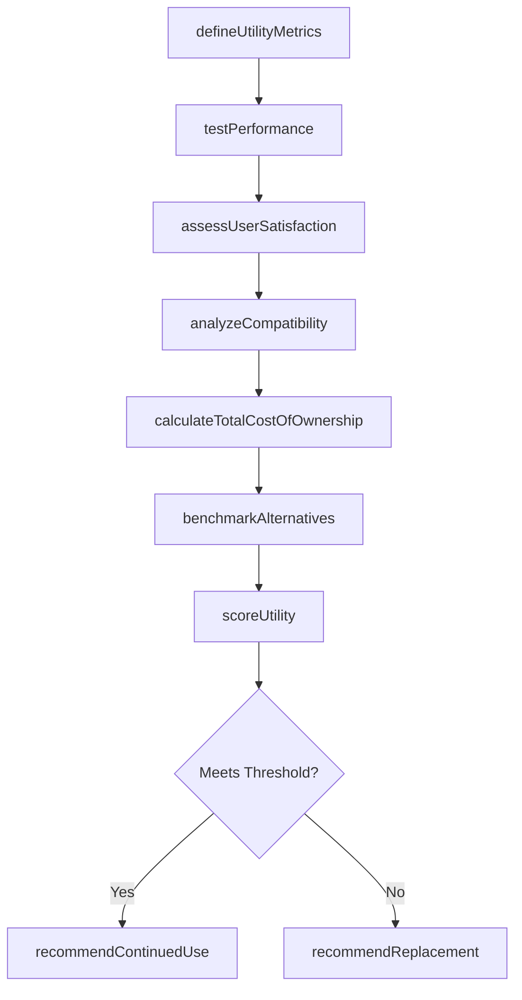
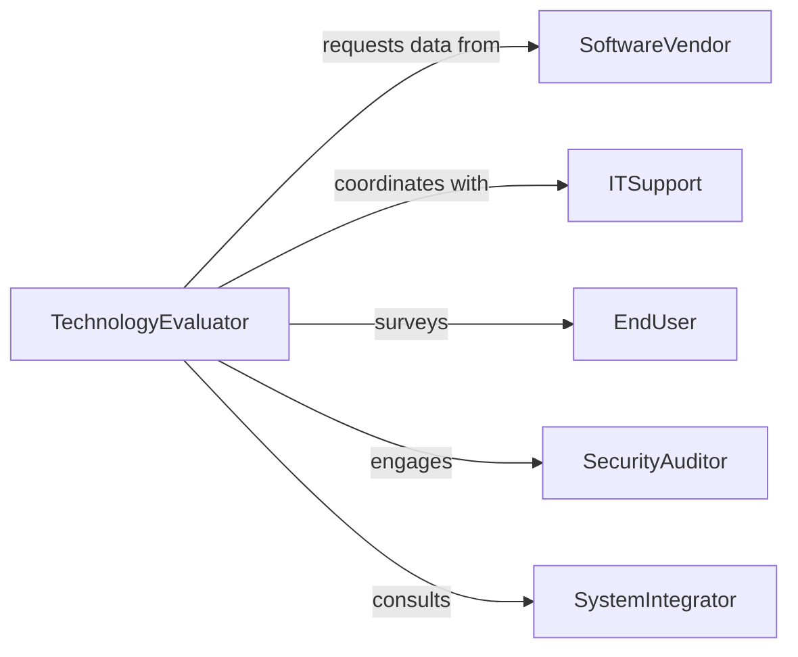

# Evaluate Utility Software Hardware Technologies

> Business-as-Code definition for technology utility evaluation. Models assessment of practical usefulness, performance, and value of software and hardware solutions.

## Overview

Technology utility evaluation involves measuring the practical value and effectiveness of software and hardware systems in meeting organizational needs. This definition exposes actions for performance testing, user satisfaction assessment, and total cost of ownership analysis to guide technology selection and optimization decisions.

## Actors

| Actor | Description |
|-------|-------------|
| SoftwareVendor | Provides software applications and support services |
| HardwareVendor | Supplies computing equipment and infrastructure |
| EndUser | Utilizes technology in daily work and provides feedback |
| ITSupport | Maintains systems and resolves technical issues |
| SecurityAuditor | Assesses security posture and compliance |
| SystemIntegrator | Evaluates compatibility with existing infrastructure |

## Roles

| Role | Description |
|------|-------------|
| TechnologyEvaluator | Conducts comprehensive utility assessments |
| PerformanceAnalyst | Measures system performance and efficiency |
| UserExperienceResearcher | Assesses user satisfaction and adoption |
| CostAnalyst | Calculates total cost of ownership and ROI |

## Entities

| Entity | Description |
|--------|-------------|
| SoftwareSystem | Application or platform being evaluated |
| HardwareSystem | Physical computing equipment under assessment |
| PerformanceMetric | Measurement of system speed, capacity, or reliability |
| UserFeedback | Input from end users on system effectiveness |
| UtilityScore | Composite measure of practical value and usefulness |
| TCOAnalysis | Total cost of ownership including acquisition and operations |

## Actions

| Action | Description |
|--------|-------------|
| defineUtilityMetrics | Establish criteria for measuring practical value |
| testPerformance | Measure system speed, capacity, and reliability |
| assessUserSatisfaction | Gather feedback on usability and effectiveness |
| analyzeCompatibility | Evaluate integration with existing systems |
| calculateTotalCostOfOwnership | Determine full lifecycle costs |
| benchmarkAlternatives | Compare utility against competing solutions |
| scoreUtility | Calculate composite utility rating |

## Events

| Event | Description |
|-------|-------------|
| metricsDefinedEvent | Utility measurement criteria have been established |
| performanceTested | System performance testing has been completed |
| userSatisfactionAssessed | User feedback has been collected and analyzed |
| compatibilityAnalyzed | Integration assessment is complete |
| totalCostCalculated | TCO analysis has been finalized |
| alternativesBenchmarked | Comparative analysis has been completed |
| utilityScored | Final utility rating has been determined |

## Searches

| Search | Description |
|--------|-------------|
| findEvaluations | Retrieve technology utility assessments by system or date |
| getPerformanceData | Search performance metrics and test results |
| getUserFeedback | List user satisfaction scores and comments |
| getTCOAnalyses | Find total cost analyses by technology type |

## Workflow



## Actor Relationships



## Usage

### Calling Actions

```typescript
import { evaluateUtilitySoftwareHardwareTechnologies } from '@headlessly/evaluate-utility-software-hardware-technologies'

const evaluator = evaluateUtilitySoftwareHardwareTechnologies()

// Define utility metrics for ERP system evaluation
const metrics = await evaluator.defineUtilityMetrics({
  systemName: 'Enterprise ERP Platform',
  systemType: 'software',
  metrics: {
    performance: ['responseTime', 'throughput', 'uptime'],
    usability: ['userSatisfaction', 'taskCompletion', 'trainingTime'],
    integration: ['apiAvailability', 'dataCompatibility'],
    cost: ['licenseExpense', 'maintenanceCost', 'supportCost']
  }
})

// Test system performance
const performanceResults = await evaluator.testPerformance({
  systemId: 'ERP-001',
  evaluationId: metrics.id,
  tests: [
    { metric: 'responseTime', load: '1000 concurrent users', duration: '24 hours' },
    { metric: 'throughput', scenario: 'order processing', volume: '10000 transactions' }
  ]
})

// Assess user satisfaction
const userFeedback = await evaluator.assessUserSatisfaction({
  systemId: 'ERP-001',
  evaluationId: metrics.id,
  surveyResponses: 247,
  satisfactionScore: 7.2,
  commonIssues: ['slow report generation', 'complex navigation']
})

// Calculate total cost of ownership
const tco = await evaluator.calculateTotalCostOfOwnership({
  systemId: 'ERP-001',
  evaluationId: metrics.id,
  timeframe: '5 years',
  acquisitionCost: 850000,
  annualLicensing: 120000,
  annualSupport: 95000,
  staffingCost: 180000
})
```

### Event-Driven Automation

```typescript
// Flag underperforming systems for review
evaluator.utilityScored(async ({ systemId, utilityScore, evaluation }) => {
  if (utilityScore.overall < 6.0) {
    await createTask({
      type: 'SystemReview',
      priority: 'high',
      system: systemId,
      issues: evaluation.deficiencies,
      action: 'Evaluate replacement or optimization options'
    })
  }
})

// Auto-generate executive reports on critical systems
evaluator.totalCostCalculated(async ({ systemId, tcoAnalysis }) => {
  if (tcoAnalysis.annualizedCost > 500000) {
    await generateReport({
      type: 'ExecutiveSummary',
      system: systemId,
      sections: ['costBreakdown', 'utilizationRate', 'alternatives'],
      recipients: ['cio', 'cfo']
    })
  }
})
```
