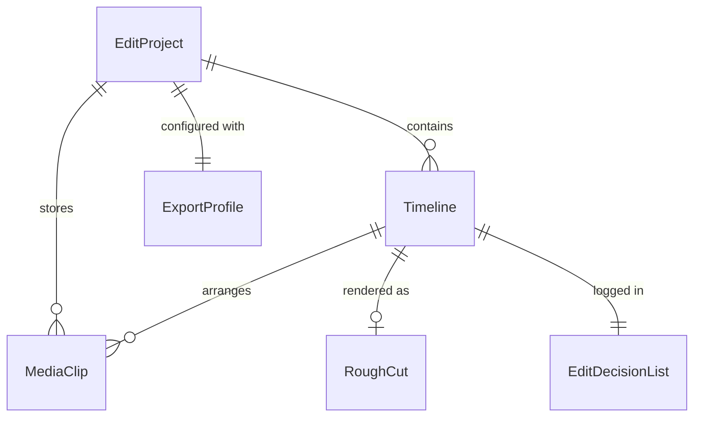
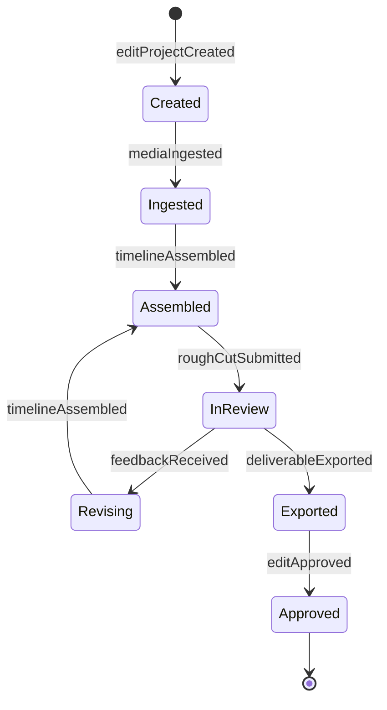
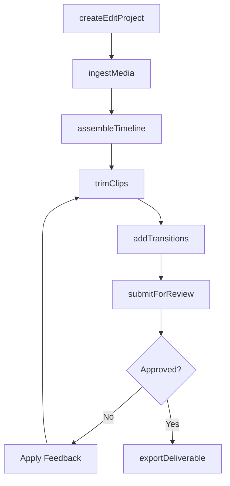
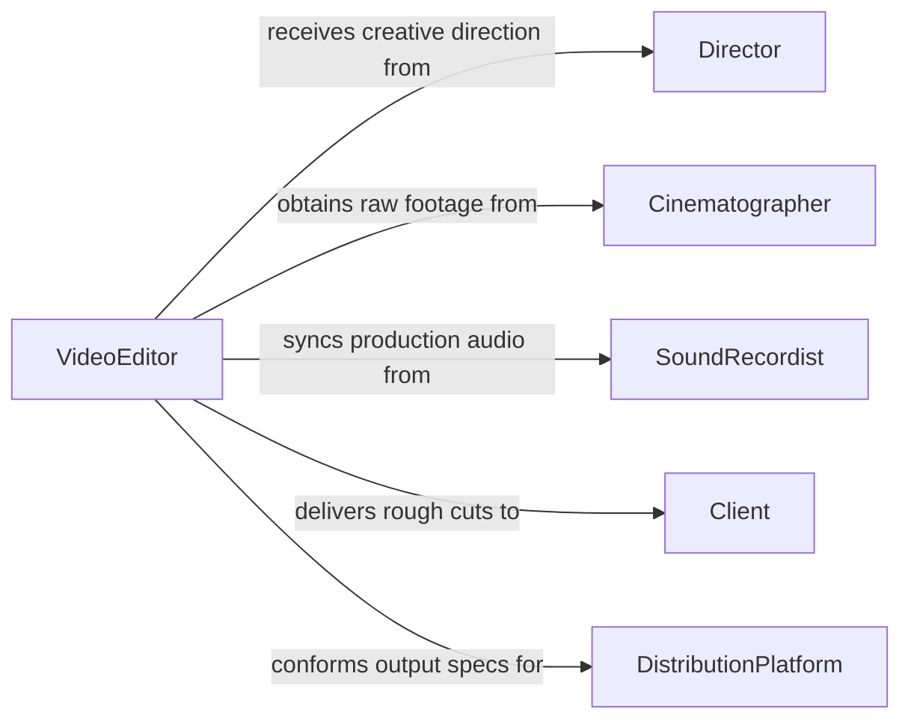

# Edit Audio Video Recordings

> Business-as-Code definition for editing audio and video recordings. Models the post-production workflow from media ingest through assembly, review, and final export.

## Overview

Editing audio and video recordings involves selecting, arranging, trimming, and combining media clips to produce a cohesive final product for broadcast, streaming, corporate communications, or entertainment distribution. This process includes cutting footage, synchronizing audio, adding transitions, and conforming output to technical specifications. The definition provides actions for each editing phase, events for review cycle automation, and searches for managing project timelines and asset libraries.

## Actors

| Actor | Description |
|-------|-------------|
| Director | Provides creative direction and approves editorial decisions |
| Cinematographer | Supplies raw video footage and shot metadata |
| SoundRecordist | Delivers production audio and field recordings |
| Client | Commissions the project and provides feedback on rough cuts |
| DistributionPlatform | Specifies technical delivery requirements for the final output |

## Roles

| Role | Description |
|------|-------------|
| VideoEditor | Assembles footage, applies cuts, and builds the narrative structure |
| AudioEditor | Cleans, syncs, and layers audio tracks within the timeline |
| PostProductionSupervisor | Manages the editing schedule, resources, and delivery milestones |
| ColoristAssistant | Prepares clips for color grading and manages look-up tables |

## Entities

| Entity | Description |
|--------|-------------|
| EditProject | A workspace containing all media, timelines, and project settings |
| Timeline | The sequenced arrangement of clips, transitions, and effects |
| MediaClip | An individual audio or video segment used in the edit |
| RoughCut | An early assembled version of the project for review |
| ExportProfile | A set of encoding parameters for the final deliverable |
| EditDecisionList | A machine-readable log of all cuts and transitions in the timeline |

## Actions

| Action | Description |
|--------|-------------|
| createEditProject | Initialize a new editing project with media and settings |
| ingestMedia | Import raw footage and audio into the project asset library |
| assembleTimeline | Arrange clips on the timeline to build the narrative sequence |
| trimClips | Adjust in and out points on individual clips for precise timing |
| addTransitions | Apply visual or audio transitions between clips |
| exportDeliverable | Render the final timeline to a deliverable file format |
| submitForReview | Send the current cut to stakeholders for feedback |

## Events

| Event | Description |
|-------|-------------|
| editProjectCreated | A new editing project has been initialized |
| mediaIngested | Raw footage and audio have been imported into the project |
| timelineAssembled | The initial clip arrangement has been completed |
| roughCutSubmitted | An early version has been sent for stakeholder review |
| feedbackReceived | Review notes have been returned on the current cut |
| deliverableExported | The final output has been rendered and is ready for distribution |
| editApproved | The final cut has been signed off by the director or client |

## Searches

| Search | Description |
|--------|-------------|
| findEditProjects | List editing projects by status, client, or date range |
| getMediaAssets | Retrieve clips and audio files within a project library |
| getTimelineVersions | Find all saved timeline versions for a given project |
| getReviewNotes | Retrieve feedback comments associated with a specific cut |

## Entity Relationships



## State Diagram



## Workflow



## Actor Relationships



## Usage

### Calling Actions

```typescript
import { editAudioVideoRecordings } from '@headlessly/edit-audio-video-recordings'

const editor = editAudioVideoRecordings()

// Create a new editing project
const project = await editor.createEditProject({
  name: 'Product Launch Video - Q2 2026',
  resolution: '4K',
  frameRate: 24,
  audioSampleRate: 48000
})

// Ingest raw media
await editor.ingestMedia({
  projectId: project.id,
  sources: [
    { name: 'Interview A', path: '/footage/interview-a.mov' },
    { name: 'B-Roll Warehouse', path: '/footage/broll-warehouse.mp4' },
    { name: 'Voiceover', path: '/audio/voiceover-final.wav' }
  ]
})

// Export the final deliverable
await editor.exportDeliverable({
  projectId: project.id,
  profile: 'broadcast-hd',
  format: 'h264',
  destination: '/deliverables/launch-video-final.mp4'
})
```

### Event-Driven Automation

```typescript
// Notify stakeholders when rough cut is ready
editor.roughCutSubmitted(async ({ projectId, version }) => {
  await notify({
    to: 'review-team',
    message: `Rough cut v${version} is ready for review on project ${projectId}`
  })
})

// Archive project assets on final approval
editor.editApproved(async ({ projectId, deliverablePath }) => {
  await archiveProject({
    projectId,
    deliverable: deliverablePath,
    destination: 'cold-storage'
  })
})
```
