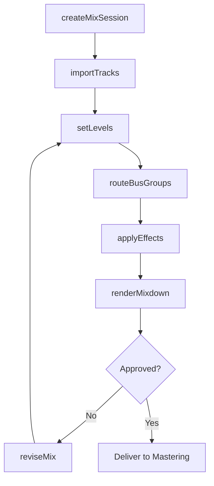
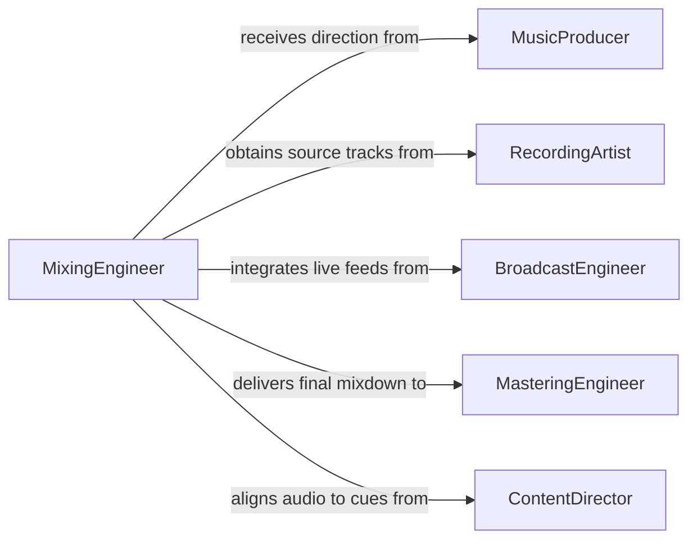

# Mix Sound Inputs

> Business-as-Code definition for mixing sound inputs. Models the complete audio mixing workflow from session setup through level balancing, effects processing, and final mixdown delivery.

## Overview

Mixing sound inputs involves combining multiple audio tracks, adjusting volume levels, applying equalization and effects, and producing a balanced stereo or surround-sound output. This activity spans live sound reinforcement, studio recording sessions, broadcast production, and post-production for film and media. The definition provides actions for each phase of the mixing process, events for workflow automation, and searches for managing sessions and track libraries.

## Actors

| Actor | Description |
|-------|-------------|
| MusicProducer | Directs the creative vision and approves final mix decisions |
| RecordingArtist | Provides source recordings and performance input for the mix |
| BroadcastEngineer | Supplies live audio feeds requiring real-time mixing |
| ContentDirector | Specifies audio requirements for film, television, or media projects |
| MasteringEngineer | Receives the final mixdown for mastering and distribution preparation |

## Roles

| Role | Description |
|------|-------------|
| MixingEngineer | Operates the mixing console and makes technical and creative mix decisions |
| AudioTechnician | Sets up equipment, patches signal chains, and manages recording sessions |
| SoundDesigner | Creates and integrates sound effects and ambient audio layers |

## Entities

| Entity | Description |
|--------|-------------|
| MixSession | A project workspace containing all tracks, settings, and mix parameters |
| AudioTrack | An individual audio channel with its associated source recording |
| EffectsChain | A sequence of audio processors applied to a track or bus |
| Mixdown | The rendered stereo or surround output of a completed mix session |
| BusGroup | A submix channel that combines multiple tracks for collective processing |
| CueSheet | A timed reference document mapping audio events to visual or narrative cues |

## Actions

| Action | Description |
|--------|-------------|
| createMixSession | Initialize a new mixing session with project parameters |
| importTracks | Load audio tracks into the session from source recordings |
| setLevels | Adjust volume, panning, and gain staging across all tracks |
| applyEffects | Add equalization, compression, reverb, or other processing to tracks |
| routeBusGroups | Assign tracks to submix buses for grouped processing |
| renderMixdown | Bounce the final mix to a deliverable audio file |
| reviseMix | Apply feedback-driven adjustments to an existing mix |

## Events

| Event | Description |
|-------|-------------|
| mixSessionCreated | A new mixing session has been initialized |
| tracksImported | Source audio tracks have been loaded into the session |
| levelsSet | Volume and panning adjustments have been applied |
| effectsApplied | Audio processing has been added to one or more tracks |
| mixdownRendered | The final mix has been bounced to an output file |
| mixRevisionRequested | Feedback has triggered a request for mix adjustments |
| mixApproved | The final mixdown has been approved for delivery |

## Searches

| Search | Description |
|--------|-------------|
| findMixSessions | List mixing sessions by project, date, or status |
| getTracksBySession | Retrieve all audio tracks within a given session |
| getMixdownVersions | Find all rendered mixdown versions for a project |

## Workflow



## Actor Relationships



## Usage

### Calling Actions

```typescript
import { mixSoundInputs } from '@headlessly/mix-sound-inputs'

const mixer = mixSoundInputs()

// Create a new mix session
const session = await mixer.createMixSession({
  name: 'Album Track 03 - Final Mix',
  sampleRate: 48000,
  bitDepth: 24,
  format: 'surround-5.1'
})

// Import source tracks
await mixer.importTracks({
  sessionId: session.id,
  tracks: [
    { name: 'Vocals', source: '/recordings/vocals-take-3.wav' },
    { name: 'Drums', source: '/recordings/drums-stereo.wav' },
    { name: 'Bass', source: '/recordings/bass-di.wav' }
  ]
})

// Render the final mixdown
const mixdown = await mixer.renderMixdown({
  sessionId: session.id,
  format: 'wav',
  bitDepth: 24
})
```

### Event-Driven Automation

```typescript
// Notify producer when mixdown is ready for review
mixer.mixdownRendered(async ({ sessionId, mixdownId, format }) => {
  await notify({
    to: 'producer',
    message: `Mixdown ready for review: session ${sessionId}, format ${format}`
  })
})

// Archive session on final approval
mixer.mixApproved(async ({ sessionId, mixdownId }) => {
  await archiveSession({
    sessionId,
    deliverable: mixdownId,
    destination: 'mastering-inbox'
  })
})
```
