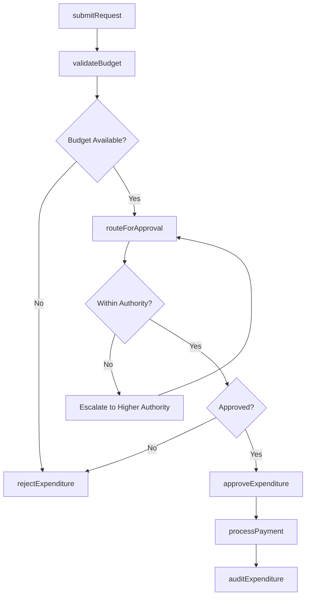
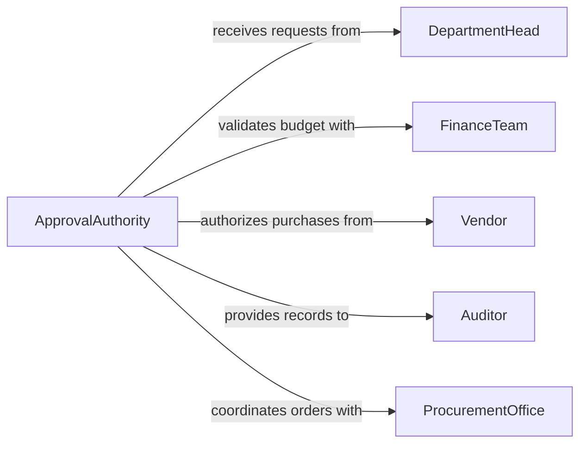

# Approve Expenditures

> Business-as-Code definition for approving organizational expenditures. Models the spend authorization process from request through multi-level approval and disbursement.

## Overview

Approving expenditures involves evaluating spending requests against budgets, policies, and authority limits, then routing them through the appropriate approval chain. This definition exposes actions for submitting expenditure requests, validating budget availability, applying approval workflows, and tracking disbursement, along with events for automating procurement and financial controls.

## Actors

| Actor | Description |
|-------|-------------|
| Vendor | Supplies goods or services that generate expenditure requests |
| DepartmentHead | Originates and justifies spending requests for their unit |
| FinanceTeam | Validates budget availability and processes payments |
| Auditor | Reviews expenditure approvals for policy compliance |
| ProcurementOffice | Manages vendor relationships and purchase order processing |

## Roles

| Role | Description |
|------|-------------|
| ApprovalAuthority | Reviews and approves or rejects expenditure requests |
| BudgetOwner | Manages the budget against which expenditures are charged |
| FinancialController | Verifies funding and authorizes disbursement |
| Requester | Submits the expenditure request with supporting documentation |

## Entities

| Entity | Description |
|--------|-------------|
| ExpenditureRequest | A formal request for authorization to spend funds |
| ApprovalRecord | Documentation of the approval decision and rationale |
| BudgetAllocation | The budget line item against which the expenditure is charged |
| PurchaseOrder | A commitment to purchase goods or services from a vendor |
| DisbursementRecord | Record of the actual payment made against an approved request |
| SpendingPolicy | Rules governing expenditure thresholds and approval routing |

## Actions

| Action | Description |
|--------|-------------|
| submitRequest | File an expenditure request with cost justification and supporting documents |
| validateBudget | Confirm sufficient funds exist in the relevant budget allocation |
| routeForApproval | Direct the request to the appropriate authority based on amount and policy |
| approveExpenditure | Grant formal authorization for the requested spending |
| rejectExpenditure | Deny the expenditure with documented rationale |
| processPayment | Execute the disbursement upon approval |
| auditExpenditure | Review the authorization chain and compliance with spending policies |

## Events

| Event | Description |
|-------|-------------|
| requestSubmitted | A new expenditure request has been filed |
| budgetValidated | Budget availability has been confirmed for the request |
| approvalRouted | The request has been sent to the designated approval authority |
| expenditureApproved | The spending request has been formally authorized |
| expenditureRejected | The spending request has been denied |
| paymentProcessed | Funds have been disbursed against the approved expenditure |
| policyViolationDetected | The request exceeds policy limits or violates spending rules |

## Searches

| Search | Description |
|--------|-------------|
| findRequests | List expenditure requests by status, department, or amount range |
| getPendingApprovals | Retrieve requests awaiting approval for a specific authority |
| getSpendingByCategory | Aggregate approved expenditures by category or cost center |
| getApprovalHistory | Retrieve the approval chain and timeline for a specific request |

## Workflow



## Actor Relationships



## Usage

### Calling Actions

```typescript
import { approveExpenditures } from '@headlessly/approve-expenditures'

const expenditures = approveExpenditures()

// Submit an expenditure request
const request = await expenditures.submitRequest({
  description: 'Cloud infrastructure expansion - Q3',
  amount: 85000,
  category: 'technology',
  department: 'engineering',
  vendor: 'AWS',
  justification: 'Scale capacity for anticipated 40% traffic increase',
  budgetLineItem: 'BL-2026-INFRA-003'
})

// Validate budget availability
await expenditures.validateBudget({
  requestId: request.id,
  budgetLineItem: 'BL-2026-INFRA-003'
})

// Approve the expenditure
await expenditures.approveExpenditure({
  requestId: request.id,
  approvedBy: 'vp-engineering',
  conditions: ['requires-quarterly-review']
})
```

### Event-Driven Automation

```typescript
// Auto-approve low-value requests within policy
expenditures.requestSubmitted(async ({ requestId, amount, department }) => {
  if (amount <= 5000) {
    await expenditures.approveExpenditure({
      requestId,
      approvedBy: 'auto-policy',
      conditions: []
    })
  }
})

// Alert finance on policy violations
expenditures.policyViolationDetected(async ({ requestId, violation }) => {
  await notify({
    to: 'financial-controller',
    message: `Expenditure ${requestId} flagged: ${violation}`
  })
})
```
