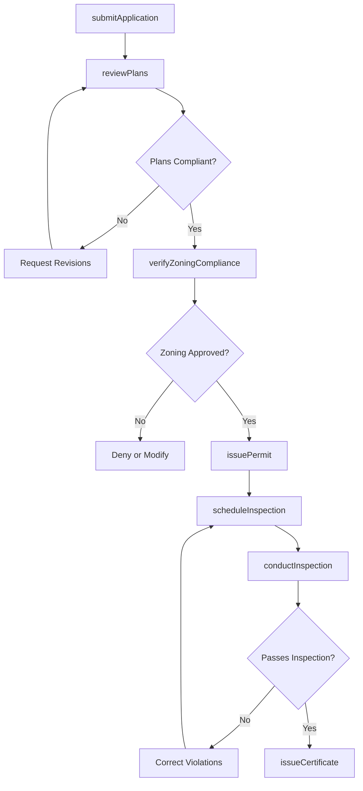
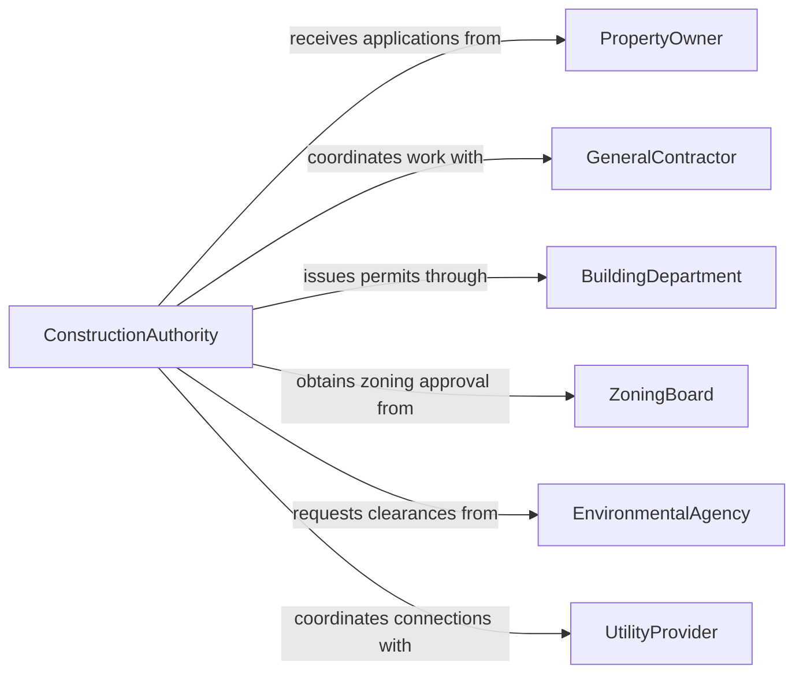

# Authorize Construction Activities

> Business-as-Code definition for authorizing construction activities. Models the permit and approval process from application through inspection and final certification.

## Overview

Authorizing construction activities involves reviewing permit applications, verifying compliance with building codes and zoning regulations, issuing approvals, and managing inspections throughout the construction lifecycle. This definition exposes actions for permit processing, code compliance verification, inspection scheduling, and authorization management.

## Actors

| Actor | Description |
|-------|-------------|
| PropertyOwner | Initiates construction projects and submits permit applications |
| GeneralContractor | Executes construction work and coordinates subcontractors |
| BuildingDepartment | Issues permits and enforces building codes |
| ZoningBoard | Reviews projects for compliance with land use regulations |
| EnvironmentalAgency | Evaluates environmental impact and issues clearances |
| UtilityProvider | Coordinates utility connections and infrastructure impacts |

## Roles

| Role | Description |
|------|-------------|
| ConstructionAuthority | Reviews applications and grants construction approvals |
| BuildingInspector | Conducts on-site inspections at construction milestones |
| PlanReviewer | Evaluates architectural and engineering drawings for code compliance |
| PermitCoordinator | Manages the administrative workflow of permit processing |

## Entities

| Entity | Description |
|--------|-------------|
| PermitApplication | A formal request to perform construction work |
| ConstructionPermit | An approved authorization to proceed with building activities |
| InspectionReport | Documentation of on-site compliance verification results |
| BuildingPlan | Architectural and engineering drawings submitted for review |
| ComplianceCertificate | A certificate confirming work meets all applicable codes |
| ZoningApproval | Authorization confirming the project meets land use requirements |

## Actions

| Action | Description |
|--------|-------------|
| submitApplication | File a permit application with required plans and documentation |
| reviewPlans | Evaluate submitted building plans against applicable codes |
| verifyZoningCompliance | Confirm the project conforms to zoning and land use regulations |
| issuePermit | Grant formal authorization to commence construction activities |
| scheduleInspection | Arrange on-site inspections at required construction milestones |
| conductInspection | Perform on-site verification of code compliance |
| issueCertificate | Grant final occupancy or completion certificate |

## Events

| Event | Description |
|-------|-------------|
| applicationSubmitted | A new construction permit application has been filed |
| plansReviewed | Building plans have been evaluated for code compliance |
| zoningVerified | Zoning compliance has been confirmed or denied |
| permitIssued | Construction authorization has been formally granted |
| inspectionCompleted | An on-site inspection has been performed and documented |
| violationIdentified | A code violation has been found during inspection |
| certificateIssued | Final occupancy or completion certification has been granted |

## Searches

| Search | Description |
|--------|-------------|
| findPermits | List permits by status, location, project type, or applicant |
| getInspections | Retrieve inspection reports by permit, date, or result |
| getViolations | Find open code violations by property, contractor, or severity |
| getApplicationStatus | Track the current status of a permit application |

## Workflow



## Actor Relationships



## Usage

### Calling Actions

```typescript
import { authorizeConstructionActivities } from '@headlessly/authorize-construction-activities'

const construction = authorizeConstructionActivities()

// Submit a permit application
const application = await construction.submitApplication({
  projectType: 'commercial-renovation',
  address: '450 Industrial Parkway, Suite 200',
  owner: 'Apex Properties LLC',
  contractor: 'BuildRight Construction Inc.',
  estimatedCost: 2500000,
  plans: ['architectural-v2.pdf', 'structural-v2.pdf', 'mep-v2.pdf']
})

// Review submitted plans
const review = await construction.reviewPlans({
  applicationId: application.id,
  codes: ['IBC-2024', 'NEC-2023', 'local-fire-code'],
  reviewer: 'plan-review-structural'
})

// Issue the permit after all approvals
await construction.issuePermit({
  applicationId: application.id,
  conditions: ['foundation-inspection-required', 'framing-inspection-required'],
  validUntil: '2027-06-30'
})
```

### Event-Driven Automation

```typescript
// Schedule inspections when permit is issued
construction.permitIssued(async ({ applicationId, conditions }) => {
  for (const milestone of conditions) {
    await construction.scheduleInspection({
      applicationId,
      type: milestone,
      status: 'pending-contractor-request'
    })
  }
})

// Escalate violations to enforcement
construction.violationIdentified(async ({ applicationId, severity, description }) => {
  if (severity === 'critical') {
    await notify({
      to: 'enforcement-division',
      message: `Stop-work order recommended for ${applicationId}: ${description}`
    })
  }
})
```
