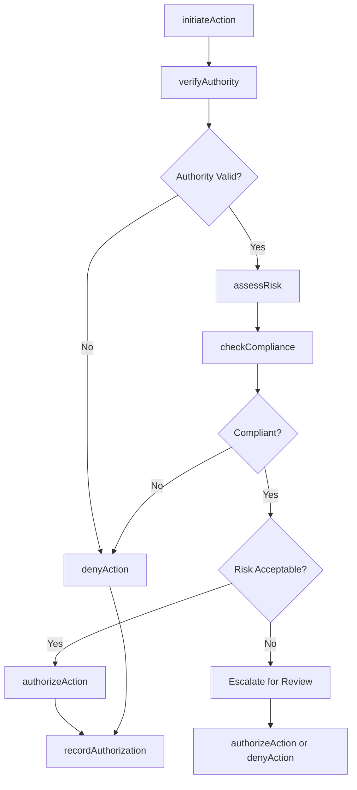
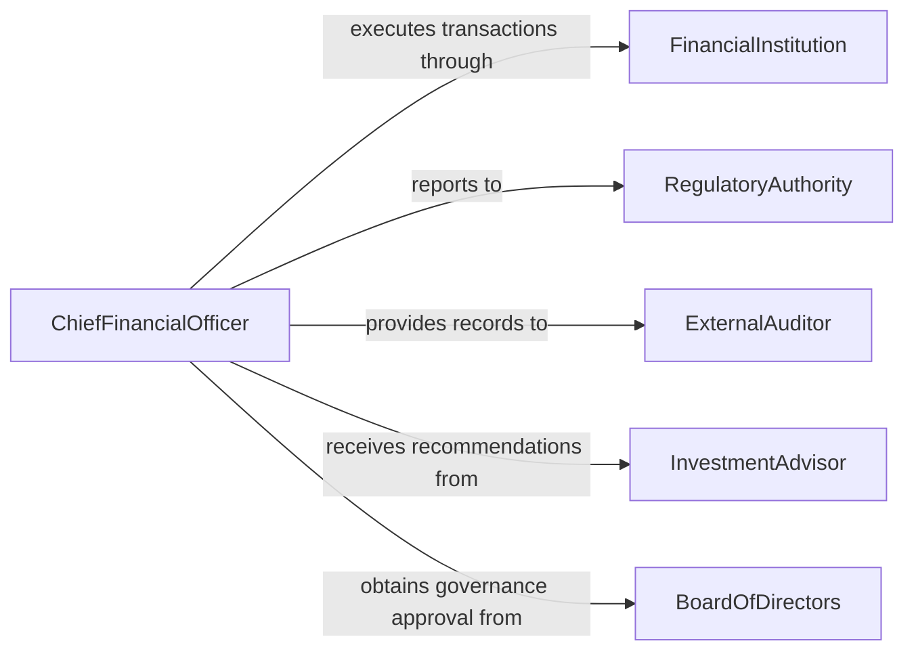

# Authorize Financial Actions

> Business-as-Code definition for authorizing financial actions. Models the governance process for approving transactions, investments, and financial commitments.

## Overview

Authorizing financial actions involves reviewing proposed transactions, verifying compliance with financial policies and regulatory requirements, and granting formal approval for execution. This definition exposes actions for transaction review, risk assessment, authority verification, and approval routing, along with events for maintaining audit trails and enforcing segregation of duties.

## Actors

| Actor | Description |
|-------|-------------|
| FinancialInstitution | Processes transactions and provides banking services |
| RegulatoryAuthority | Enforces financial regulations and reporting requirements |
| ExternalAuditor | Independently verifies financial controls and authorization procedures |
| InvestmentAdvisor | Recommends financial strategies and transaction structures |
| BoardOfDirectors | Provides governance oversight for significant financial commitments |

## Roles

| Role | Description |
|------|-------------|
| ChiefFinancialOfficer | Holds ultimate authority for financial decisions within delegated limits |
| TreasuryManager | Manages cash positions, investments, and financing activities |
| ComplianceOfficer | Verifies regulatory compliance for financial transactions |
| FinancialController | Maintains financial controls and authorizes disbursements |
| RiskAnalyst | Assesses financial risk exposure of proposed actions |

## Entities

| Entity | Description |
|--------|-------------|
| FinancialAction | A proposed transaction, investment, or financial commitment |
| AuthorizationRequest | A formal request for approval to execute a financial action |
| RiskAssessment | An evaluation of financial, operational, and compliance risks |
| AuthorityMatrix | Rules defining who can approve which types and amounts of transactions |
| ComplianceCheck | Verification that the action meets regulatory and policy requirements |
| AuditTrail | Immutable record of all authorization decisions and rationale |

## Actions

| Action | Description |
|--------|-------------|
| initiateAction | Submit a financial action for authorization review |
| assessRisk | Evaluate the financial and compliance risk of the proposed action |
| verifyAuthority | Confirm the requester and approver have appropriate delegation limits |
| checkCompliance | Validate the action against regulatory and internal policy requirements |
| authorizeAction | Grant formal approval to execute the financial action |
| denyAction | Reject the financial action with documented rationale |
| recordAuthorization | Create an immutable audit trail entry for the decision |

## Events

| Event | Description |
|-------|-------------|
| actionInitiated | A new financial action has been submitted for authorization |
| riskAssessed | Risk evaluation of the financial action is complete |
| authorityVerified | Delegation limits have been confirmed for the transaction |
| complianceChecked | Regulatory and policy compliance has been verified |
| actionAuthorized | The financial action has been formally approved for execution |
| actionDenied | The financial action has been rejected |
| unauthorizedAttemptDetected | An action was submitted outside approved authority limits |

## Searches

| Search | Description |
|--------|-------------|
| findActions | List financial actions by type, status, amount, or date range |
| getPendingAuthorizations | Retrieve actions awaiting approval for a specific authority |
| getAuthorityMatrix | Look up delegation limits by role, department, or transaction type |
| getAuditTrail | Retrieve the complete authorization history for an action |
| getRiskExposure | Aggregate outstanding authorized financial commitments |

## Workflow



## Actor Relationships



## Usage

### Calling Actions

```typescript
import { authorizeFinancialActions } from '@headlessly/authorize-financial-actions'

const finance = authorizeFinancialActions()

// Initiate a financial action
const action = await finance.initiateAction({
  type: 'wire-transfer',
  amount: 1250000,
  currency: 'USD',
  counterparty: 'Global Supply Corp',
  purpose: 'Quarterly supplier payment per contract GSC-2025-014',
  requestedBy: 'treasury-manager'
})

// Assess risk and check compliance
await finance.assessRisk({
  actionId: action.id,
  factors: ['counterparty-risk', 'currency-exposure', 'concentration-limit']
})

await finance.checkCompliance({
  actionId: action.id,
  regulations: ['aml-kyc', 'ofac-screening', 'internal-policy']
})

// Authorize the action
await finance.authorizeAction({
  actionId: action.id,
  approvedBy: 'cfo',
  conditions: ['dual-signature-required']
})
```

### Event-Driven Automation

```typescript
// Enforce dual authorization for high-value transactions
finance.actionAuthorized(async ({ actionId, amount, approvedBy }) => {
  if (amount > 1000000) {
    await notify({
      to: 'board-treasurer',
      message: `Second authorization required for ${actionId}: $${amount}`
    })
  }
})

// Alert on unauthorized access attempts
finance.unauthorizedAttemptDetected(async ({ actionId, requestedBy, reason }) => {
  await notify({
    to: 'compliance-officer',
    message: `Unauthorized financial action attempt by ${requestedBy}: ${reason}`
  })
})
```
