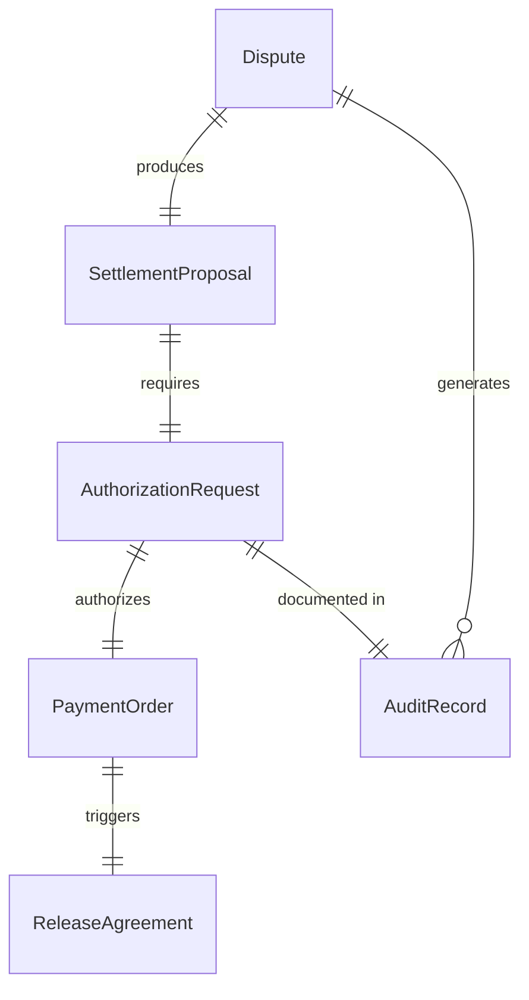
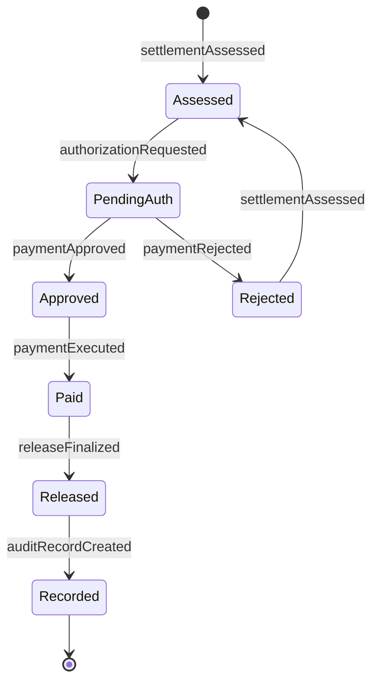
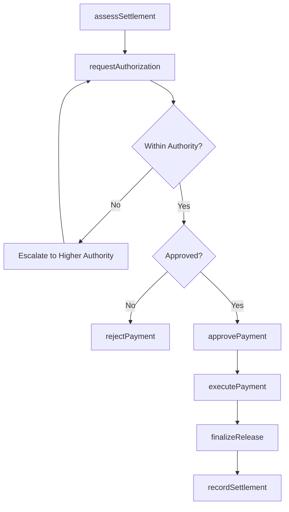
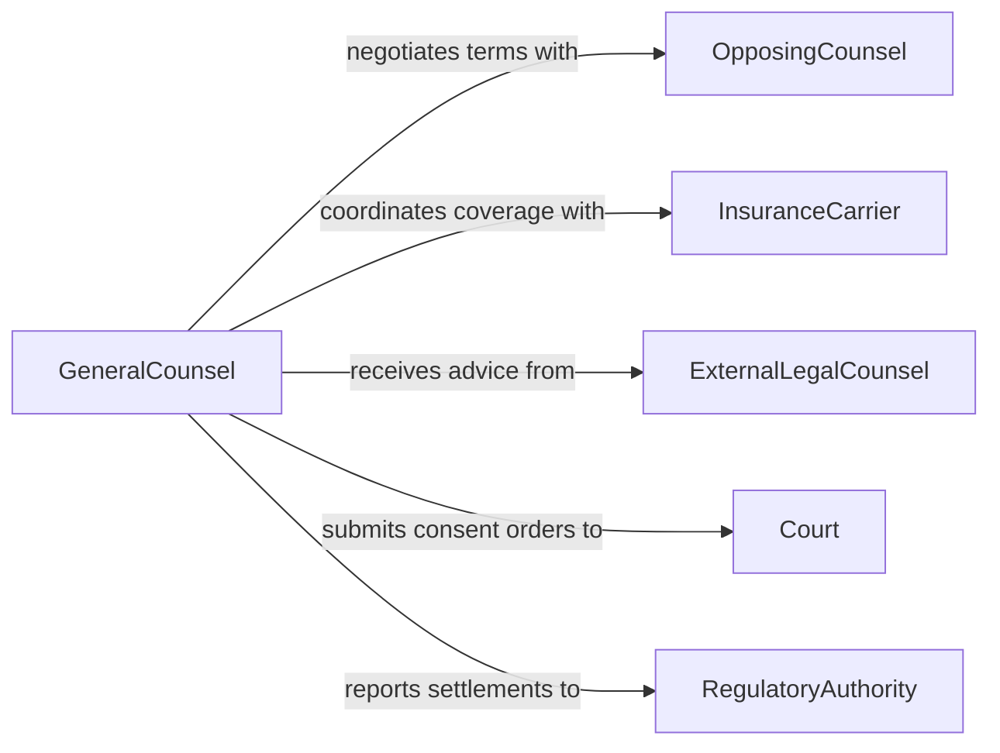

# Authorize Payments Settle Legal Disputes

> Business-as-Code definition for authorizing payments to settle legal disputes. Models the settlement approval process from dispute assessment through payment execution and compliance documentation.

## Overview

Authorizing payments to settle legal disputes involves evaluating settlement proposals, verifying authority limits, obtaining required approvals, and executing disbursements to resolve litigation or claims. This definition exposes actions for the full settlement payment lifecycle including risk assessment, approval routing, payment execution, and audit trail management.

## Actors

| Actor | Description |
|-------|-------------|
| OpposingCounsel | Negotiates settlement terms on behalf of the claimant |
| InsuranceCarrier | Provides coverage or reimbursement for settlement amounts |
| ExternalLegalCounsel | Advises on settlement strategy and legal exposure |
| Court | Approves settlements requiring judicial consent |
| RegulatoryAuthority | Reviews settlements for compliance in regulated industries |

## Roles

| Role | Description |
|------|-------------|
| GeneralCounsel | Evaluates legal risk and recommends settlement terms |
| SettlementAuthority | Holds delegated authority to approve payment amounts |
| FinanceController | Validates funding availability and processes disbursement |
| ComplianceOfficer | Ensures settlement terms meet regulatory requirements |

## Entities

| Entity | Description |
|--------|-------------|
| Dispute | The legal matter or claim requiring resolution |
| SettlementProposal | A proposed agreement including payment amount and terms |
| AuthorizationRequest | A formal request to approve settlement payment |
| PaymentOrder | An instruction to disburse funds for the settlement |
| ReleaseAgreement | Legal document releasing parties from further claims |
| AuditRecord | Documentation of the authorization chain and rationale |

## Actions

| Action | Description |
|--------|-------------|
| assessSettlement | Evaluate the proposed settlement against legal exposure and precedent |
| requestAuthorization | Submit a payment authorization request to the appropriate authority |
| approvePayment | Grant formal approval for the settlement disbursement |
| rejectPayment | Deny the authorization with documented rationale |
| executePayment | Process the settlement disbursement through finance |
| recordSettlement | Document the settlement terms and authorization chain |
| finalizeRelease | Execute the legal release agreement upon payment completion |

## Events

| Event | Description |
|-------|-------------|
| settlementAssessed | The proposed settlement has been evaluated for risk and merit |
| authorizationRequested | A payment authorization has been submitted for review |
| paymentApproved | Settlement payment has been formally authorized |
| paymentRejected | Settlement payment authorization has been denied |
| paymentExecuted | Funds have been disbursed to settle the dispute |
| releaseFinalized | The legal release agreement has been executed by all parties |
| auditRecordCreated | The complete authorization trail has been documented |

## Searches

| Search | Description |
|--------|-------------|
| findDisputes | List disputes by status, amount range, or legal matter type |
| getSettlementHistory | Retrieve past settlements by party, amount, or date |
| getPendingAuthorizations | Find authorization requests awaiting approval |
| getPaymentRecords | Retrieve settlement payment details and audit trails |

## Entity Relationships



## State Diagram



## Workflow



## Actor Relationships



## Usage

### Calling Actions

```typescript
import { authorizePaymentsSettleLegalDisputes } from '@headlessly/authorize-payments-settle-legal-disputes'

const settlements = authorizePaymentsSettleLegalDisputes()

// Assess a proposed settlement
const assessment = await settlements.assessSettlement({
  disputeId: 'DISP-2026-00892',
  proposedAmount: 175000,
  terms: 'Full release with confidentiality provision',
  legalExposure: 450000,
  recommendation: 'settle'
})

// Request authorization for payment
const auth = await settlements.requestAuthorization({
  disputeId: 'DISP-2026-00892',
  amount: 175000,
  justification: 'Settlement at 39% of estimated exposure',
  authorityLevel: 'vice-president'
})

// Execute the approved payment
await settlements.executePayment({
  authorizationId: auth.id,
  payee: 'Smith & Associates LLP',
  amount: 175000,
  method: 'wire-transfer'
})
```

### Event-Driven Automation

```typescript
// Route high-value settlements for executive approval
settlements.authorizationRequested(async ({ disputeId, amount }) => {
  if (amount > 500000) {
    await escalate({
      to: 'ceo',
      message: `Settlement authorization for ${disputeId} requires executive approval: $${amount}`
    })
  }
})

// Generate audit record upon payment
settlements.paymentExecuted(async ({ disputeId, amount, authorizationId }) => {
  await settlements.recordSettlement({
    disputeId,
    amount,
    authorizationChain: authorizationId,
    timestamp: new Date().toISOString()
  })
})
```
