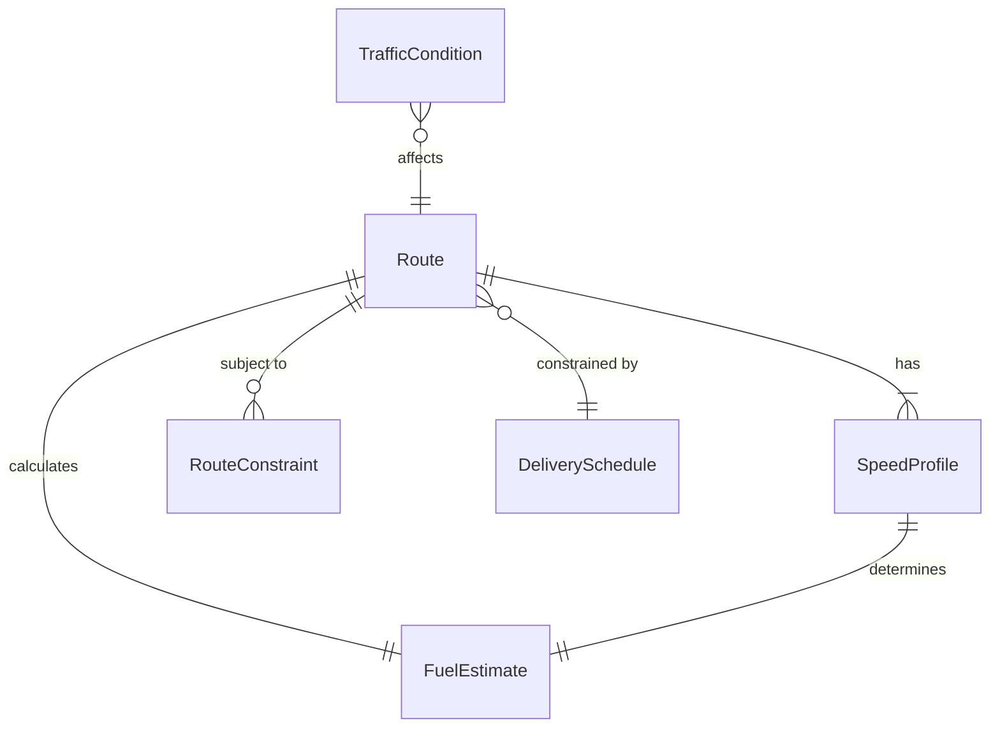
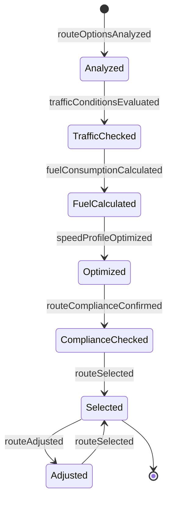
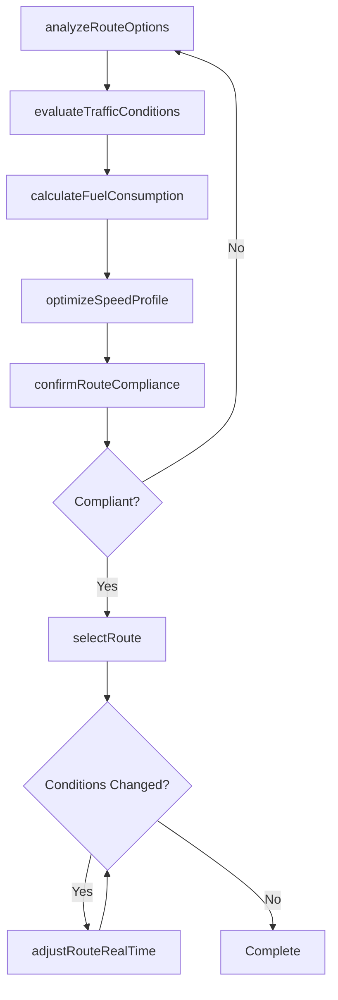
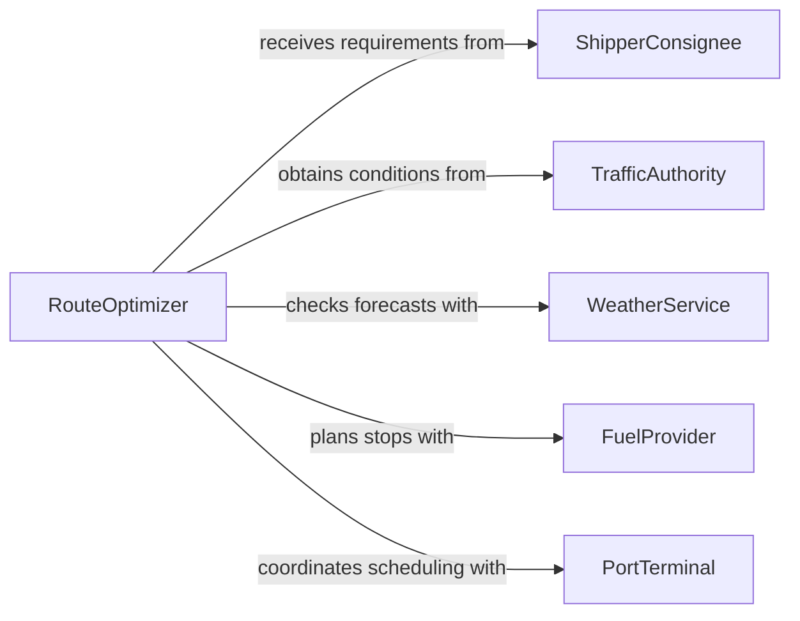

# Choose Optimal Transportation Routes Speeds

> Business-as-Code definition for choosing optimal transportation routes or speeds. Models the evaluation and selection of the most efficient routes, speeds, and travel parameters for moving goods, vehicles, or people while balancing time, cost, safety, and fuel efficiency.

## Overview

Choosing optimal transportation routes and speeds involves analyzing traffic conditions, weather, cargo requirements, fuel consumption, and regulatory constraints to determine the best travel path and velocity profile. This applies to trucking, shipping, aviation, rail, and fleet management operations. The definition provides actions for route analysis and optimization, events for tracking route decisions and conditions changes, and searches for accessing route and performance data.

## Actors

| Actor | Description |
|-------|-------------|
| ShipperConsignee | Specifies delivery origins, destinations, and time windows |
| TrafficAuthority | Provides road conditions, closures, and regulatory speed limits |
| WeatherService | Supplies weather forecasts that affect route safety and timing |
| FuelProvider | Offers fueling locations and pricing along candidate routes |
| PortTerminal | Manages dock scheduling and vessel traffic for maritime routes |

## Roles

| Role | Description |
|------|-------------|
| RouteOptimizer | Analyzes and selects the most efficient routes and speed profiles |
| FleetDispatcher | Assigns vehicles to routes and communicates instructions to operators |
| TransportOperator | Executes the route and adjusts speed based on real-time conditions |
| LogisticsManager | Oversees route decisions and balances cost, time, and service targets |

## Entities

| Entity | Description |
|--------|-------------|
| Route | A defined path from origin to destination with waypoints and segments |
| SpeedProfile | A set of target speeds for each segment considering limits and efficiency |
| RouteConstraint | A restriction such as weight limits, hazmat restrictions, or time windows |
| FuelEstimate | Projected fuel consumption for a route at a given speed profile |
| TrafficCondition | Real-time or forecasted congestion, incidents, and road status data |
| DeliverySchedule | The required pickup and delivery times that constrain route selection |

## Actions

| Action | Description |
|--------|-------------|
| analyzeRouteOptions | Generate candidate routes between origin and destination |
| evaluateTrafficConditions | Assess current and forecasted traffic for candidate routes |
| calculateFuelConsumption | Estimate fuel usage for each route and speed combination |
| optimizeSpeedProfile | Determine the most fuel-efficient speeds for each route segment |
| selectRoute | Choose the optimal route based on time, cost, and constraint analysis |
| adjustRouteRealTime | Modify the active route in response to changing conditions |
| confirmRouteCompliance | Verify the selected route meets all regulatory and cargo restrictions |

## Events

| Event | Description |
|-------|-------------|
| routeOptionsAnalyzed | Candidate routes have been generated and scored |
| trafficConditionsEvaluated | Traffic assessment for candidate routes is complete |
| fuelConsumptionCalculated | Fuel estimates for route and speed options are available |
| speedProfileOptimized | Optimal speeds have been determined for each segment |
| routeSelected | The optimal route has been chosen and assigned |
| routeAdjusted | The active route has been modified due to changed conditions |
| routeComplianceConfirmed | The selected route passes all regulatory checks |

## Searches

| Search | Description |
|--------|-------------|
| findRoutesByOriginDestination | List available routes between specified locations |
| getTrafficForecast | Retrieve traffic predictions for a route and time window |
| getRoutePerformanceHistory | Query historical transit times and fuel usage for a route |
| getActiveRouteStatus | Check real-time progress and conditions for an in-transit route |

## Entity Relationships



## State Diagram



## Workflow



## Actor Relationships



## Usage

### Calling Actions

```typescript
import { chooseOptimalTransportationRoutesSpeeds } from '@headlessly/choose-optimal-transportation-routes-speeds'

const routing = chooseOptimalTransportationRoutesSpeeds()

// Analyze route options
const options = await routing.analyzeRouteOptions({
  origin: { lat: 33.749, lng: -84.388, name: 'Atlanta Distribution Center' },
  destination: { lat: 35.227, lng: -80.843, name: 'Charlotte Fulfillment Hub' },
  vehicleType: 'class-8-truck',
  cargoWeight: 38000,
  departureTime: '2026-03-15T06:00:00Z'
})

// Optimize speed and select route
await routing.optimizeSpeedProfile({
  routeId: options[0].id,
  fuelTarget: 'minimize',
  maxSpeed: 65
})

await routing.selectRoute({
  routeId: options[0].id,
  rationale: 'Shortest transit time within fuel budget constraints'
})
```

### Event-Driven Automation

```typescript
// Reroute when conditions change
routing.trafficConditionsEvaluated(async ({ routeId, severity }) => {
  if (severity === 'severe') {
    await routing.adjustRouteRealTime({
      routeId,
      reason: 'Major traffic incident detected on current route'
    })
  }
})

// Log route selection for analytics
routing.routeSelected(async ({ routeId, origin, destination, estimatedDuration }) => {
  await analytics.track({
    event: 'route-selected',
    routeId,
    origin,
    destination,
    estimatedDuration
  })
})
```
