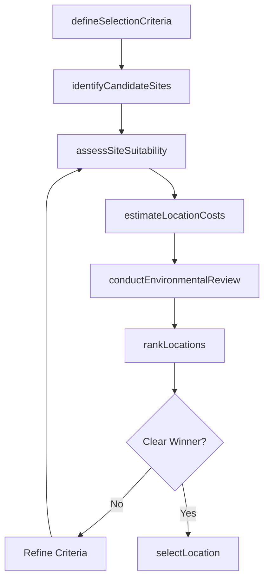
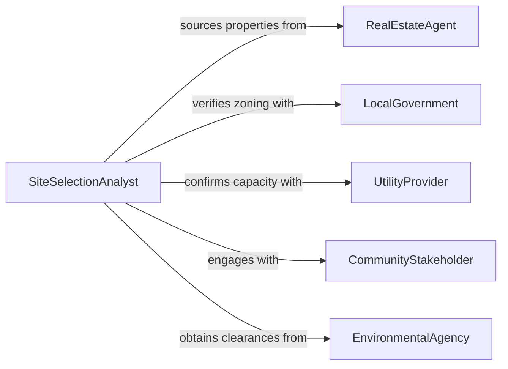

# Determine Appropriate Locations Operations Installatio

> Business-as-Code definition for determining appropriate locations for operations or installations. Models the site selection process including evaluation of geographic, logistical, regulatory, and economic factors to identify optimal placement for facilities, equipment, or operational activities.

## Overview

Determining appropriate locations for operations or installations involves evaluating candidate sites against criteria such as proximity to markets or resources, infrastructure availability, regulatory requirements, environmental conditions, and total cost of operations. This applies to facility siting, equipment installation, retail location selection, and infrastructure deployment. The definition provides actions for site analysis and selection, events for tracking location decisions, and searches for accessing geographic and suitability data.

## Actors

| Actor | Description |
|-------|-------------|
| RealEstateAgent | Provides available properties and market data for candidate locations |
| LocalGovernment | Enforces zoning, permitting, and land-use regulations |
| UtilityProvider | Confirms availability and capacity of water, power, and communications |
| CommunityStakeholder | Represents local interests and potential impacts of the installation |
| EnvironmentalAgency | Reviews environmental impact and issues necessary clearances |
| LogisticsPartner | Assesses transportation access and supply chain connectivity |

## Roles

| Role | Description |
|------|-------------|
| SiteSelectionAnalyst | Evaluates candidate locations against weighted selection criteria |
| FacilitiesManager | Assesses operational feasibility and infrastructure requirements at each site |
| FinancialAnalyst | Calculates total cost of ownership and return on investment by location |
| ProjectDirector | Makes the final location decision based on analysis and strategic priorities |

## Entities

| Entity | Description |
|--------|-------------|
| CandidateSite | A potential location under evaluation for the operation or installation |
| SelectionCriteria | Weighted factors used to score and rank candidate sites |
| SiteAssessment | A detailed evaluation of a candidate site against all criteria |
| CostModel | A financial projection of capital and operating costs at a specific location |
| EnvironmentalReview | An assessment of environmental conditions and regulatory requirements |
| InfrastructureReport | An inventory of available utilities, roads, and services at a site |

## Actions

| Action | Description |
|--------|-------------|
| defineSelectionCriteria | Establish the weighted factors for evaluating candidate locations |
| identifyCandidateSites | Generate a list of potential locations meeting baseline requirements |
| assessSiteSuitability | Evaluate each candidate site against the selection criteria |
| estimateLocationCosts | Calculate total cost of ownership for each candidate location |
| conductEnvironmentalReview | Assess environmental conditions and regulatory requirements at a site |
| rankLocations | Score and rank candidate sites based on assessment results |
| selectLocation | Choose the optimal location and document the decision rationale |

## Events

| Event | Description |
|-------|-------------|
| selectionCriteriaDefined | The evaluation criteria and weights have been established |
| candidateSitesIdentified | A shortlist of potential locations has been generated |
| siteSuitabilityAssessed | A candidate site has been evaluated against all criteria |
| locationCostsEstimated | Cost projections for a candidate location are complete |
| environmentalReviewCompleted | Environmental assessment of a site is finished |
| locationsRanked | All candidate sites have been scored and ranked |
| locationSelected | The optimal location has been chosen |

## Searches

| Search | Description |
|--------|-------------|
| findSitesByRegion | List candidate sites within a geographic area matching baseline criteria |
| getSiteAssessments | Retrieve evaluation results for candidate sites on a project |
| getCostComparisons | Find cost models comparing candidate locations |
| getInfrastructureData | Query utility and transportation infrastructure data for a site |

## Workflow



## Actor Relationships



## Usage

### Calling Actions

```typescript
import { determineAppropriateLocationsOperationsInstallations } from '@headlessly/determine-appropriate-locations-operations-installations'

const locations = determineAppropriateLocationsOperationsInstallations()

// Define criteria and identify sites
await locations.defineSelectionCriteria({
  projectId: 'distribution-center-southeast',
  criteria: [
    { factor: 'highway-access', weight: 0.25 },
    { factor: 'labor-availability', weight: 0.20 },
    { factor: 'utility-cost', weight: 0.20 },
    { factor: 'proximity-to-customers', weight: 0.20 },
    { factor: 'tax-incentives', weight: 0.15 }
  ]
})

const sites = await locations.identifyCandidateSites({
  projectId: 'distribution-center-southeast',
  region: 'southeastern-us',
  minimumAcreage: 25,
  requiredZoning: 'industrial'
})

// Assess and rank
for (const site of sites) {
  await locations.assessSiteSuitability({
    projectId: 'distribution-center-southeast',
    siteId: site.id
  })
}

const ranking = await locations.rankLocations({
  projectId: 'distribution-center-southeast'
})
```

### Event-Driven Automation

```typescript
// Notify stakeholders when a location is selected
locations.locationSelected(async ({ projectId, siteId, siteName }) => {
  await notify({
    to: 'executive-team',
    message: `Location selected for ${projectId}: ${siteName}`
  })
})

// Trigger environmental review for each assessed site
locations.siteSuitabilityAssessed(async ({ projectId, siteId }) => {
  await locations.conductEnvironmentalReview({
    projectId,
    siteId
  })
})
```
