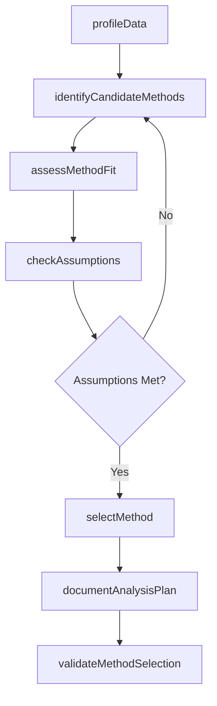
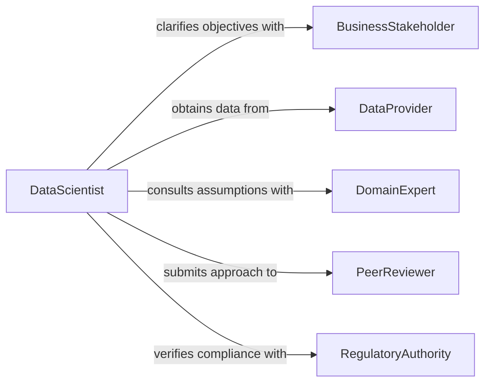

# Determine Appropriate Methods Data Analysis

> Business-as-Code definition for determining appropriate data analysis methods. Models the evaluation, selection, and validation of statistical techniques, algorithms, and analytical frameworks suited to specific data characteristics and business objectives.

## Overview

Determining appropriate methods for data analysis involves assessing the nature of available data, the research questions or business objectives being addressed, and the constraints of the analytical environment to select the most effective techniques. This includes evaluating whether descriptive, inferential, predictive, or prescriptive approaches are needed, and choosing specific algorithms or statistical tests accordingly. The definition provides actions for method evaluation and selection, events for tracking analytical decisions, and searches for accessing method catalogs.

## Actors

| Actor | Description |
|-------|-------------|
| BusinessStakeholder | Defines the questions and objectives the analysis must address |
| DataProvider | Supplies the datasets and metadata describing data characteristics |
| DomainExpert | Provides contextual knowledge about the subject matter and valid assumptions |
| PeerReviewer | Validates the methodological rigor of the selected approach |
| RegulatoryAuthority | Specifies compliance requirements for data handling and analytical methods |

## Roles

| Role | Description |
|------|-------------|
| DataScientist | Evaluates and selects analytical methods based on data and objectives |
| StatisticalAnalyst | Assesses statistical validity and assumption requirements for candidate methods |
| AnalyticsManager | Approves the analytical approach and allocates computational resources |
| DataEngineer | Ensures data infrastructure supports the selected analytical methods |

## Entities

| Entity | Description |
|--------|-------------|
| AnalysisRequest | A formal request specifying the business question and data available |
| MethodCandidate | A potential analytical technique under evaluation |
| DataProfile | A characterization of the dataset including types, distributions, and quality metrics |
| MethodAssessment | An evaluation of a candidate method against selection criteria |
| AnalysisPlan | The finalized specification of methods, tools, and validation approach |
| AssumptionCheck | A verification that data meets the prerequisites of the selected method |

## Actions

| Action | Description |
|--------|-------------|
| profileData | Characterize the dataset including variable types, distributions, and completeness |
| identifyCandidateMethods | Generate a shortlist of analytical methods suited to the data and objectives |
| assessMethodFit | Evaluate a candidate method against data characteristics and constraints |
| checkAssumptions | Verify that the data satisfies the statistical assumptions of a method |
| selectMethod | Choose the optimal analytical method from evaluated candidates |
| documentAnalysisPlan | Record the selected method, rationale, and validation strategy |
| validateMethodSelection | Confirm the selected method produces reliable results through pilot testing |

## Events

| Event | Description |
|-------|-------------|
| dataProfiled | The dataset characterization has been completed |
| candidateMethodsIdentified | A shortlist of potential methods has been generated |
| methodAssessed | A candidate method has been evaluated against criteria |
| assumptionsChecked | Statistical assumption verification is complete |
| methodSelected | An analytical method has been chosen for the analysis |
| analysisPlanDocumented | The finalized analysis plan has been recorded |
| methodValidated | The selected method has passed pilot validation |

## Searches

| Search | Description |
|--------|-------------|
| findMethodsByDataType | List analytical methods compatible with specific data types and structures |
| getAssessmentResults | Retrieve evaluation results for candidate methods on a request |
| getAnalysisPlans | Find documented analysis plans by project, method type, or date |

## Workflow



## Actor Relationships



## Usage

### Calling Actions

```typescript
import { determineAppropriateMethodsDataAnalysis } from '@headlessly/determine-appropriate-methods-data-analysis'

const methods = determineAppropriateMethodsDataAnalysis()

// Profile the dataset
const profile = await methods.profileData({
  datasetId: 'sales-transactions-2025',
  variables: ['revenue', 'region', 'product_category', 'date'],
  sampleSize: 50000
})

// Identify candidate methods
const candidates = await methods.identifyCandidateMethods({
  objective: 'predictive',
  targetVariable: 'revenue',
  dataProfile: profile.id
})

// Select and document the chosen method
await methods.selectMethod({
  requestId: 'req-42',
  methodId: candidates[0].id,
  rationale: 'Gradient boosting selected for non-linear relationships and mixed variable types'
})

await methods.documentAnalysisPlan({
  requestId: 'req-42',
  validationStrategy: 'k-fold cross-validation with k=10'
})
```

### Event-Driven Automation

```typescript
// Alert when assumptions are not met
methods.assumptionsChecked(async ({ requestId, methodId, passed, violations }) => {
  if (!passed) {
    await notify({
      to: 'data-science-team',
      message: `Method ${methodId} failed assumption checks: ${violations.join(', ')}`
    })
  }
})

// Log method selection decisions for audit
methods.methodSelected(async ({ requestId, methodId, rationale }) => {
  await auditLog({
    action: 'method-selection',
    requestId,
    methodId,
    rationale
  })
})
```
