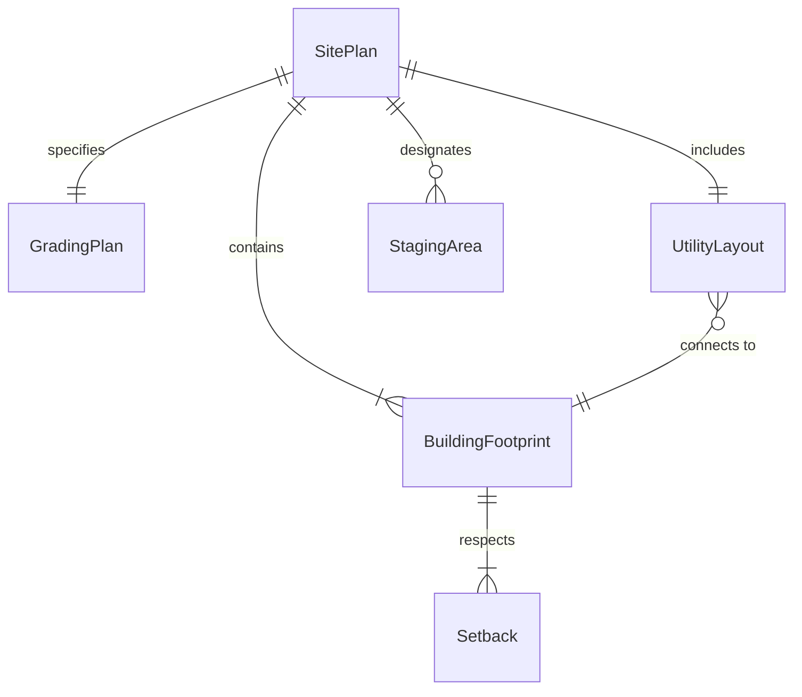
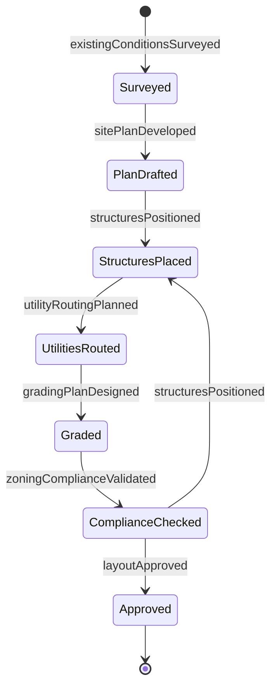
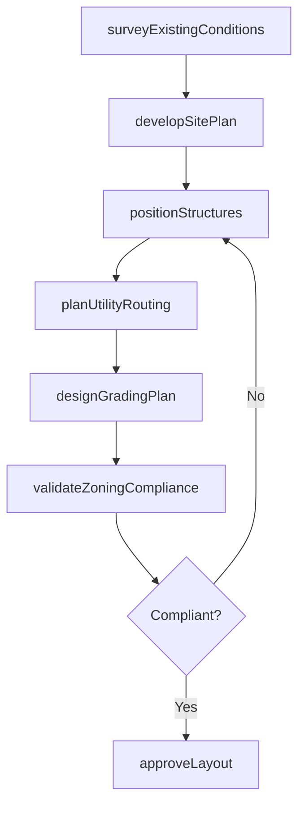
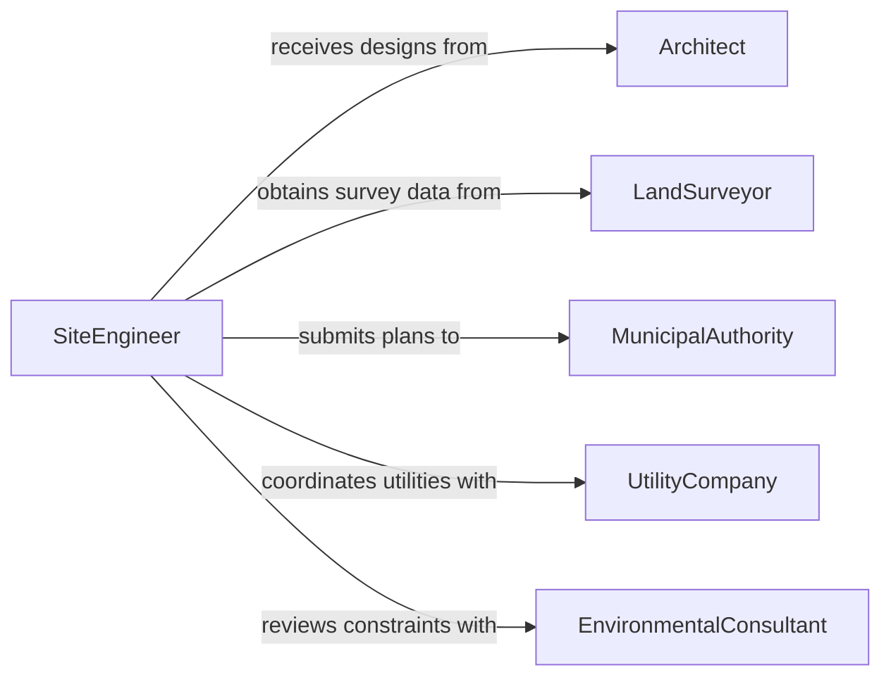

# Determine Construction Project Layouts

> Business-as-Code definition for determining construction project layouts. Models the planning, design, and validation of spatial arrangements for buildings, infrastructure, and site elements during construction projects.

## Overview

Determining construction project layouts involves establishing the physical arrangement of structures, utilities, access routes, staging areas, and site features based on architectural plans, engineering requirements, and site conditions. This includes interpreting blueprints, conducting site surveys, positioning buildings relative to property boundaries and topography, and planning temporary facilities for construction operations. The definition provides actions for layout planning and validation, events for tracking layout decisions, and searches for accessing site and design data.

## Actors

| Actor | Description |
|-------|-------------|
| Architect | Provides building designs and spatial relationship requirements |
| LandSurveyor | Supplies topographic data, property boundaries, and elevation details |
| MunicipalAuthority | Enforces zoning codes, setback requirements, and building permits |
| UtilityCompany | Identifies existing underground and overhead utility locations |
| EnvironmentalConsultant | Assesses environmental constraints such as wetlands and protected areas |
| PropertyOwner | Specifies site preferences and approves the proposed layout |

## Roles

| Role | Description |
|------|-------------|
| SiteEngineer | Plans and validates the physical layout of the construction project |
| ConstructionSuperintendent | Coordinates field layout activities and staging area placement |
| ProjectDesigner | Integrates architectural and engineering requirements into the site plan |
| SafetyCoordinator | Ensures layout accounts for safe access, egress, and construction zones |

## Entities

| Entity | Description |
|--------|-------------|
| SitePlan | A scaled drawing showing the arrangement of all elements on the construction site |
| BuildingFootprint | The ground-level outline of a structure including setbacks and clearances |
| GradingPlan | A specification for earthwork including cut, fill, and drainage slopes |
| UtilityLayout | The planned routing of water, sewer, electrical, and communications lines |
| StagingArea | A temporary zone for material storage, equipment parking, and worker facilities |
| Setback | A required distance between structures and property boundaries or easements |

## Actions

| Action | Description |
|--------|-------------|
| surveyExistingConditions | Collect topographic, utility, and boundary data for the site |
| developSitePlan | Create the initial layout showing building positions and site elements |
| positionStructures | Locate buildings and infrastructure relative to boundaries and topography |
| planUtilityRouting | Design the path and connection points for all site utilities |
| designGradingPlan | Establish earthwork requirements for drainage and foundation preparation |
| validateZoningCompliance | Verify the layout meets all zoning setbacks and code requirements |
| approveLayout | Finalize and approve the construction project layout |

## Events

| Event | Description |
|-------|-------------|
| existingConditionsSurveyed | Site survey data has been collected and processed |
| sitePlanDeveloped | The initial site layout has been created |
| structuresPositioned | Building locations have been established on the site plan |
| utilityRoutingPlanned | Utility paths and connections have been designed |
| gradingPlanDesigned | Earthwork specifications have been completed |
| zoningComplianceValidated | The layout has been confirmed compliant with zoning codes |
| layoutApproved | The final construction project layout has been approved |

## Searches

| Search | Description |
|--------|-------------|
| findSitePlansByProject | List site plans associated with a specific construction project |
| getZoningRequirements | Retrieve zoning codes and setback rules for a parcel or jurisdiction |
| getUtilityLocations | Query existing utility infrastructure near or on the project site |
| getSurveyData | Access topographic and boundary survey data for a site |

## Entity Relationships



## State Diagram



## Workflow



## Actor Relationships



## Usage

### Calling Actions

```typescript
import { determineConstructionProjectLayouts } from '@headlessly/determine-construction-project-layouts'

const layouts = determineConstructionProjectLayouts()

// Survey existing conditions
const survey = await layouts.surveyExistingConditions({
  projectId: 'riverside-mixed-use',
  parcelId: 'APN-4421-022',
  surveyTypes: ['topographic', 'boundary', 'utility-locate']
})

// Develop site plan and position structures
const plan = await layouts.developSitePlan({
  projectId: 'riverside-mixed-use',
  surveyId: survey.id,
  architecturalDrawings: ['arch-set-rev-c']
})

await layouts.positionStructures({
  planId: plan.id,
  structures: [
    { name: 'Building A', footprint: '12000sqft', setbackFront: '25ft' },
    { name: 'Parking Garage', footprint: '8000sqft', setbackSide: '10ft' }
  ]
})

// Validate and approve
await layouts.validateZoningCompliance({ planId: plan.id })
await layouts.approveLayout({ planId: plan.id })
```

### Event-Driven Automation

```typescript
// Alert when zoning compliance fails
layouts.zoningComplianceValidated(async ({ planId, compliant, violations }) => {
  if (!compliant) {
    await notify({
      to: 'project-design-team',
      message: `Zoning violations found on plan ${planId}: ${violations.join(', ')}`
    })
  }
})

// Trigger utility coordination when structures are positioned
layouts.structuresPositioned(async ({ planId, structures }) => {
  await layouts.planUtilityRouting({
    planId,
    servicePoints: structures.map(s => s.utilityConnectionPoint)
  })
})
```
