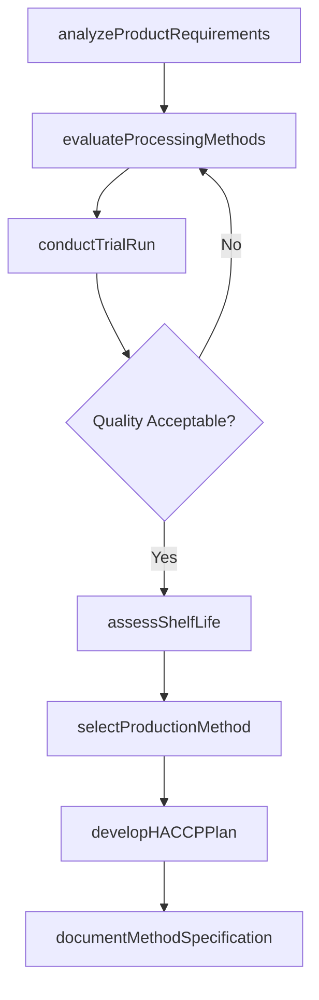
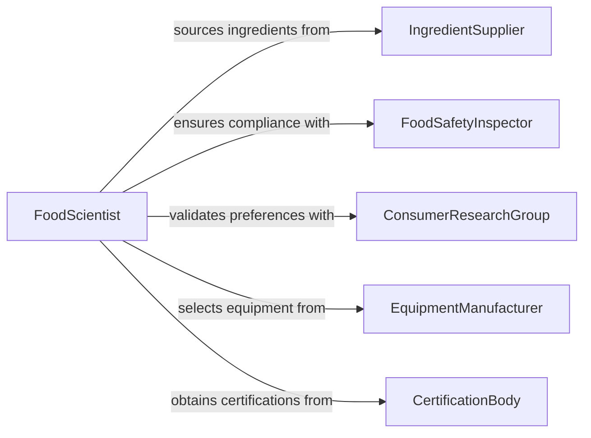

# Determine Food Production Methods

> Business-as-Code definition for determining food production methods. Models the evaluation and selection of processing techniques, cooking methods, preservation approaches, and production workflows for food manufacturing and preparation operations.

## Overview

Determining food production methods involves selecting the appropriate processing techniques, equipment, and workflows to transform raw ingredients into finished food products that meet quality, safety, and nutritional standards. This includes evaluating methods such as batch processing, continuous flow, pasteurization, fermentation, freeze-drying, and commercial cooking operations. The definition provides actions for method assessment and selection, events for tracking production decisions, and searches for accessing food processing data.

## Actors

| Actor | Description |
|-------|-------------|
| IngredientSupplier | Provides raw materials with specifications on quality and shelf life |
| FoodSafetyInspector | Enforces HACCP, FDA, and local food safety regulations |
| ConsumerResearchGroup | Provides market data on consumer preferences and dietary trends |
| EquipmentManufacturer | Supplies food processing machinery and technical specifications |
| CertificationBody | Issues organic, kosher, halal, or other food certification approvals |

## Roles

| Role | Description |
|------|-------------|
| FoodScientist | Evaluates production methods for quality, safety, and nutritional outcomes |
| ProductionPlanner | Designs production workflows and schedules based on selected methods |
| QualityAssuranceManager | Ensures selected methods comply with food safety and quality standards |
| RecipeDeveloper | Formulates product recipes that align with production method capabilities |

## Entities

| Entity | Description |
|--------|-------------|
| ProductionMethod | A food processing technique such as extrusion, retort, or blast chilling |
| Recipe | A formulation specifying ingredients, quantities, and processing steps |
| QualityStandard | A defined threshold for taste, texture, nutrition, and safety attributes |
| HACCPPlan | A hazard analysis and critical control point plan for the production process |
| ShelfLifeProfile | Expected product longevity under specified storage conditions |
| ProductionLine | A configured sequence of equipment for a specific production method |

## Actions

| Action | Description |
|--------|-------------|
| analyzeProductRequirements | Review product specifications including taste, texture, and nutritional targets |
| evaluateProcessingMethods | Assess candidate production methods against product and safety requirements |
| conductTrialRun | Execute a small-scale production test using the candidate method |
| assessShelfLife | Evaluate how the production method affects product longevity and stability |
| selectProductionMethod | Choose the optimal method based on quality, cost, and compliance criteria |
| developHACCPPlan | Create a hazard analysis plan specific to the selected production method |
| documentMethodSpecification | Record the selected method with detailed process parameters |

## Events

| Event | Description |
|-------|-------------|
| productRequirementsAnalyzed | Product specifications and targets have been reviewed |
| processingMethodsEvaluated | Candidate methods have been assessed against requirements |
| trialRunCompleted | A small-scale production test has been executed and results recorded |
| shelfLifeAssessed | Product longevity under the selected method has been evaluated |
| productionMethodSelected | A food production method has been chosen |
| haccpPlanDeveloped | A hazard analysis plan for the selected method is complete |
| methodSpecificationDocumented | The production method specification has been formally recorded |

## Searches

| Search | Description |
|--------|-------------|
| findMethodsByProductType | List production methods suitable for a specific food product category |
| getTrialRunResults | Retrieve trial production results by product, method, or date |
| getComplianceStatus | Check HACCP and regulatory compliance status for production methods |
| getShelfLifeData | Query shelf life testing results by product and production method |

## Workflow



## Actor Relationships



## Usage

### Calling Actions

```typescript
import { determineFoodProductionMethods } from '@headlessly/determine-food-production-methods'

const foodProduction = determineFoodProductionMethods()

// Analyze product requirements
const requirements = await foodProduction.analyzeProductRequirements({
  productName: 'Organic Fruit Puree Pouches',
  targetShelfLife: { months: 12 },
  nutritionalTargets: { vitaminCRetention: '85%', sugarContent: 'no-added' },
  certifications: ['organic', 'non-gmo']
})

// Evaluate methods and run trial
const methods = await foodProduction.evaluateProcessingMethods({
  requirementsId: requirements.id,
  candidates: ['high-pressure-processing', 'retort-sterilization', 'hot-fill']
})

await foodProduction.conductTrialRun({
  requirementsId: requirements.id,
  methodId: 'high-pressure-processing',
  batchSize: 500
})

// Select and document
await foodProduction.selectProductionMethod({
  requirementsId: requirements.id,
  methodId: 'high-pressure-processing',
  rationale: 'Best vitamin C retention while achieving target shelf life'
})
```

### Event-Driven Automation

```typescript
// Trigger HACCP planning when method is selected
foodProduction.productionMethodSelected(async ({ requirementsId, methodId }) => {
  await foodProduction.developHACCPPlan({
    requirementsId,
    methodId
  })
})

// Alert quality team on trial run results
foodProduction.trialRunCompleted(async ({ requirementsId, methodId, results }) => {
  if (!results.meetsQualityTargets) {
    await notify({
      to: 'quality-assurance',
      message: `Trial run for ${methodId} did not meet quality targets - review required`
    })
  }
})
```
