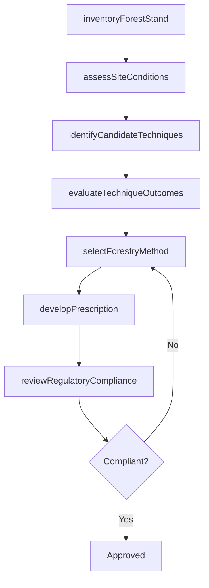
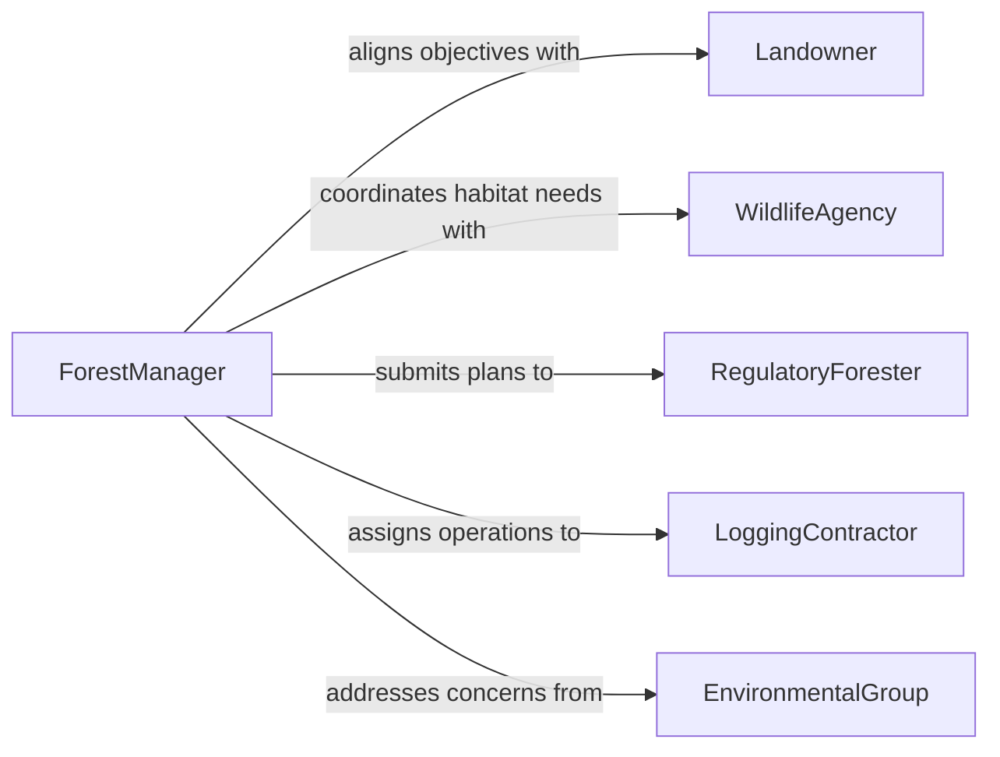

# Determine Forestry Techniques Methods

> Business-as-Code definition for determining forestry techniques or methods. Models the evaluation and selection of silvicultural practices, harvesting methods, and forest management strategies based on stand conditions, landowner objectives, and environmental regulations.

## Overview

Determining forestry techniques and methods involves assessing forest stand conditions, species composition, terrain, and ecological factors to select appropriate silvicultural practices such as thinning, clear-cutting, selective harvesting, prescribed burning, and reforestation methods. This process balances timber production objectives with conservation goals, wildlife habitat preservation, and watershed protection. The definition provides actions for stand assessment and technique selection, events for tracking management decisions, and searches for accessing forest inventory and regulatory data.

## Actors

| Actor | Description |
|-------|-------------|
| Landowner | Specifies management objectives such as timber revenue, recreation, or conservation |
| WildlifeAgency | Provides habitat requirements and species protection mandates |
| RegulatoryForester | Enforces state and federal forestry regulations and best management practices |
| LoggingContractor | Executes harvesting operations using the selected methods and equipment |
| EnvironmentalGroup | Advocates for ecosystem preservation and sustainable practices |

## Roles

| Role | Description |
|------|-------------|
| ForestManager | Evaluates stand conditions and selects appropriate silvicultural techniques |
| Silviculturist | Designs planting, thinning, and regeneration prescriptions |
| TimberCruiser | Inventories forest stands to provide volume and species composition data |
| HarvestPlanner | Designs logging layouts, road access, and equipment requirements |

## Entities

| Entity | Description |
|--------|-------------|
| ForestStand | A contiguous area of trees with similar species, age, and stocking characteristics |
| SilviculturalPrescription | A detailed plan specifying the technique, timing, and intensity of a treatment |
| TimberInventory | An assessment of tree species, volume, age class, and quality within a stand |
| HarvestPlan | A layout of cutting units, skid trails, landings, and haul roads |
| BestManagementPractice | A regulatory guideline for protecting water quality, soil, and habitat during operations |
| RegenerationPlan | A strategy for establishing new tree growth after harvest |

## Actions

| Action | Description |
|--------|-------------|
| inventoryForestStand | Collect species, volume, age, and health data for the management area |
| assessSiteConditions | Evaluate terrain, soil, hydrology, and ecological sensitivity |
| identifyCandidateTechniques | Generate a list of silvicultural methods suited to stand and site conditions |
| evaluateTechniqueOutcomes | Project the ecological and economic results of each candidate technique |
| selectForestryMethod | Choose the optimal technique based on objectives and regulatory constraints |
| developPrescription | Create a detailed silvicultural prescription for the selected method |
| reviewRegulatory Compliance | Verify the prescription meets all applicable forestry regulations |

## Events

| Event | Description |
|-------|-------------|
| forestStandInventoried | Stand inventory data has been collected and summarized |
| siteConditionsAssessed | Terrain and ecological conditions have been evaluated |
| candidateTechniquesIdentified | A shortlist of suitable forestry methods has been generated |
| techniqueOutcomesEvaluated | Projected outcomes for candidate techniques are complete |
| forestryMethodSelected | A silvicultural technique has been chosen |
| prescriptionDeveloped | A detailed treatment prescription has been created |
| regulatoryComplianceReviewed | The prescription has been verified against regulations |

## Searches

| Search | Description |
|--------|-------------|
| findStandsByCondition | List forest stands matching species, age, or stocking criteria |
| getPrescriptionsByTechnique | Retrieve silvicultural prescriptions by method type or treatment area |
| getInventoryData | Access timber inventory records for a specific stand or management unit |
| getRegulatoryRequirements | Query applicable forestry regulations by state, county, or watershed |

## Workflow



## Actor Relationships



## Usage

### Calling Actions

```typescript
import { determineForestryTechniquesMethods } from '@headlessly/determine-forestry-techniques-methods'

const forestry = determineForestryTechniquesMethods()

// Inventory the stand
const inventory = await forestry.inventoryForestStand({
  standId: 'unit-14-north-ridge',
  acres: 120,
  species: ['douglas-fir', 'western-red-cedar', 'red-alder'],
  ageClass: 'second-growth-45yr'
})

// Evaluate candidate techniques
const candidates = await forestry.identifyCandidateTechniques({
  inventoryId: inventory.id,
  objectives: ['timber-revenue', 'wildlife-habitat'],
  constraints: ['riparian-buffer-150ft', 'steep-slope-exclusion']
})

await forestry.evaluateTechniqueOutcomes({
  inventoryId: inventory.id,
  techniqueIds: candidates.map(c => c.id)
})

// Select method and develop prescription
await forestry.selectForestryMethod({
  inventoryId: inventory.id,
  techniqueId: 'variable-retention-harvest',
  rationale: 'Balances timber yield with structural retention for spotted owl habitat'
})
```

### Event-Driven Automation

```typescript
// Auto-generate prescription after method selection
forestry.forestryMethodSelected(async ({ inventoryId, techniqueId }) => {
  await forestry.developPrescription({
    inventoryId,
    techniqueId,
    retentionTargets: { snags: 4, liveTreesPerAcre: 12 }
  })
})

// Alert when regulatory compliance fails
forestry.regulatoryComplianceReviewed(async ({ prescriptionId, compliant, issues }) => {
  if (!compliant) {
    await notify({
      to: 'forest-management',
      message: `Prescription ${prescriptionId} has regulatory issues: ${issues.join(', ')}`
    })
  }
})
```
