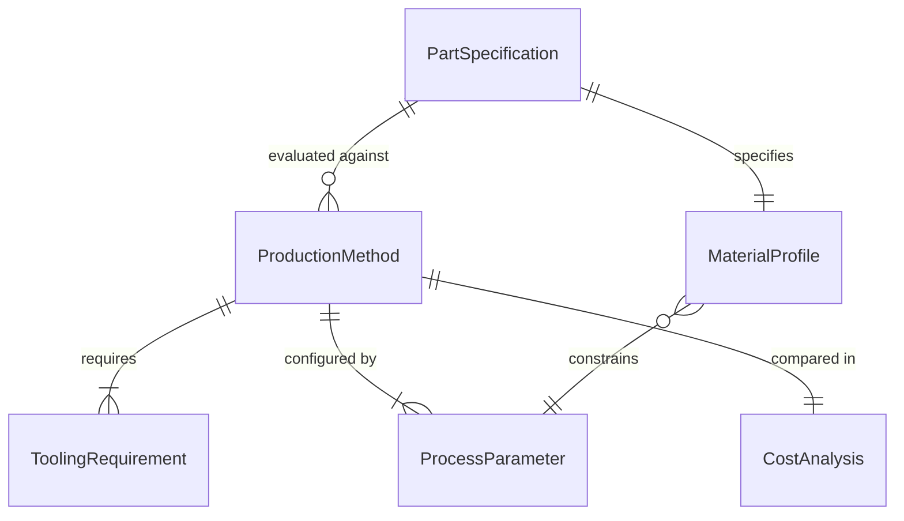
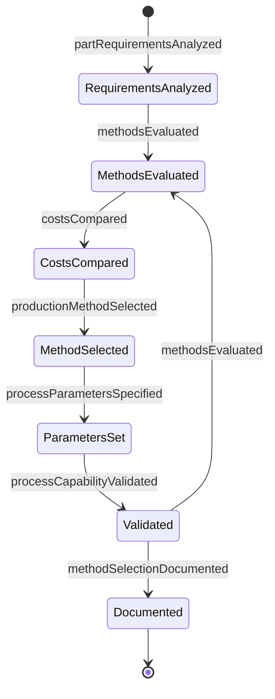
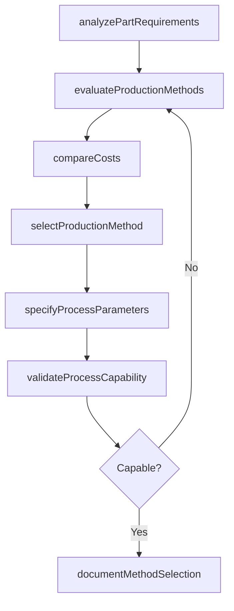
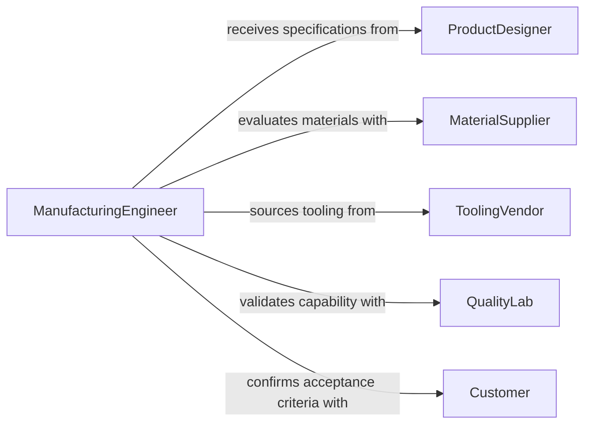

# Determine Metal Plastic Production Methods

> Business-as-Code definition for determining metal or plastic production methods. Models the evaluation, selection, and specification of manufacturing processes such as casting, machining, molding, and forming based on material properties, part geometry, and production requirements.

## Overview

Determining metal or plastic production methods involves analyzing part specifications, material characteristics, production volume, and cost constraints to select the optimal manufacturing process. This includes evaluating techniques such as CNC machining, injection molding, die casting, extrusion, stamping, and additive manufacturing. The definition provides actions for method evaluation and process specification, events for tracking production decisions, and searches for accessing manufacturing capability data.

## Actors

| Actor | Description |
|-------|-------------|
| ProductDesigner | Provides part geometry, tolerances, and functional requirements |
| MaterialSupplier | Supplies material specifications and availability data |
| ToolingVendor | Provides tooling options, lead times, and cost estimates |
| QualityLab | Validates material and process capabilities against specifications |
| Customer | Specifies end-use requirements and acceptance criteria |

## Roles

| Role | Description |
|------|-------------|
| ManufacturingEngineer | Evaluates and selects production methods based on technical requirements |
| ProcessPlanner | Sequences manufacturing operations and defines process parameters |
| CostEstimator | Analyzes production costs across candidate methods |
| ProductionManager | Approves the selected method and schedules manufacturing resources |

## Entities

| Entity | Description |
|--------|-------------|
| PartSpecification | Detailed requirements including dimensions, tolerances, and material grade |
| ProductionMethod | A manufacturing technique such as injection molding, CNC milling, or die casting |
| MaterialProfile | Properties of the raw material including strength, thermal behavior, and machinability |
| ToolingRequirement | Molds, dies, fixtures, or cutting tools needed for the selected method |
| ProcessParameter | Machine settings such as temperature, pressure, speed, and feed rate |
| CostAnalysis | A comparison of production costs across candidate methods |

## Actions

| Action | Description |
|--------|-------------|
| analyzePartRequirements | Review part geometry, tolerances, and material needs to define constraints |
| evaluateProductionMethods | Assess candidate manufacturing processes against part requirements |
| compareCosts | Calculate and compare unit costs, tooling investment, and lead times |
| selectProductionMethod | Choose the optimal method based on technical and economic criteria |
| specifyProcessParameters | Define machine settings and operating conditions for the chosen method |
| validateProcessCapability | Confirm the selected method can consistently produce parts within specification |
| documentMethodSelection | Record the production method decision with supporting rationale |

## Events

| Event | Description |
|-------|-------------|
| partRequirementsAnalyzed | Part specifications have been reviewed and constraints defined |
| methodsEvaluated | Candidate production methods have been assessed |
| costsCompared | Cost analysis across candidate methods is complete |
| productionMethodSelected | A manufacturing method has been chosen |
| processParametersSpecified | Machine settings have been defined for the selected method |
| processCapabilityValidated | The selected method has been confirmed capable |
| methodSelectionDocumented | The production method decision has been recorded |

## Searches

| Search | Description |
|--------|-------------|
| findMethodsByMaterial | List production methods compatible with a specific material type |
| getProcessCapabilities | Retrieve tolerance and volume capabilities for available production methods |
| getCostComparisons | Find cost analyses by part, material, or production volume |

## Entity Relationships



## State Diagram



## Workflow



## Actor Relationships



## Usage

### Calling Actions

```typescript
import { determineMetalPlasticProductionMethods } from '@headlessly/determine-metal-plastic-production-methods'

const production = determineMetalPlasticProductionMethods()

// Analyze part requirements
const analysis = await production.analyzePartRequirements({
  partNumber: 'HSG-4420',
  material: 'Aluminum 6061-T6',
  tolerances: { dimensional: '±0.05mm', surface: 'Ra 1.6' },
  annualVolume: 25000
})

// Evaluate and compare methods
const methods = await production.evaluateProductionMethods({
  analysisId: analysis.id,
  candidates: ['cnc-milling', 'die-casting', 'investment-casting']
})

const costs = await production.compareCosts({
  analysisId: analysis.id,
  methodIds: methods.map(m => m.id)
})

// Select and document
await production.selectProductionMethod({
  analysisId: analysis.id,
  methodId: 'die-casting',
  rationale: 'Lowest unit cost at volume with acceptable tolerance capability'
})
```

### Event-Driven Automation

```typescript
// Alert when process capability validation fails
production.processCapabilityValidated(async ({ analysisId, methodId, cpk }) => {
  if (cpk < 1.33) {
    await notify({
      to: 'manufacturing-engineering',
      message: `Process capability Cpk=${cpk} below threshold for method ${methodId}`
    })
  }
})

// Log all method selection decisions
production.productionMethodSelected(async ({ analysisId, methodId, rationale }) => {
  await auditLog({
    action: 'production-method-selected',
    analysisId,
    methodId,
    rationale
  })
})
```
