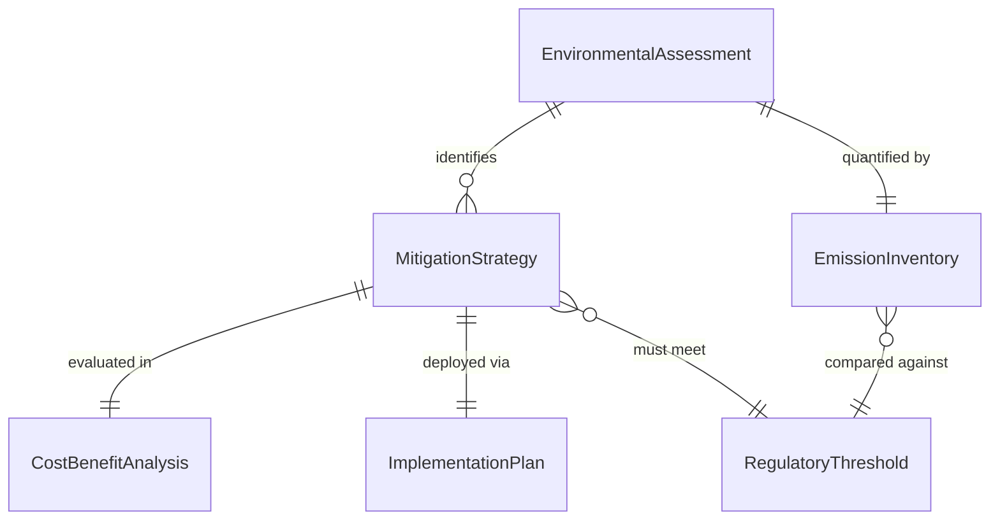
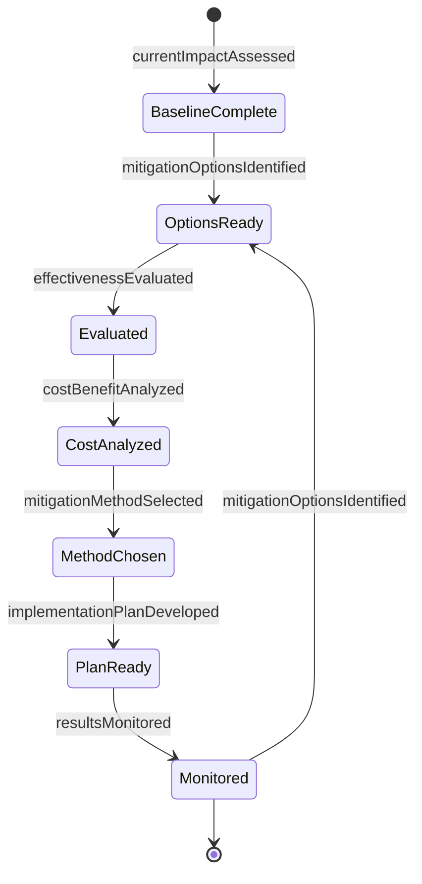
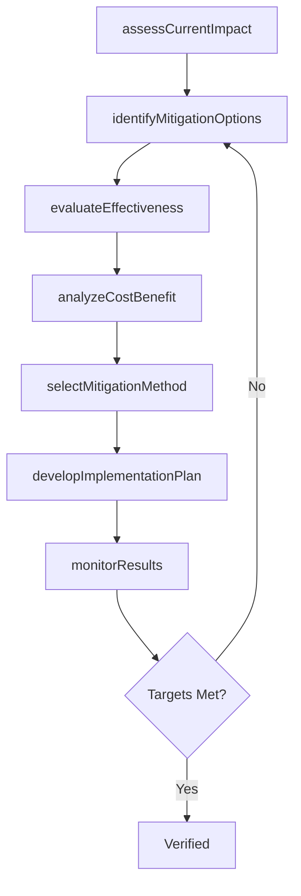
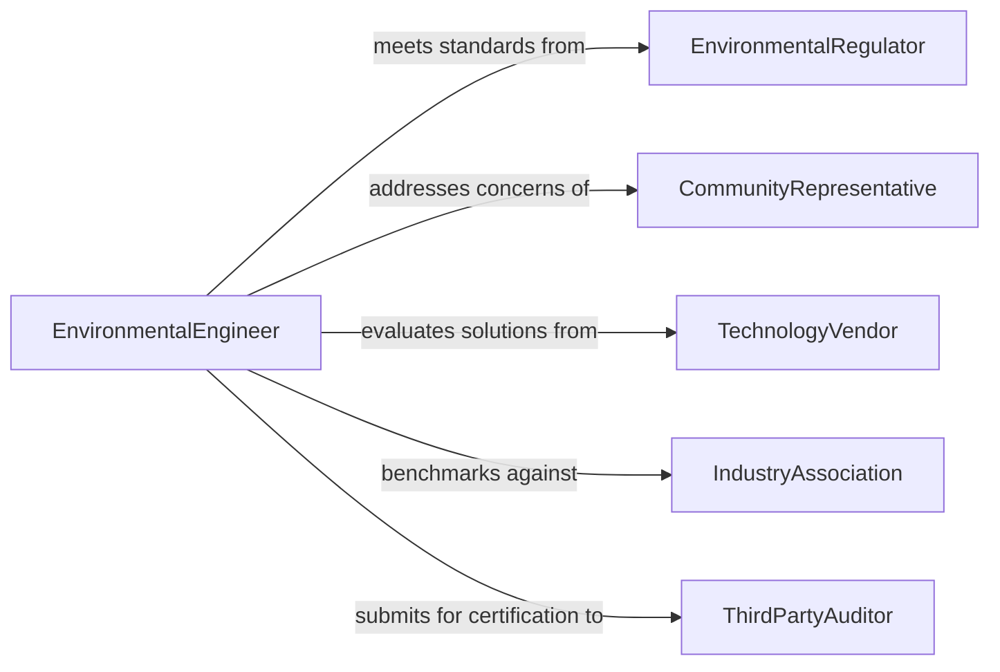

# Determine Methods Minimize Environmental Impact

> Business-as-Code definition for determining methods to minimize the environmental impact of activities. Models the identification, evaluation, and implementation of practices and technologies that reduce emissions, waste, resource consumption, and ecological disruption from business and industrial operations.

## Overview

Determining methods to minimize environmental impact involves assessing operational activities for their ecological footprint and identifying mitigation strategies such as pollution prevention, waste reduction, energy efficiency improvements, and sustainable material substitution. This process draws on environmental assessments, regulatory requirements, and best available technologies to select cost-effective approaches. The definition provides actions for impact analysis and mitigation planning, events for tracking environmental decisions, and searches for accessing impact data and regulatory guidelines.

## Actors

| Actor | Description |
|-------|-------------|
| EnvironmentalRegulator | Sets emission limits, discharge standards, and compliance requirements |
| CommunityRepresentative | Raises concerns about local environmental quality and public health |
| TechnologyVendor | Provides pollution control equipment, software, and sustainable technologies |
| IndustryAssociation | Publishes best practice guidelines and benchmarking data |
| ThirdPartyAuditor | Conducts independent environmental assessments and certifications |

## Roles

| Role | Description |
|------|-------------|
| EnvironmentalEngineer | Evaluates activities and designs mitigation strategies |
| SustainabilityManager | Oversees environmental programs and sets organizational reduction targets |
| OperationsManager | Implements approved environmental methods within production workflows |
| ComplianceOfficer | Ensures all mitigation methods meet regulatory requirements |

## Entities

| Entity | Description |
|--------|-------------|
| EnvironmentalAssessment | A baseline analysis of the environmental impact of current operations |
| MitigationStrategy | A proposed method for reducing a specific environmental impact |
| EmissionInventory | A quantified record of air, water, and waste emissions from operations |
| RegulatoryThreshold | A legal limit for pollutant discharge or resource consumption |
| CostBenefitAnalysis | An economic evaluation of a mitigation strategy's costs versus environmental gains |
| ImplementationPlan | A schedule and resource plan for deploying a selected mitigation method |

## Actions

| Action | Description |
|--------|-------------|
| assessCurrentImpact | Quantify the environmental footprint of existing operations |
| identifyMitigationOptions | Generate a list of strategies to reduce identified impacts |
| evaluateEffectiveness | Estimate the environmental benefit of each candidate strategy |
| analyzeCostBenefit | Compare the economic costs and environmental gains of each option |
| selectMitigationMethod | Choose the optimal strategy based on effectiveness and feasibility |
| developImplementationPlan | Create a timeline and resource plan for deploying the selected method |
| monitorResults | Track environmental metrics after implementation to verify impact reduction |

## Events

| Event | Description |
|-------|-------------|
| currentImpactAssessed | The baseline environmental assessment has been completed |
| mitigationOptionsIdentified | Candidate strategies for impact reduction have been generated |
| effectivenessEvaluated | The environmental benefit of a strategy has been estimated |
| costBenefitAnalyzed | Economic analysis of a mitigation option is complete |
| mitigationMethodSelected | An environmental mitigation strategy has been chosen |
| implementationPlanDeveloped | The deployment plan for the selected method has been created |
| resultsMonitored | Post-implementation environmental metrics have been collected |

## Searches

| Search | Description |
|--------|-------------|
| findAssessmentsByFacility | List environmental assessments for a specific facility or operation |
| getMitigationStrategies | Retrieve candidate strategies by impact type or industry sector |
| getEmissionTrends | Query emission data over time for a facility or process |
| getRegulatoryLimits | Look up applicable environmental thresholds by jurisdiction and pollutant |

## Entity Relationships



## State Diagram



## Workflow



## Actor Relationships



## Usage

### Calling Actions

```typescript
import { determineMethodsMinimizeEnvironmentalImpact } from '@headlessly/determine-methods-minimize-environmental-impact'

const envImpact = determineMethodsMinimizeEnvironmentalImpact()

// Assess current impact
const assessment = await envImpact.assessCurrentImpact({
  facilityId: 'plant-midwest-03',
  scope: ['air-emissions', 'wastewater', 'solid-waste', 'energy-consumption'],
  baselineYear: 2025
})

// Identify and evaluate options
const options = await envImpact.identifyMitigationOptions({
  assessmentId: assessment.id,
  targetReduction: { co2: '30%', waterUsage: '20%' }
})

for (const option of options) {
  await envImpact.analyzeCostBenefit({
    strategyId: option.id,
    investmentHorizon: { years: 5 }
  })
}

// Select and implement
await envImpact.selectMitigationMethod({
  assessmentId: assessment.id,
  strategyId: options[0].id,
  rationale: 'Best payback period with highest CO2 reduction potential'
})
```

### Event-Driven Automation

```typescript
// Trigger implementation planning after method selection
envImpact.mitigationMethodSelected(async ({ assessmentId, strategyId }) => {
  await envImpact.developImplementationPlan({
    assessmentId,
    strategyId,
    startDate: '2026-04-01'
  })
})

// Alert when monitoring shows targets not met
envImpact.resultsMonitored(async ({ facilityId, metrics, targetsMet }) => {
  if (!targetsMet) {
    await notify({
      to: 'sustainability-team',
      message: `Environmental targets not met at ${facilityId} - additional mitigation needed`
    })
  }
})
```
