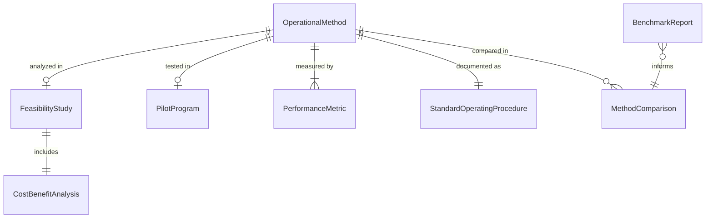
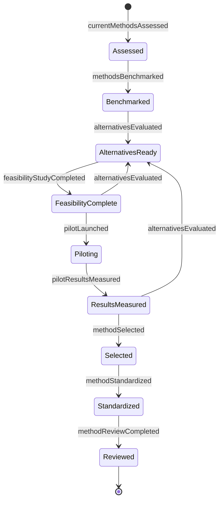
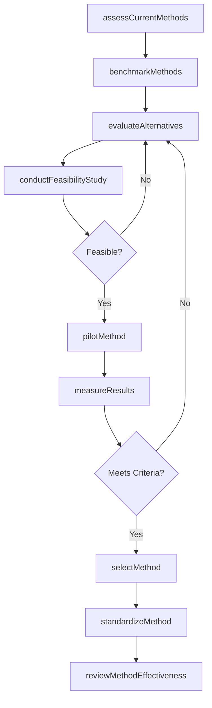
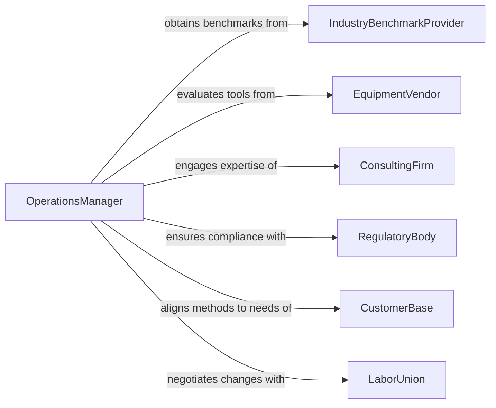

# Determine Operational Methods

> Business-as-Code definition for determining operational methods. Models the lifecycle from operational assessment through method selection, validation, standardization, and continuous improvement.

## Overview

Determining operational methods involves evaluating current workflows, analyzing performance data, researching best practices, and selecting the most effective approaches for accomplishing work objectives. This encompasses benchmarking against industry standards, conducting feasibility studies, piloting new methods, measuring results, and standardizing proven approaches across the organization. The definition exposes actions for method evaluation and selection, events for workflow automation, and searches for operational performance data.

## Actors

| Actor | Description |
|-------|-------------|
| IndustryBenchmarkProvider | Organization supplying comparative performance data and standards |
| EquipmentVendor | Supplier of machinery and tools that influence method selection |
| ConsultingFirm | External advisor providing operational improvement expertise |
| RegulatoryBody | Authority imposing constraints on permissible operational methods |
| CustomerBase | End users whose requirements shape method selection priorities |
| LaborUnion | Worker representative body influencing method adoption and work rules |

## Roles

| Role | Description |
|------|-------------|
| OperationsManager | Evaluates and selects operational methods for the organization |
| ProcessEngineer | Analyzes workflows and designs method improvements |
| QualityAnalyst | Measures performance outcomes of different operational approaches |
| FrontlineSupervisor | Implements selected methods at the work-unit level |
| ContinuousImprovementLead | Drives iterative refinement of established methods |
| SafetyCoordinator | Ensures selected methods comply with safety standards |

## Entities

| Entity | Description |
|--------|-------------|
| OperationalMethod | A defined approach for performing a specific work process |
| FeasibilityStudy | Analysis evaluating the practicality and cost of a proposed method |
| BenchmarkReport | Comparative analysis of methods against industry standards |
| PilotProgram | Controlled trial of a new method in a limited scope |
| PerformanceMetric | Quantitative measure of method effectiveness |
| StandardOperatingProcedure | Documented steps for executing the approved operational method |
| MethodComparison | Side-by-side evaluation of alternative approaches |
| CostBenefitAnalysis | Financial assessment of method adoption versus current state |

## Actions

| Action | Description |
|--------|-------------|
| assessCurrentMethods | Evaluate existing operational methods and their performance |
| benchmarkMethods | Compare current methods against industry standards and peers |
| evaluateAlternatives | Research and assess potential replacement methods |
| conductFeasibilityStudy | Analyze the practicality and cost of a proposed method |
| pilotMethod | Run a controlled trial of a new operational method |
| measureResults | Quantify the performance outcomes of a piloted method |
| selectMethod | Choose the optimal operational method based on evaluation data |
| standardizeMethod | Document and deploy the selected method across the organization |
| reviewMethodEffectiveness | Periodically evaluate whether the method continues to perform |

## Events

| Event | Description |
|-------|-------------|
| currentMethodsAssessed | Baseline evaluation of existing methods is complete |
| methodsBenchmarked | Comparative analysis against industry standards is complete |
| alternativesEvaluated | Potential replacement methods have been assessed |
| feasibilityStudyCompleted | Practicality and cost analysis for a method is finished |
| pilotLaunched | A controlled trial of a new method has begun |
| pilotResultsMeasured | Performance data from the pilot has been collected and analyzed |
| methodSelected | The optimal operational method has been chosen |
| methodStandardized | The selected method has been documented and deployed |
| methodReviewCompleted | Periodic effectiveness review of the method is finished |

## Searches

| Search | Description |
|--------|-------------|
| findOperationalMethods | List methods by department, process type, or status |
| getBenchmarkData | Retrieve comparative performance data by industry or peer group |
| getPilotResults | Find pilot program outcomes by method, metric, or time period |
| getPerformanceMetrics | Retrieve method performance data by metric type and date range |
| findFeasibilityStudies | Search feasibility analyses by method, department, or outcome |

## Entity Relationships



## State Diagram



## Workflow



## Actor Relationships



## Usage

### Calling Actions

```typescript
import { determineOperationalMethods } from '@headlessly/determine-operational-methods'

const methods = determineOperationalMethods()

// Assess current warehouse picking methods
const assessment = await methods.assessCurrentMethods({
  department: 'warehouse-operations',
  process: 'order-picking',
  metrics: ['throughput', 'error-rate', 'labor-hours-per-order']
})

// Benchmark against industry standards
const benchmark = await methods.benchmarkMethods({
  process: 'order-picking',
  industryGroup: 'e-commerce-fulfillment',
  metrics: ['picks-per-hour', 'accuracy-rate']
})

// Pilot a new method
await methods.pilotMethod({
  name: 'Zone-Based Batch Picking',
  department: 'warehouse-operations',
  duration: '60-days',
  targetMetrics: { throughput: '+20%', errorRate: '-50%' },
  controlGroup: 'current-discrete-picking'
})
```

### Event-Driven Automation

```typescript
// Trigger standardization when pilot succeeds
methods.pilotResultsMeasured(async ({ methodName, results, targetMetrics }) => {
  const meetsTargets = Object.keys(targetMetrics).every(
    metric => results[metric] >= targetMetrics[metric]
  )
  if (meetsTargets) {
    await methods.selectMethod({ name: methodName, basis: 'pilot-results' })
  }
})

// Schedule periodic effectiveness reviews
methods.methodStandardized(async ({ methodId, department }) => {
  await scheduleReview({
    methodId,
    department,
    frequency: 'quarterly',
    firstReview: addDays(new Date(), 90)
  })
})
```
