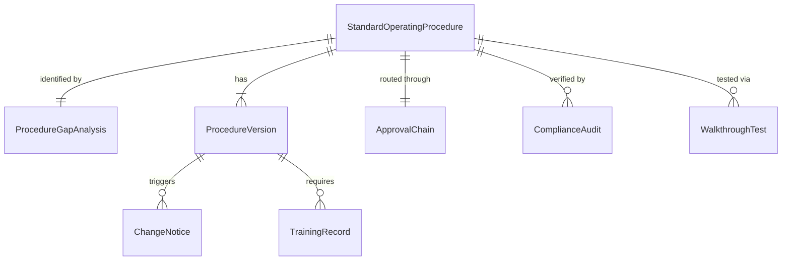
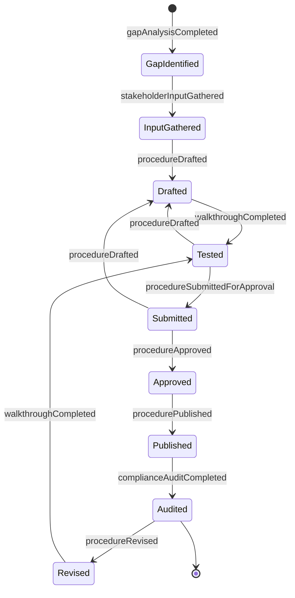
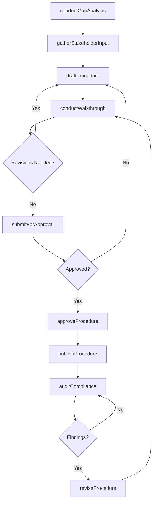
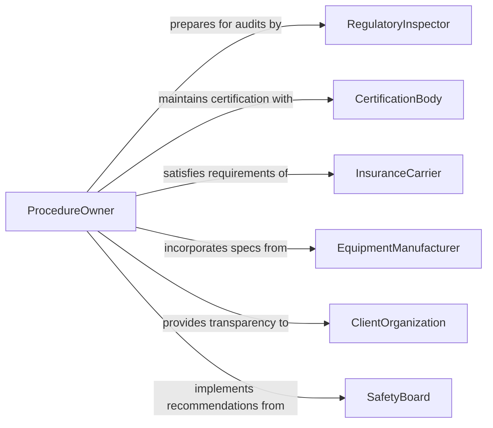

# Determine Operational Procedures

> Business-as-Code definition for determining operational procedures. Models the lifecycle from procedural gap analysis through development, validation, documentation, and compliance monitoring.

## Overview

Determining operational procedures involves identifying procedural needs, designing step-by-step workflows, validating them against safety and quality standards, and formalizing them as standard operating procedures. This encompasses gap analysis of current documentation, stakeholder input gathering, procedure drafting, walkthrough testing, approval routing, version control, and periodic review cycles. The definition exposes actions for procedure development and governance, events for document lifecycle automation, and searches for procedural documentation retrieval.

## Actors

| Actor | Description |
|-------|-------------|
| RegulatoryInspector | Government official verifying procedural compliance during audits |
| CertificationBody | Organization issuing quality certifications requiring documented procedures |
| InsuranceCarrier | Underwriter requiring procedural safeguards for coverage eligibility |
| EquipmentManufacturer | Vendor providing operating specifications that inform procedures |
| ClientOrganization | Customer requiring procedural transparency in contracted services |
| SafetyBoard | Authority investigating incidents and recommending procedural changes |

## Roles

| Role | Description |
|------|-------------|
| ProcedureOwner | Individual accountable for a specific procedure's accuracy and currency |
| TechnicalWriter | Specialist who drafts and formats procedure documentation |
| SubjectMatterExpert | Practitioner with deep knowledge of the process being documented |
| QualityManager | Ensures procedures meet quality management system standards |
| OperationsSupervisor | Validates that procedures are practical for front-line execution |
| DocumentController | Manages version control, distribution, and archival of procedures |

## Entities

| Entity | Description |
|--------|-------------|
| StandardOperatingProcedure | Formal document prescribing step-by-step work instructions |
| ProcedureGapAnalysis | Assessment identifying processes lacking documented procedures |
| WalkthroughTest | Supervised execution of a draft procedure to validate accuracy |
| ApprovalChain | Defined sequence of reviewers who must sign off on a procedure |
| ProcedureVersion | A specific revision of a standard operating procedure |
| ComplianceAudit | Formal review verifying adherence to documented procedures |
| ChangeNotice | Communication alerting staff to procedure modifications |
| TrainingRecord | Documentation that personnel have been trained on a procedure |

## Actions

| Action | Description |
|--------|-------------|
| conductGapAnalysis | Identify processes that lack documented procedures |
| gatherStakeholderInput | Collect requirements and constraints from affected parties |
| draftProcedure | Write step-by-step instructions for a specific process |
| conductWalkthrough | Test the draft procedure with practitioners in a real setting |
| submitForApproval | Route the procedure through the defined approval chain |
| approveProcedure | Formally authorize the procedure for operational use |
| publishProcedure | Release the approved procedure and notify affected staff |
| auditCompliance | Verify that operations follow the documented procedure |
| reviseProcedure | Update the procedure based on audit findings or process changes |

## Events

| Event | Description |
|-------|-------------|
| gapAnalysisCompleted | Assessment of undocumented processes has been finished |
| stakeholderInputGathered | Requirements from affected parties have been collected |
| procedureDrafted | A new or revised procedure document has been written |
| walkthroughCompleted | Supervised testing of the draft procedure is finished |
| procedureSubmittedForApproval | The draft has entered the approval chain |
| procedureApproved | The procedure has been formally authorized |
| procedurePublished | The approved procedure has been distributed to staff |
| complianceAuditCompleted | Adherence review of a procedure is finished |
| procedureRevised | The procedure has been updated with a new version |

## Searches

| Search | Description |
|--------|-------------|
| findProcedures | List procedures by department, process area, or status |
| getGapAnalysisResults | Retrieve undocumented process findings by department or priority |
| getProcedureVersions | Find revision history for a specific procedure |
| getAuditResults | Retrieve compliance audit findings by procedure or department |
| findTrainingRecords | Search training completion records by procedure and personnel |

## Entity Relationships



## State Diagram



## Workflow



## Actor Relationships



## Usage

### Calling Actions

```typescript
import { determineOperationalProcedures } from '@headlessly/determine-operational-procedures'

const procedures = determineOperationalProcedures()

// Conduct a gap analysis for the manufacturing floor
const gaps = await procedures.conductGapAnalysis({
  department: 'manufacturing',
  scope: ['assembly', 'quality-inspection', 'packaging'],
  standard: 'ISO-9001'
})

// Draft a procedure for an identified gap
const draft = await procedures.draftProcedure({
  title: 'Final Assembly Inspection Procedure',
  processArea: 'quality-inspection',
  steps: [
    'Verify component count against bill of materials',
    'Perform visual inspection for defects',
    'Run functional test per specification SPC-401',
    'Record results in quality management system',
    'Apply pass/fail label and route accordingly'
  ],
  requiredTraining: ['quality-inspection-certification']
})

// Audit compliance with the published procedure
await procedures.auditCompliance({
  procedureId: draft.id,
  auditor: 'internal-quality-team',
  sampleSize: 50,
  period: 'Q1-2026'
})
```

### Event-Driven Automation

```typescript
// Auto-distribute when a procedure is published
procedures.procedurePublished(async ({ procedureId, affectedDepartments }) => {
  for (const dept of affectedDepartments) {
    await distributeNotice({
      department: dept,
      procedureId,
      action: 'review-and-acknowledge',
      deadline: addDays(new Date(), 14)
    })
  }
})

// Trigger revision when compliance audit finds issues
procedures.complianceAuditCompleted(async ({ procedureId, findings }) => {
  if (findings.length > 0) {
    await procedures.reviseProcedure({
      procedureId,
      reason: 'compliance-audit-findings',
      findings: findings.map(f => f.description)
    })
  }
})
```
