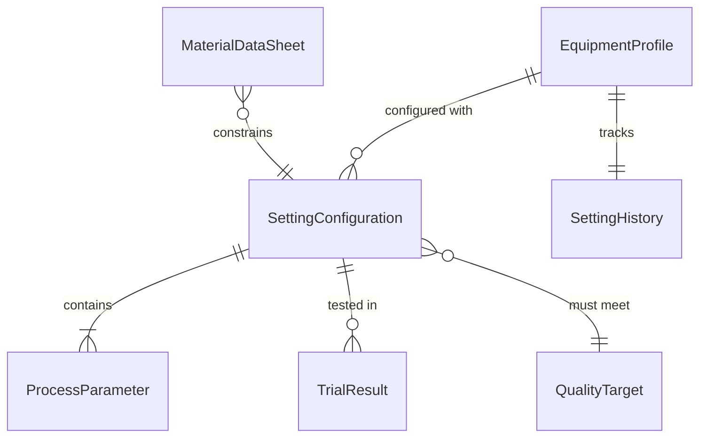
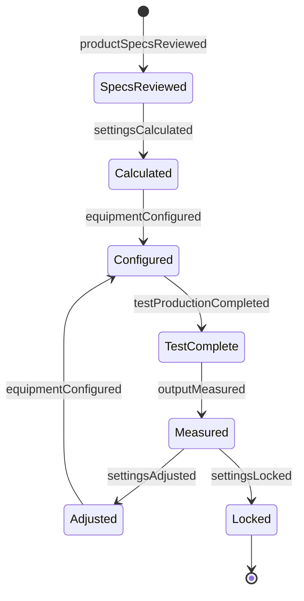
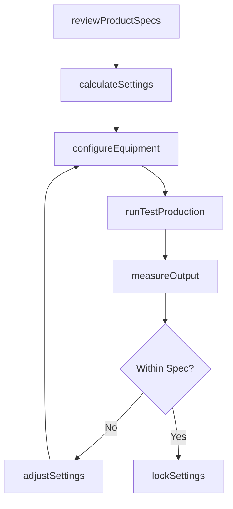
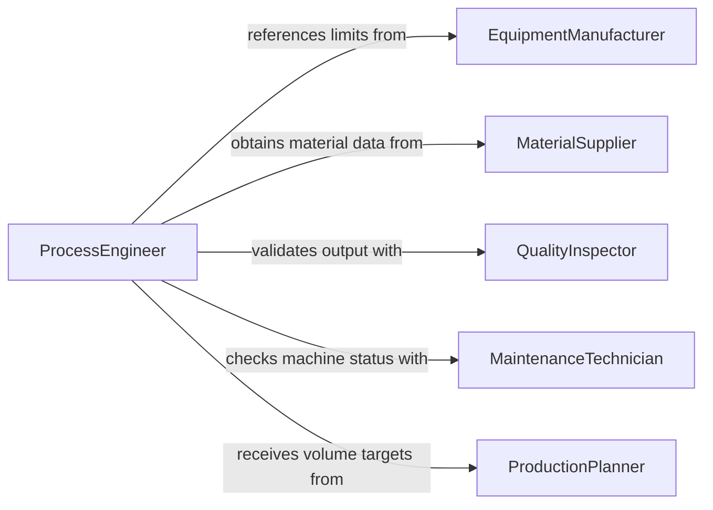

# Determine Production Equipment Settings

> Business-as-Code definition for determining production equipment settings. Models the calculation, configuration, and validation of machine parameters such as speed, temperature, pressure, and feed rates to achieve desired production output and quality.

## Overview

Determining production equipment settings involves analyzing product specifications, material properties, and equipment capabilities to calculate the optimal operating parameters for manufacturing processes. This includes setting speeds, temperatures, pressures, feed rates, and tolerances on CNC machines, presses, extruders, ovens, and other production equipment. The definition provides actions for parameter calculation and validation, events for tracking configuration changes, and searches for accessing historical settings and performance data.

## Actors

| Actor | Description |
|-------|-------------|
| EquipmentManufacturer | Provides machine specifications, operating limits, and recommended settings |
| MaterialSupplier | Supplies material data sheets with processing parameter ranges |
| QualityInspector | Verifies that output produced under current settings meets specifications |
| MaintenanceTechnician | Reports equipment condition that may affect optimal settings |
| ProductionPlanner | Specifies production volumes and schedule requirements |

## Roles

| Role | Description |
|------|-------------|
| ProcessEngineer | Calculates and configures optimal equipment settings |
| MachineOperator | Implements settings on equipment and monitors production performance |
| QualityEngineer | Validates output quality and recommends setting adjustments |
| ProductionSupervisor | Approves setting changes and manages production continuity |

## Entities

| Entity | Description |
|--------|-------------|
| EquipmentProfile | A machine's capabilities, operating ranges, and maintenance status |
| SettingConfiguration | A complete set of parameters for a specific production run |
| MaterialDataSheet | Processing characteristics of the raw material being used |
| QualityTarget | The dimensional, surface, and performance specifications for the output |
| TrialResult | The outcome of a test run under a specific setting configuration |
| SettingHistory | A log of previous configurations and their associated performance metrics |

## Actions

| Action | Description |
|--------|-------------|
| reviewProductSpecs | Analyze the product requirements that drive equipment parameter selection |
| calculateSettings | Compute optimal machine parameters based on material and product data |
| configureEquipment | Apply the calculated settings to the production equipment |
| runTestProduction | Execute a trial run to validate settings before full production |
| measureOutput | Inspect trial output for dimensional accuracy, finish, and defects |
| adjustSettings | Fine-tune parameters based on test production results |
| lockSettings | Approve and lock the validated configuration for production |

## Events

| Event | Description |
|-------|-------------|
| productSpecsReviewed | Product specifications have been analyzed for parameter requirements |
| settingsCalculated | Optimal machine parameters have been computed |
| equipmentConfigured | Settings have been applied to the production equipment |
| testProductionCompleted | A trial run under the new settings has been executed |
| outputMeasured | Quality inspection of trial output is complete |
| settingsAdjusted | Machine parameters have been fine-tuned based on test results |
| settingsLocked | The validated configuration has been approved for production |

## Searches

| Search | Description |
|--------|-------------|
| findSettingsByProduct | List approved setting configurations for a specific product |
| getSettingHistory | Retrieve historical configurations and performance for an equipment unit |
| getTrialResults | Query test production results by equipment, product, or date |
| getEquipmentCapabilities | Look up operating ranges and limits for a specific machine |

## Entity Relationships



## State Diagram



## Workflow



## Actor Relationships



## Usage

### Calling Actions

```typescript
import { determineProductionEquipmentSettings } from '@headlessly/determine-production-equipment-settings'

const settings = determineProductionEquipmentSettings()

// Review product specs and calculate settings
const specs = await settings.reviewProductSpecs({
  productId: 'bracket-assy-7700',
  material: 'Stainless Steel 304',
  tolerances: { dimensional: '±0.025mm', surfaceFinish: 'Ra 0.8' }
})

const config = await settings.calculateSettings({
  equipmentId: 'cnc-lathe-12',
  productSpecId: specs.id,
  parameters: ['spindleSpeed', 'feedRate', 'depthOfCut', 'coolantPressure']
})

// Test and validate
await settings.configureEquipment({
  equipmentId: 'cnc-lathe-12',
  configurationId: config.id
})

const trial = await settings.runTestProduction({
  configurationId: config.id,
  quantity: 10
})

// Lock settings for production
await settings.lockSettings({ configurationId: config.id })
```

### Event-Driven Automation

```typescript
// Alert when test output is out of spec
settings.outputMeasured(async ({ configurationId, withinSpec, deviations }) => {
  if (!withinSpec) {
    await notify({
      to: 'process-engineering',
      message: `Test output out of spec: ${deviations.map(d => `${d.parameter}: ${d.actual} vs ${d.target}`).join(', ')}`
    })
  }
})

// Log all locked settings for traceability
settings.settingsLocked(async ({ configurationId, equipmentId, parameters }) => {
  await auditLog({
    action: 'settings-locked',
    configurationId,
    equipmentId,
    parameters
  })
})
```
