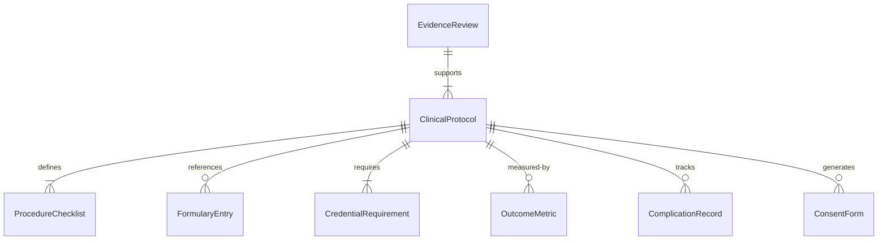
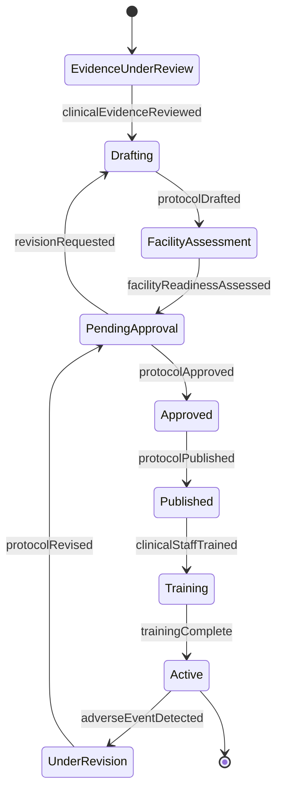
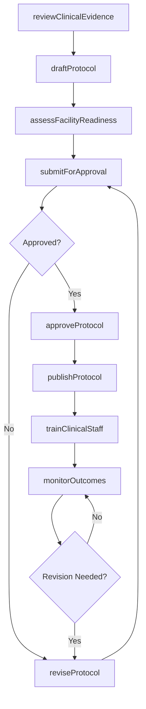
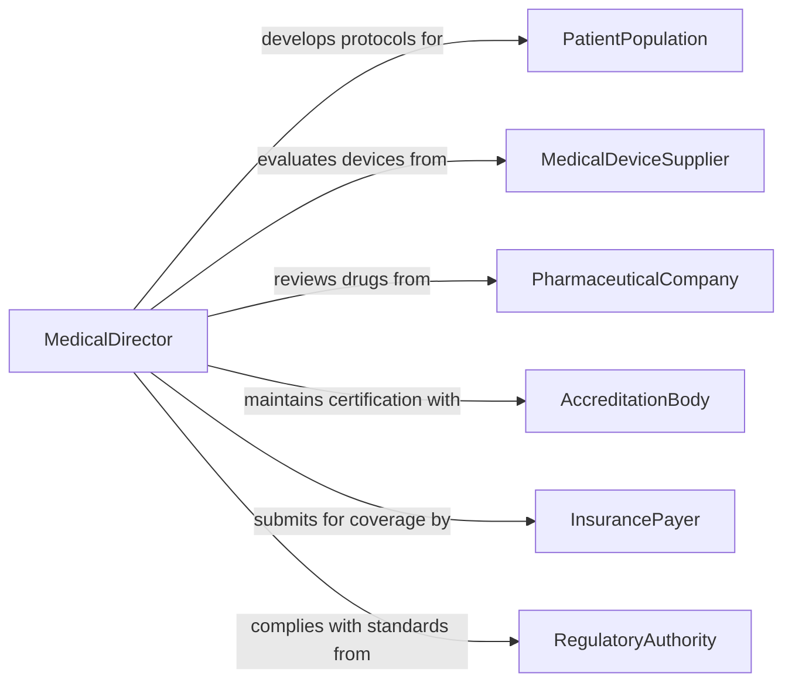

# Determine Protocols for Medical Procedures

> Business-as-Code definition for determining protocols for medical procedures. Models the lifecycle from clinical evidence review through protocol development, approval, implementation, and outcomes monitoring.

## Overview

Determining protocols for medical procedures involves evaluating clinical evidence, assessing patient populations, and establishing standardized guidelines for diagnosis, treatment, and surgical interventions. This encompasses reviewing peer-reviewed research, consulting clinical practice guidelines, adapting protocols to facility capabilities, obtaining committee approvals, and monitoring patient outcomes to refine procedures. The definition exposes actions for protocol development and governance, events for clinical workflow automation, and searches for evidence-based clinical data.

## Actors

| Actor | Description |
|-------|-------------|
| PatientPopulation | The group of patients for whom the protocol is being developed |
| MedicalDeviceSupplier | Manufacturer providing instruments and devices used in procedures |
| PharmaceuticalCompany | Drug manufacturer supplying medications referenced in protocols |
| AccreditationBody | Organization certifying facility compliance with clinical standards |
| InsurancePayer | Health plan evaluating procedure coverage and reimbursement |
| RegulatoryAuthority | Government body overseeing medical practice standards and drug approvals |

## Roles

| Role | Description |
|------|-------------|
| MedicalDirector | Physician leader who authorizes and oversees protocol adoption |
| ClinicalSpecialist | Subject matter expert in the relevant medical discipline |
| NurseManager | Nursing leader who adapts protocols for bedside implementation |
| QualityOfficer | Monitors protocol adherence and patient outcome metrics |
| PharmacistConsultant | Reviews medication dosing, interactions, and formulary alignment |
| EthicsCommitteeMember | Evaluates protocols for patient safety and ethical considerations |

## Entities

| Entity | Description |
|--------|-------------|
| ClinicalProtocol | Standardized guideline defining steps for a medical procedure |
| EvidenceReview | Systematic assessment of published clinical research and data |
| ProcedureChecklist | Step-by-step verification list for safe procedure execution |
| ConsentForm | Document authorizing patient-specific procedure performance |
| OutcomeMetric | Measurable indicator of procedure effectiveness and safety |
| ComplicationRecord | Documentation of adverse events or deviations during procedures |
| FormularyEntry | Approved medication and dosing referenced within a protocol |
| CredentialRequirement | Qualifications practitioners must hold to perform the procedure |

## Actions

| Action | Description |
|--------|-------------|
| reviewClinicalEvidence | Evaluate published research and guidelines for best practices |
| draftProtocol | Create a standardized procedure protocol based on evidence |
| assessFacilityReadiness | Evaluate whether the facility has equipment, staffing, and space |
| submitForApproval | Route the draft protocol through clinical committee review |
| approveProtocol | Formally authorize the protocol for clinical use |
| publishProtocol | Distribute the approved protocol to clinical staff and systems |
| trainClinicalStaff | Educate practitioners on protocol steps and requirements |
| monitorOutcomes | Track patient outcomes and complication rates post-implementation |
| reviseProtocol | Update the protocol based on outcomes data and new evidence |

## Events

| Event | Description |
|-------|-------------|
| clinicalEvidenceReviewed | Systematic review of relevant clinical literature is complete |
| protocolDrafted | A new procedure protocol has been written for review |
| facilityReadinessAssessed | Facility capability evaluation for the procedure is complete |
| protocolSubmittedForApproval | The draft protocol has entered committee review |
| protocolApproved | The clinical committee has authorized the protocol |
| protocolPublished | The approved protocol has been distributed to clinical staff |
| clinicalStaffTrained | Practitioners have completed protocol training |
| adverseEventDetected | A complication or deviation from protocol has been recorded |
| protocolRevised | The protocol has been updated based on new evidence or outcomes |

## Searches

| Search | Description |
|--------|-------------|
| findProtocols | List clinical protocols by specialty, procedure type, or status |
| getEvidenceReviews | Retrieve evidence assessments by condition, intervention, or date |
| getOutcomeMetrics | Find patient outcome data by protocol, time period, or facility |
| findComplicationRecords | Search adverse events by protocol, severity, or contributing factor |
| getCredentialRequirements | Retrieve practitioner qualifications needed for specific protocols |

## Entity Relationships



## State Diagram



## Workflow



## Actor Relationships



## Usage

### Calling Actions

```typescript
import { determineProtocolsForMedicalProcedures } from '@headlessly/determine-protocols-for-medical-procedures'

const protocols = determineProtocolsForMedicalProcedures()

// Review clinical evidence for a new surgical technique
const evidence = await protocols.reviewClinicalEvidence({
  condition: 'lumbar-spinal-stenosis',
  intervention: 'minimally-invasive-decompression',
  evidenceLevel: 'meta-analysis',
  dateRange: { from: '2020-01-01', to: '2026-01-01' }
})

// Draft a protocol based on evidence findings
const draft = await protocols.draftProtocol({
  name: 'Minimally Invasive Lumbar Decompression',
  specialty: 'orthopedic-surgery',
  evidenceReviewId: evidence.id,
  steps: ['patient-selection', 'imaging-review', 'anesthesia', 'approach', 'decompression', 'closure'],
  requiredCredentials: ['board-certified-spine-surgeon']
})

// Monitor outcomes after protocol goes live
await protocols.monitorOutcomes({
  protocolId: draft.id,
  metrics: ['readmission-rate', 'complication-rate', 'length-of-stay', 'patient-satisfaction'],
  reportingFrequency: 'quarterly'
})
```

### Event-Driven Automation

```typescript
// Alert quality team when adverse event occurs
protocols.adverseEventDetected(async ({ protocolId, severity, patientId }) => {
  if (severity === 'serious') {
    await notify({
      to: 'quality-committee',
      message: `Serious adverse event reported for protocol ${protocolId}`
    })
    await protocols.reviseProtocol({ protocolId, trigger: 'adverse-event-review' })
  }
})

// Schedule staff training when new protocol is published
protocols.protocolPublished(async ({ protocolId, specialty, affectedUnits }) => {
  await protocols.trainClinicalStaff({
    protocolId,
    targetUnits: affectedUnits,
    deadline: addDays(new Date(), 30),
    format: 'simulation-lab'
  })
})
```
